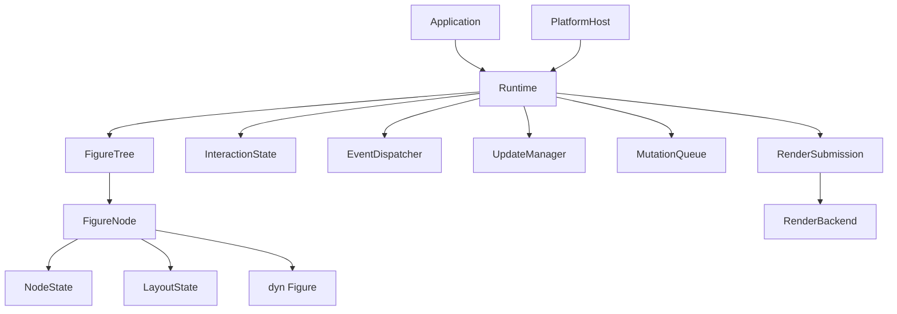

# 理想架构蓝图

本页是派生知识摘要，不是规范来源。完整契约以以下文档为准：

- [总体架构](../../../doc/design/architecture/overview.md)
- [静态结构](../../../doc/design/architecture/static-architecture.md)
- [动态协议](../../../doc/design/architecture/dynamic-architecture.md)
- [坐标与变换](../../../doc/design/coordinates/coordinate-system.md)
- [UpdateManager](../../../doc/design/rendering/update-manager.md)

## 北极星

> Figure 定义图形行为，FigureNode 保存通用节点状态，FigureTree 保存拓扑，
> Runtime 原子协调交互、更新与变更事务，PlatformHost 和 RenderBackend 分别隔离
> 平台循环与渲染实现。

## 核心结构



## Draw2D 语义迁移

保留：

- 轻量 Figure 树；
- bounds/client area 盒模型；
- 绘制、命中和 Z-order 一致性；
- LayoutManager 策略与 child constraint；
- Validation 后 Damage Repair；
- capture、focus、hover 和单 target 分发；
- Viewport、RangeModel、ScrollPane 和 ZoomManager 的职责关系。

迁移：

- Java 对象引用树改为 arena + `FigureId`；
- 宽 IFigure 改为小 Figure trait 和可选 capability；
- 通用节点状态从具体 Figure 中分离；
- 交互状态从树存储中分离为 `InteractionState`；
- 回调通过 effect queue 请求修改；
- 核心默认使用单线程借用，不使用通用 `Arc<Mutex<_>>`。

## 坐标与 3D

- 二维布局 bounds 位于 parent content domain；
- 每条父子边通过统一 `Affine2D` 连接；
- paint、hit-test、event point、clip 和 damage 共享变换链；
- 2.5D 透视效果位于可选 `Projective3D` 合成层；
- 真正 3D 使用独立 Scene3D、Camera、Bounds3D 和 RayHitTest；
- 不依赖替换二维 Point 类型完成 3D 升级。

## 平台与渲染

- PlatformHost 隔离 redraw、surface、DPI、cursor、IME 和 accessibility；
- RenderBackend 隔离 Vello、软件或其他渲染器；
- Figure 只录制平台无关绘制命令；
- DisplayList 二进制 ABI 是 proposal，不是核心架构前提。

## 动态事务

```text
input
→ target selection
→ Figure callback
→ effects
→ structural mutations
→ validation
→ damage repair
→ render submission
```

事件回调期间不直接修改正在遍历的树。所有状态变化按产生顺序提交，结构 mutation
在顶层事务边界统一应用。
