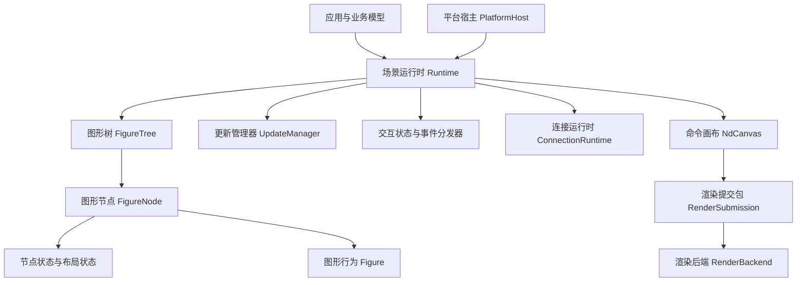
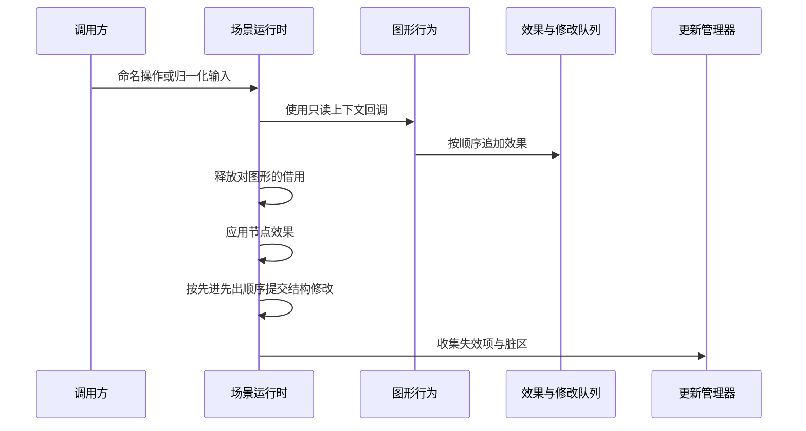

# 1. 系统模型与设计公理

## 1.1 引擎真正解决的问题

调用图形处理器接口（GPU API）画一个矩形并不难。图形引擎的难点是让同一棵
**场景树**在布局、绘制、命中、事件和局部重绘中给出一致答案。场景树是按父子关系
组织全部图形对象的层级结构。

例如，一个节点从 `(10, 10)` 移动到 `(40, 20)`，系统至少要同时保证：

1. 新位置由布局与命中测试读取；
2. 旧位置被加入**重绘损伤区域**（damage），避免留下残影；
3. 后代到绘制表面（surface）的映射失效，但后代自己的父级局部边界矩形
   （parent-local bounds）不被改写；
4. 连接（Connection）观察到端点几何变化并重新计算路径；
5. 活动反馈图形（active feedback）和操作手柄（handles）使用新变换重新投影；
6. 监听器（listener）只能观察到稳定提交后的结果。

因此 Novadraw 的核心不是某种绘图 API，而是一组跨模块不变量。

## 1.2 九条基础公理

Novadraw 从 Draw2D 保留行为语义，再用 Rust 所有权和显式事务重新组织对象关系。
这里的**事务**是指一组相关变化作为一个整体接受校验和提交；需要原子完成时，要么
全部成功，要么不留下部分结果。**派生状态**是由原始输入或模型状态计算得到、可以
在失效后重新生成的状态。

| 公理 | Novadraw 中的承载者 | 直接后果 |
|---|---|---|
| 轻量图形对象树 | `FigureTree`、`FigureNode` | 图形节点不持有平台控件 |
| 树是运行时骨架 | 父子关系、稳定的子节点顺序 | 绘制正序，命中逆序 |
| 边界矩形是布局几何真源 | `NodeState.bounds` | 布局、默认命中、重绘区域共用 |
| 坐标沿父链组合 | `child_transform`、`local_to_surface_transform` | 不允许事件或应用复制换算公式 |
| 客户区是盒模型协议 | 边界矩形 + 内边距 | 同时约束布局、子节点裁剪、命中下降 |
| 几何变化必须受控 | `Runtime::set_bounds` | 新旧重绘区域、通知、失效原子发生 |
| 校验收敛先于重绘修复 | `UpdateManager`、`Runtime::stabilize` | 重绘区域基于稳定几何计算 |
| 脏区必须投影到根 | `repair::propagate_damage_to_root` | 不能绕过变换与祖先裁剪 |
| 输入是有状态分发 | `EventDispatcher`、`InteractionState` | 指针捕获、悬停、焦点统一管理 |

外部参考：

- [Draw2D 设计公理](../doc/reference/draw2d/architecture/design-axioms.md)
- [GEF 核心原理](../doc/reference/gef/core-principles.md)

## 1.3 静态职责



关键分工如下。

### 图形行为（Figure）

`Figure` 表达不同图形对象的差异行为，例如绘制、内在尺寸、精确命中和可选能力。
它不保存父节点、子节点、平台绘制表面或全局管理器。

实际接口见
[`Figure`](../novadraw-scene/src/figure/mod.rs#L369-L573)。

### 图形节点（FigureNode）

`FigureNode` 是树中的一个运行时节点，组合通用状态、树关系和具体 `Figure`：

```rust
pub struct FigureNode {
    id: FigureId,
    children: Vec<FigureId>,
    parent: Option<FigureId>,
    depth: usize,
    figure: Box<dyn Figure>,
    component_revision: u64,
    layout: LayoutState,
    state: NodeState,
}
```

实际定义见
[`FigureNode`](../novadraw-scene/src/graph/mod.rs#L403-L432)。

### 图形树（FigureTree）

`FigureTree` 是所有图形节点及其父子关系的唯一所有者。它维护代际 ID、父子双向
关系、顺序、深度与拓扑约束，但不拥有输入状态、平台资源或命令历史。

### 场景运行时（Runtime）

`Runtime` 是一个场景的组合根和事务边界，也就是统一拥有并协调场景主要组件的
顶层对象。它同时拥有图形树、交互、更新、资源、图层索引和连接状态，因此能够
原子维护跨组件不变量。

实际字段见
[`Runtime`](../novadraw-scene/src/runtime/runtime.rs#L160-L189)。

### 平台宿主与渲染后端（PlatformHost / RenderBackend）

平台宿主负责平台事件循环、绘制表面生命周期和重绘调度；渲染后端只消费渲染提交包
（`RenderSubmission`）。平台类型不进入图形行为、布局和事件协议。

## 1.4 为什么使用 ID 引用树

Java Draw2D 可以让对象互相保存引用。Rust 中如果 `Figure` 同时拥有父节点、子节点
和管理器引用，会迅速形成自引用、别名可变借用与销毁顺序问题。

Novadraw 使用：

```text
运行时命名空间 + 带代数的槽位键 -> FigureId
```

**代际 ID**（generational ID）由槽位编号和代数共同组成；槽位被删除并复用后，
旧 ID 的代数不再匹配，因此不会误指向新对象。

它提供三项保证：

- 删除后旧 ID 不会误指向复用槽位；
- 不同场景运行时的 ID 可被结构化拒绝；
- 持续状态保存 ID，而不是保存借用或对象地址。

外部持久化业务 ID 与运行时 `FigureId` 不同。跨场景运行时的默认迁移方式是从模型
或描述重建，并获得新运行时身份。

## 1.5 单线程核心与短借用

图形树、交互状态和更新事务默认由单个界面/运行时线程独占。核心对象不被统一
包装成 `Arc<Mutex<_>>`，也不默认要求所有 Figure `Send + Sync`。

异步字体、图像或 GPU 工作通过消息和资源句柄回到 Runtime：

```text
后台任务结果
-> 运行时资源事务
-> 依赖该资源的图形失效或请求重绘
-> 稳定帧
```

这使线程安全成为边界策略，而不是所有领域对象的额外成本。

## 1.6 因果事务

**因果事务**是指运行时严格按效果产生的顺序收集、校验并提交一次操作的全部影响。
`Runtime` 顶层事务按发生顺序处理：



图形回调不能在运行时已可变借用整棵树时再次修改它。`EventContext` 只记录待执行
效果（effect）；`Runtime` 在释放 `Figure` 借用后再提交：

```rust
enum RuntimeEffect {
    Repaint { block_id: FigureId, rect: Rectangle },
    Notification(NotificationEffect),
    Invalidate(FigureId),
    Mutation(PendingMutation),
    // ...
}
```

代码锚点：

- [`EventContext`](../novadraw-scene/src/runtime/context.rs#L33-L43)
- [`RuntimeEffect`](../novadraw-scene/src/runtime/context.rs#L14-L31)
- [`PendingMutation`](../novadraw-scene/src/runtime/mutation/mod.rs)

## 1.7 稳定状态与可观察状态

一次**源状态修改**（source mutation，即直接来自应用或输入的原始变化）可以触发
布局、连接重路由、自由范围、视口范围和文本呈现等多级派生计算。只有所有必需工作
队列排空后，派生版本 `derivation_epoch` 才晋升为**稳定版本** `stable_epoch`。稳定
版本表示所有必需派生状态已收敛，可以安全地被外部读取。

```text
源状态或资源
-> 内在尺寸
-> 布局几何
-> 依赖失效传播
-> 连接路径计算
-> 路由后的几何更新
-> 最终显示状态
-> 稳定版本
```

`Runtime::stable_query()` 在仍有待处理工作时返回 `NotStable`，而不是暴露只更新
了一部分的场景。帧、监听器与无障碍系统都只消费稳定版本。

代码锚点：

- [`DerivedWorkKind`](../novadraw-scene/src/runtime/runtime.rs#L50-L85)
- [`Runtime::stabilize`](../novadraw-scene/src/runtime/runtime.rs#L3533-L3614)
- [`Runtime::stable_query`](../novadraw-scene/src/runtime/runtime.rs#L2706-L2715)

## 1.8 失败边界

Novadraw 不承诺回滚任意用户代码副作用。原子性按层划分：

| 层 | 保证 |
|---|---|
| 源操作 | 预验证失败不产生可见修改 |
| 派生计算 | 不发布不完整的 `LayoutOutput` 或路由批次 |
| 稳定发布 | 派生工作未闭合时不生成新的稳定帧 |
| 后端确认 | 使用会话与帧身份确认提交 |

扩展代码恐慌（panic）、不可恢复的命令错误或无法保证一致性的结构提交，会使
`Runtime`、`Viewer` 或 `CommandStack` 进入**故障锁定状态**（faulted）：系统拒绝
继续提交，以免在未知状态上扩大损坏。

规范依据：

- [ADR-014：扩展协议、生命周期与稳定发布](../doc/adr/adr-014-extensibility-and-lifecycle-boundaries.md)
- [总体架构](../doc/design/architecture/overview.md)
- [动态协议](../doc/design/architecture/dynamic-architecture.md)

## 1.9 本章检查清单

理解一个新能力时先回答：

1. 它改变的是源状态、派生状态还是最终显示状态？
2. 状态由哪个组合根拥有？
3. 身份属于业务模型、编辑框架还是场景运行时？
4. 修改通过哪个事务边界提交？
5. 何时才能被帧或监听器观察？
6. 失败后可以继续、可以重试，还是必须进入故障锁定状态？
