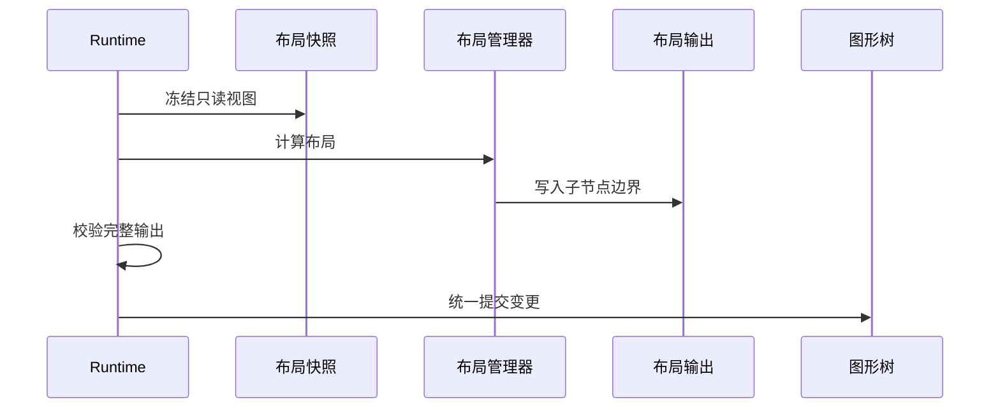
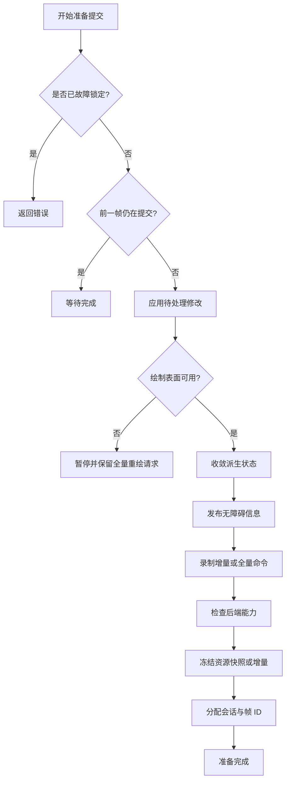

# 4. 布局、校验收敛、重绘区域与帧提交

## 4.1 更新不是立即绘制

**帧**是引擎为一次屏幕呈现准备并提交的完整结果。修改发生时不立即绘制，而是先
记录需要重新计算和重新绘制的事实。

一次修改通常只声明两类事实：

- **失效**（invalid）：几何、布局或派生状态已过期，需要重新计算；派生状态是由
  源状态计算得到、可以重新生成的状态；
- **脏区**（dirty）：某个节点本地区域的可见像素可能变化，需要纳入重绘。

失效描述“数据需要重算”，脏区描述“像素需要重画”，两者不能混为一谈。

它们被延迟合并，在帧边界执行：


严格顺序是关键：如果在布局稳定前计算重绘损伤区域（damage），脏区会基于旧几何
传播，造成漏绘。

## 4.2 布局管理器的读写隔离

**布局管理器**（`LayoutManager`）负责根据容器、子节点和布局约束计算几何结果。
它不能直接修改 `FigureTree`。`Runtime` 先建立只读的**布局快照**
（`LayoutSnapshot`），布局器再把候选变更写入**布局输出**（`LayoutOutput`）：

```rust
pub trait LayoutManager {
    fn layout(
        &mut self,
        container: FigureId,
        snapshot: &LayoutSnapshot<'_>,
        out: &mut LayoutOutput,
    ) -> Result<(), LayoutError>;
}
```

`LayoutOutput` 可记录子节点边界、可见性、失效请求和少量封闭的内建效果。`Runtime`
先完整校验输出，再统一提交。



代码锚点：

- [`LayoutSnapshot`](../novadraw-scene/src/layout/mod.rs)
- [`LayoutOutput`](../novadraw-scene/src/layout/mod.rs)
- [`LayoutManager`](../novadraw-scene/src/layout/mod.rs)
- [`FigureTree::validate_layout_output`](../novadraw-scene/src/graph/mod.rs#L1991-L2036)

## 4.3 布局约束属于父子关系

**布局约束**（constraint）描述父容器如何放置某个子节点，因此不是子节点的固有
属性，而是父节点与子节点之间的关系：

```text
LayoutState(container)
├── LayoutManager
└── child FigureId -> LayoutConstraint
```

因此删除子节点或更换父节点时，必须原子清理旧父节点中的约束。约束使用受控类型
擦除，布局管理器必须显式验证类型；错误类型不能被静默忽略。

`XYLayout` 的示例：

```rust
fn validate_constraint(
    &self,
    container: FigureId,
    child: FigureId,
    constraint: &dyn LayoutConstraint,
) -> Result<(), LayoutError> {
    if constraint.as_any().is::<XYConstraint>()
        || constraint.as_any().is::<Rectangle>()
    {
        return Ok(());
    }
    Err(LayoutError::ConstraintTypeMismatch { /* ... */ })
}
```

代码锚点：
[`XYLayout`](../novadraw-scene/src/layout/xy_layout.rs)。

## 4.4 测量顺序

尺寸解析遵循：

```text
显式指定的尺寸
-> 布局管理器测量
-> 图形自身的内在尺寸测量
-> 回退到当前边界尺寸
```

`None` 表示没有结果；零尺寸是合法结果，不能把 `Size::ZERO` 当作哨兵值
（sentinel，即用特殊值表示“无结果”）。

约束文本测量必须在布局阶段完成：

```text
父级宽度约束
-> 子节点按约束测量
-> 得到高度、基线和不可变布局快照
-> 排列子节点
-> 放置最终显示内容
```

如果把换行推迟到仅绘制阶段的显示逻辑，父布局无法得到正确高度，只能依赖第二次
全量重绘修补，破坏单帧收敛。

## 4.5 校验阶段如何收敛

**校验**（validation）是把失效的布局和派生状态反复重算，直到没有待处理工作的
过程，并不只是遍历一次。布局提交可能产生新的失效项、自由范围或视口范围更新，
因此 `Runtime` 使用固定优先级工作列表（worklist）：

```text
内在尺寸
-> 布局
-> 依赖失效传播
-> 连接路由
-> 路由后的几何更新
-> 最终显示状态
```

后置阶段产生高优先级工作时，调度器回到高优先级继续处理。全部队列排空才形成
稳定版本。

实际调度见
[`Runtime::stabilize`](../novadraw-scene/src/runtime/runtime.rs#L3533-L3614)。

为避免错误扩展无限失效，单个阶段有反馈预算。超过预算返回
`FramePreparationError::DidNotConverge`：

- 不生成只完成一部分的渲染提交包；
- 保留待处理工作；
- 请求后续诊断或重试；
- 不在渲染热路径打印日志。

## 4.6 两阶段更新管理器

**更新管理器**（`UpdateManager`）汇总失效项和脏区，并按“先校验、后计算重绘区域”
的两阶段协议准备一帧。它先完成校验，再冻结脏区快照：

```rust
self.perform_validation_phase(graph)?;
self.update_queued = false;
let snapshot = self.take_dirty_snapshot();
let damage = prepare_damage_set(graph, canvas, snapshot.iter());
if damage.is_some() {
    graph.render_to(canvas);
}
```

实际实现见
[`UpdateManager::perform_update_transaction`](../novadraw-scene/src/runtime/update/deferred.rs#L517-L550)。

冻结快照的意义是：计算重绘区域或绘制期间新产生的脏区不会被当前遍历意外消费，
而会保留到下一事务。

## 4.7 重绘区域如何传播

一个图形对象的脏矩形位于节点本地域。最终重绘区域的计算如下：

```text
本地脏区
-> 与当前视觉边界求交
-> 应用节点定位
-> 应用父节点的子内容变换
-> 与父级有效裁剪区求交
-> 重复直到根节点
-> 归一化多个区域
-> 得到逻辑表面域的 DamageSet
```

概念伪代码：

```rust
for step in parent_chain {
    dirty.transform(step.transform);
    if let Some(clip) = step.clip {
        dirty = dirty.intersection(clip)?;
    }
}
```

实际实现：
[`propagate_damage_through_parent_chain`](../novadraw-scene/src/runtime/update/repair.rs#L63-L84)。

这条链必须与绘制和命中测试使用同一子内容变换与裁剪策略。

## 4.8 重绘区域合并与正确性

`DamageSet` 是本帧需要重绘区域的集合，有三种状态：

```text
None
Full
Partial { union, regions }
```

`regions` 是用于优化的分散区域，`union` 是包围所有区域的单一矩形。区域过多时可以
安全退化为 `union`；后端无法可靠保留重绘区域外像素时必须升级为全量重绘（`Full`）。

真正的不变量是：

> 帧提交后，重绘区域外的可见像素必须与提交前等价。

它不强制所有后端使用同一种局部呈现（partial present）技术。

代码锚点：

- [`DamageSet`](../novadraw-render/src/submission.rs)
- [`normalize_damage_regions`](../novadraw-scene/src/runtime/update/repair.rs)

## 4.9 帧准备状态机

**帧准备状态机**用明确状态表示当前能否产生一帧。`prepare_submission_state`
不用 `Option` 混淆所有情况，而是区分：

```rust
pub enum FramePreparation {
    Ready(RenderSubmission),
    Idle,
    Suspended,
    AwaitingCompletion,
    Error(FramePreparationError),
}
```

完整顺序：



实际实现见
[`Runtime::prepare_submission_state_inner`](../novadraw-scene/src/runtime/runtime.rs#L3653-L3745)。

## 4.10 后端会话与资源基线

**后端会话**（backend session）表示一段连续使用同一后端资源基线的提交序列。新
会话必须先收到资源全量快照（`Snapshot`），之后才能消费资源增量（`Delta`）。提交
携带：

- `BackendSessionId`
- `FrameId`
- `ResourceSync`

后端入口可以拒绝旧代数或缺失快照的切换。提交失败时 `Runtime` 恢复资源增量，或
重新要求全量快照，并将下一帧提升为全量重绘。

这解决了“旧 `Runtime` 的迟到帧污染新绘制表面”与“新后端不知道已有资源”的问题。

## 4.11 通知为什么最后发布

内部变化按因果顺序写入通知日志（notification journal），但监听器只在稳定版本形成
后收到记录。否则监听器可能观察到：

- 边界已改但连接尚未重新路由；
- 路径已改但定位器尚未更新；
- 内容范围已改但视口范围尚未钳制到合法区间；
- 文本度量已改但最终显示状态仍旧。

通知记录保留 `source_epoch` 与 `sequence`，查询上下文指向发送通知时最新的稳定场景。

## 4.12 失败模式

| 错误 | 后果 |
|---|---|
| 重绘区域计算先于校验 | 重绘区域基于旧几何，产生残影 |
| 布局管理器直接改树 | 可变借用重入，无法原子校验 |
| 绘制阶段反向改变布局 | 帧无法稳定，依赖第二次重绘 |
| 脏区不记录来源图形 | 无法正确应用变换与裁剪 |
| 局部重绘后端不保留旧像素 | 重绘区域外内容丢失 |
| 资源切换没有全量快照 | 后端缓存缺少基线 |
| 监听器在中间状态执行 | 外部观察到半提交场景 |

## 4.13 验证入口

- [`m5_layout_contract.rs`](../novadraw-scene/tests/m5_layout_contract.rs)
- [`d4_constrained_measurement.rs`](../novadraw-scene/tests/d4_constrained_measurement.rs)
- [`d4_component_update.rs`](../novadraw-scene/tests/d4_component_update.rs)
- [`d4_notification_epoch.rs`](../novadraw-scene/tests/d4_notification_epoch.rs)
- [`runtime_resize_contract.rs`](../novadraw-scene/tests/runtime_resize_contract.rs)
- `cargo xtask run core.runtime`
- 规范 SSOT：
  [`update-manager.md`](../doc/design/rendering/update-manager.md)
