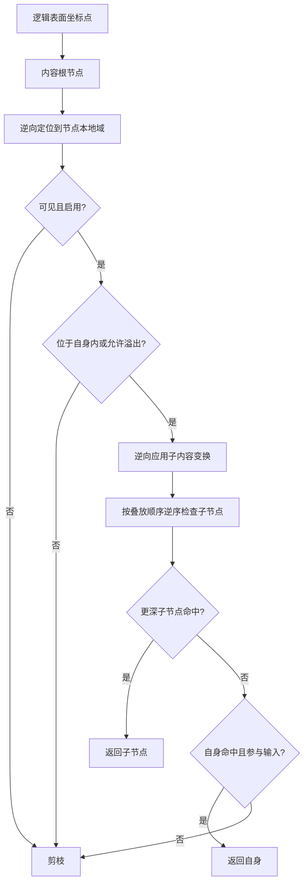
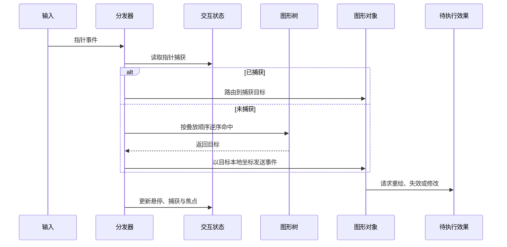

# 5. 命中测试与输入状态机

## 5.1 平台只负责归一化

**输入归一化**是把不同平台的鼠标、触控板和键盘事件转换成引擎统一事件与逻辑坐标
的过程。输入边界如下：

```text
平台原始事件
-> 平台输入适配器
-> 使用逻辑单位的统一输入事件
-> 场景运行时分发
```

平台适配器处理按键、按钮、指针 ID、物理/逻辑坐标换算和事件阶段；它不执行图形
命中测试，不保存指针捕获或焦点，也不直接调用图形对象。

## 5.2 命中测试与绘制互为镜像

**命中测试**（hit-test）根据一个坐标找出应该接收输入的最前方图形对象。绘制按
子节点正序，命中按子节点逆序：



实际核心：

```rust
let mut local_point = point;
self.translate_from_parent(id, &mut local_point);
let self_hit = node.figure.precise_hit(...);

let mut child_point = local_point;
if node.child_transform().apply_inverse_to(&mut child_point) {
    for &child_id in node.children.iter().rev() {
        // recurse
    }
}
```

代码锚点：
[`FigureTree::hit_test_from_with_inner`](../novadraw-scene/src/graph/search.rs#L227-L277)。

## 5.3 容器命中与自身命中是两件事

图层等透明结构节点要允许命中后代，但不应成为事件目标。因此
`HitParticipation` 区分：

- `SelfAndDescendants`：自身和后代都可成为事件目标；
- `DescendantsOnly`：只允许后代成为目标，自身保持输入透明。

不能简单用 `hit_test = false` 表示透明容器，否则算法可能直接剪掉整个子树。

自由范围容器的 `OverflowVisible` 也会放宽“必须先命中父边界才能下降”的条件，但
仍继承祖先裁剪。

## 5.4 交互状态保存跨事件信息

`InteractionState` 是场景运行时保存跨事件交互信息的状态集合。一次命中测试只能
回答当前点下是什么，不能表达持续状态。**状态机**根据当前状态和新事件决定下一
状态与动作，因此 `Runtime` 还需要维护：

- 鼠标目标；
- 光标目标；
- 悬停来源；
- 焦点所有者；
- 指针捕获；
- 滚动/缩放手势会话目标。

这些状态独立于 `FigureTree`，但都使用 `FigureId` 引用节点。节点退休时 `Runtime`
必须清理所有悬空引用。

## 5.5 指针事件的分发顺序

**指针事件**（pointer event）统一表示鼠标、触控笔或触摸点的按下、移动、释放等
输入。



普通事件只回调一个目标，不使用文档对象模型（DOM）式通用冒泡。

## 5.6 悬停状态的因果顺序

**悬停**（hover）表示指针当前停留在哪个图形上。目标变化时：

```text
旧目标接收 MouseExited
-> 应用旧回调产生的效果
-> 保存新悬停目标
-> 新目标接收 MouseEntered
-> 应用新回调产生的效果
-> 分发主事件
```

顺序不能倒置，否则回调查询交互状态时会看到错误的所有者。

## 5.7 指针捕获

**指针捕获**（capture）表示后续移动和释放事件固定发送给某个图形，不再随指针位置
重新命中。按下事件被图形处理后，分发器建立捕获：

```rust
let handled = ctx.dispatch_to_target(target, &event);
if handled {
    ctx.set_captured(target);
    // pressed/focus updates
}
```

后续移动和释放事件优先发给已捕获图形，即使指针已离开其边界。释放或取消时清理
捕获，再重新计算悬停目标。

实际实现见
[`EventDispatcher::dispatch_mouse_pressed/released`](../novadraw-scene/src/runtime/event/mod.rs#L464-L504)。

## 5.8 焦点与键盘事件

**焦点**（focus）表示当前接收键盘输入的对象。键盘事件发送给 `focus_owner`，不是
当前悬停目标。焦点变化顺序如下：

```text
保存新焦点所有者
-> 旧对象接收 FocusLost
-> 新对象接收 FocusGained
```

编辑框架的 `EditPart` 焦点与图形对象的键盘焦点属于两个身份域，只有明确场景才能
同步，不能让二者共用一个字段。

## 5.9 滚动与缩放使用类型化回退

**类型化回退**（typed fallback）是指目标图形未处理事件时，引擎寻找明确实现了对应
滚动或缩放能力的最近控制器，而不是向所有祖先冒泡。`RangeModel` 保存滚动范围与
当前位置，`ZoomManager` 协调缩放比例和视口原点。行为如下：

```text
开始
-> 命中测试并锁定手势目标
-> 回调目标一次
-> 若未处理，查找最近的类型化控制器
-> 应用 RangeModel 或 ZoomManager
-> 更新与结束阶段保持同一会话目标
```

它不是普通的祖先冒泡。固定会话目标可以避免滚动过程中内容移动，导致连续事件被
不同图形对象接收。

代码锚点：

- [`EventDispatcher::dispatch_scroll`](../novadraw-scene/src/runtime/event/mod.rs#L575-L598)
- [`EventDispatcher::dispatch_zoom`](../novadraw-scene/src/runtime/event/mod.rs#L600-L620)
- [Scroll/Zoom 输入规范](../doc/design/input/scroll-zoom-gesture-contract.md)

## 5.10 事件上下文与效果队列

`EventContext` 是图形事件回调可用的受限上下文；**效果队列**（effect queue）保存
回调请求、但尚未执行的重绘、失效和结构修改。图形事件处理器被调用时，`Runtime`
已经借用该图形。为了避免重入可变借用，回调只向 `EventContext` 记录效果：

```rust
pub fn repaint(&mut self, rect: Option<Rectangle>);
pub fn invalidate(&mut self);
pub fn add_child_later(...);
pub fn remove_child_later(...);
pub fn reparent_later(...);
```

结构修改在顶层分发完成后按先进先出顺序提交。局部效果保持产生顺序，`Runtime`
可以合并重绘区域，但不能重排有可观察差异的状态变化。

代码锚点：
[`EventContext`](../novadraw-scene/src/runtime/context.rs#L33-L325)。

## 5.11 分发结果是图形核心与编辑框架的仲裁边界

**分发结果**（`DispatchOutcome`）说明输入命中了谁、是否已被处理，以及是否存在
指针捕获。图形核心对每个归一化输入返回：

```rust
pub struct DispatchOutcome {
    target: Option<FigureId>,
    handled: bool,
    capture: Option<FigureId>,
}
```

编辑框架用它判断图形原生控件是否已经消费输入：

```text
归一化输入
-> 图形场景运行时
-> 已处理或已捕获则停止
-> 否则交给活动编辑工具
```

这让按钮、开关等图形控件交互与编辑框架的选择和工具共存，而不要求图形核心依赖
编辑框架类型。

代码锚点：

- [`DispatchOutcome`](../novadraw-scene/src/runtime/event/mod.rs#L268-L299)
- [`GraphicalViewer::dispatch_mouse_pressed`](../novadraw-editor/src/viewer/mod.rs#L1157-L1198)

## 5.12 指针离开绘制表面

**指针离开**（pointer leave）表示指针已移出应用可接收输入的绘制表面。此时必须：

- 清理悬停目标与光标目标；
- 保留或按上层协议取消指针捕获；
- 编辑框架取消活动手势；
- 清理临时反馈图形；
- 停止边缘自动滚动调度。

尤其在快速移出窗口时，不能依赖后续释放事件一定到达。编辑框架的
`EditorDomain::pointer_exited` 是这个边界的一部分。

## 5.13 失败模式

| 错误 | 后果 |
|---|---|
| 命中正序遍历 | 被遮挡节点抢到事件 |
| 事件点不转为目标本地坐标 | 嵌套、滚动、缩放后交互漂移 |
| 透明图层返回自身作为目标 | 空白图层吞掉业务节点事件 |
| 捕获后仍重新命中 | 拖拽出边界后中断 |
| 滚动时每帧重新选择目标 | 内容移动时手势跳转 |
| 图形回调直接改树 | 遍历中拓扑变化和借用冲突 |
| 指针离开时不取消编辑手势 | 反馈图形和边缘自动滚动残留 |

## 5.14 验证入口

- [`m6_event_contract.rs`](../novadraw-scene/tests/m6_event_contract.rs)
- [`p2_dispatch_outcome_contract.rs`](../novadraw-scene/tests/p2_dispatch_outcome_contract.rs)
- [`d1_focus_contract.rs`](../novadraw-scene/tests/d1_focus_contract.rs)
- [`g3_viewer_interaction_contract.rs`](../novadraw-editor/tests/g3_viewer_interaction_contract.rs)
- `cargo xtask run core.runtime`
