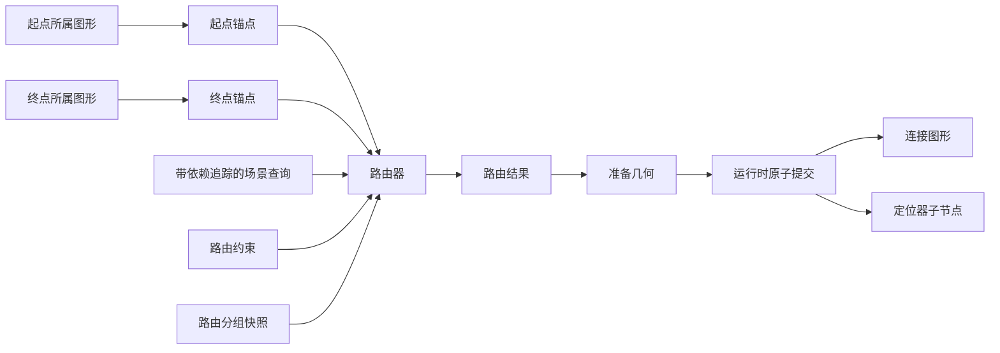
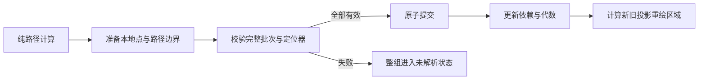

# 7. 连接、锚点与路由器

## 7.1 连接为什么不是普通折线

**连接**（Connection）是把两个图形端点关联起来、并能随端点变化自动更新路径的
图形。它的可见路径依赖：

- 起点和终点所属图形的几何；
- 锚点（Anchor）语义；
- 路由坐标域；
- 路由器（Router）与路由约束；
- 同组其他连接；
- 视口拓扑；
- 定位器与端点装饰。

**定位器**（Locator）根据已提交路径放置标签或操作手柄；**端点装饰**
（decoration）是在连接首尾绘制的箭头等附加图形；**路由约束**（routing constraint）
是调用方交给路由器的额外路径要求，例如必须经过的折点。

因此它不能只是应用手工维护的一组点。Novadraw 将职责拆成：



## 7.2 身份与状态归属

`ConnectionId` 是底层 `FigureId` 的类型安全包装，但不是任意图形都能转换：

```rust
pub struct ConnectionId(FigureId);
```

`Runtime` 必须确认图形提供 `ConnectionFigureBehavior`。

状态分工：

| 所有者 | 保存内容 |
|---|---|
| `ConnectionRuntime` | 锚点/路由器绑定、约束、依赖、代数和解析状态 |
| `ConnectionFigure` | 已提交的节点本地点列表、样式和精确命中 |
| `FigureNode` | 路径派生出的父内容域边界 |
| `FigureTree` | 连接图形的拓扑与叠放顺序 |

不能在 `ConnectionState` 和图形对象中各存一份路径点。

## 7.3 路由坐标域

**路由坐标域**（routing domain）是路由器读写连接路径点时使用的统一参照空间。每条
连接的规范路由坐标域是其父节点的子内容域。

原因是连接边界由路径派生：

```text
父节点子内容域中的路径点
-> 计算路径边界
-> 把路径点归一化到连接本地域
-> 提交 NodeState.bounds 与本地点
```

如果先用连接自己的本地边界计算路径，再由路径计算边界，就会形成循环依赖。

## 7.4 锚点是纯端点策略

**锚点**（Anchor）是根据所属图形的当前几何和另一端方向，计算连接端点位置的策略；
它本身不修改场景。

实际接口：

```rust
pub trait ConnectionAnchor {
    fn owner(&self) -> Option<FigureId>;
    fn semantic_group_key(&self) -> Option<AnchorSemanticKey>;

    fn reference_point(
        &self,
        scene: &mut dyn SceneQuery,
        output: CoordinateSpace,
    ) -> Result<Point, AnchorError>;

    fn location(
        &self,
        scene: &mut dyn SceneQuery,
        reference: Point,
        reference_space: CoordinateSpace,
        output: CoordinateSpace,
    ) -> Result<AnchorSite, AnchorError>;
}
```

代码锚点：
[`ConnectionAnchor`](../novadraw-scene/src/connection/anchor.rs)。

锚点不注册监听器，不持有 `Runtime`，也不缓存构造时所属图形的矩形。它通过短生命
周期的 `SceneQuery` 读取当前几何。

内置锚点包括：

- 固定坐标锚点 `XYAnchor`
- 矩形边界锚点 `ChopboxAnchor`
- 椭圆边界锚点 `EllipseAnchor`
- 圆角矩形边界锚点 `RoundedRectangleAnchor`
- 标签锚点 `LabelAnchor`

`AnchorSite` 可携带向外法向量，为正交路由的首尾方向和端点装饰提供显式几何信息。

## 7.5 双向端点求值

默认端点解析保留 Draw2D 语义：

```text
source_reference = target.reference_point(routing_domain)
target_reference = source.reference_point(routing_domain)
source_site = source.location(target_reference)
target_site = target.location(source_reference)
```

这使边界锚点根据“另一端在哪里”选择正确交点，而不是固定使用所属图形的中心。

## 7.6 场景查询同时追踪依赖

**场景查询**（`SceneQuery`）向锚点和路由器提供只读几何，同时记录计算过程中读取了
哪些场景事实。这里的**依赖**是“某条路径计算读取过某项场景数据”的关系；**代数**
（generation）是该数据每次变化时递增的版本号。查询对象使用 `&mut self`，就是为了
记录本次读取过的依赖：

```text
FigureGeometry(FigureId)
NamedAnchorRegion(FigureId, key)
RelativeTransform(from, to)
Topology(FigureId)
```

成功路由后，`Runtime` 原子替换依赖集合。相关对象的代数变化时，通过反向索引把
连接标记为需要重新路由。

这比“锚点给所属图形注册监听器”更适合 Rust：

- 没有对象引用环；
- 自定义锚点读到什么就依赖什么；
- 命名端口和跨坐标映射能被准确追踪；
- 失败前已读取的依赖仍可用于恢复调度。

代码锚点：
[`SceneQuery`](../novadraw-scene/src/connection/query.rs)。

## 7.7 路由器是纯计算策略

**路由器**（Router）接收两个端点、约束和分组上下文，返回完整路径，但不直接修改
图形或运行时状态。

```rust
pub trait ConnectionRouter {
    fn route(&self, request: RouteRequest<'_>)
        -> Result<RouteOutput, RouteError>;

    fn constraint_type(&self) -> Option<TypeId>;
    fn routing_group_scope(&self) -> RoutingGroupScope;
}
```

路由器不直接修改图形。`RouteOutput::new` 校验：

- 至少两个点；
- 所有坐标有限；
- 首尾点与端点元数据一致。

代码锚点：

- [`ConnectionRouter`](../novadraw-scene/src/connection/router.rs)
- [`RouteOutput`](../novadraw-scene/src/connection/router.rs)

## 7.8 四种核心路由

### 直线路由（Direct）

只连接两个锚点位置，不接受额外约束。

### 折点路由（Bendpoint）

在端点之间保留有序折点：

```text
起点 -> 零个或多个折点 -> 终点
```

支持路由坐标域中的绝对点，以及由两端参考点、偏移和权重派生的相对折点。

### 正交路由（Manhattan）

生成只含水平和垂直线段的正交折线，并在同一 `RouterId`、同一路由坐标域内共享
通道占位（lane reservation）。它不负责绕开障碍物。

### 扇出路由（Fan）

对使用相同无向锚点对的多条直线增加垂直偏移，避免完全重叠。已有折点的路线不被
扇出路由改写。

## 7.9 分组路由

单条连接的变化可能改变组内其他路径，因此跨连接策略必须批量计算：

```text
冻结稳定的分组快照
-> 按确定顺序计算每个成员
-> 校验全部输出
-> 准备全部图形几何与定位器
-> 原子提交整个批次
```

分组范围：

| 路由器 | 分组范围 |
|---|---|
| 直线/折点 | 不分组 |
| 扇出 | `RouterId` + 路由坐标域 + 无序锚点组键对 |
| 正交 | `RouterId` + 路由坐标域 |

若组内任一成员失败，不能提交部分新路径并保留部分旧路径。该组进入稳定的
**未解析状态**（unresolved），旧几何被清除，依赖保留用于后续恢复。

## 7.10 准备、校验与提交

连接路由更新采用“准备（Prepare）/校验（Validate）/提交（Commit）”三阶段：



`PreparedConnectionGeometry` 从父内容域中的点计算：

- 考虑描边宽度的 `path_bounds`；
- 平移到节点本地域的点列表。

实际实现见
[`PreparedConnectionGeometry`](../novadraw-scene/src/connection/figure.rs)。

## 7.11 路由自动失效

派生状态收敛中：

```text
几何或拓扑变化
-> 依赖代数变化
-> ConnectionRuntime 标记受影响路径
-> Runtime 重新计算待更新分组
-> 路径提交改变连接边界
-> 可能加入定位器、自由范围或视口工作
-> 继续处理直到稳定
```

应用不需要在每次移动节点后手工触发路由解析。

## 7.12 连接的绘制与命中

`ConnectionFigure` 只负责已提交几何的表现：

- 绘制：绘制折线；
- 精确命中：计算点到各线段的最短距离；
- 视觉边界：使用路径准备阶段得到的、考虑描边宽度的边界；
- 端点装饰：可通过内缩保持锚点给出的真实端点不变。

空连接或未解析连接不绘制旧路径。

代码锚点：
[`ConnectionFigure`](../novadraw-scene/src/connection/figure.rs)。

## 7.13 自环连接

**自环连接**（self-loop）是起点和终点指向同一编辑部件的合法连接。它仍只创建一个
`ConnectionPart`，同时进入所属部件的出边和入边索引。

正交自环必须由真实路径点表达，而不是仅在绘制时画出视觉假象。这样折点操作手柄、
命中测试、重绘、保存和撤销/重做都读取同一几何事实。

## 7.14 失败模式

| 错误 | 后果 |
|---|---|
| 锚点缓存构造时的矩形 | 所属图形改变尺寸后端点过期 |
| 路由器直接修改图形 | 无法批量预验证和原子提交 |
| 路径点在多个对象中重复保存 | 代数漂移，绘制与命中不一致 |
| 正交路由按锚点对分组 | 不同端点对占用同一通道时冲突 |
| 分组中只提交一部分 | 同帧路径相互不一致 |
| 未解析状态保留旧路径 | 用户看到已经失效的连接 |
| 自环只在绘制阶段模拟 | 操作手柄与模型中不存在真实折点 |

## 7.15 验证入口

- [`m9_connection_contract.rs`](../novadraw-scene/tests/m9_connection_contract.rs)
- [`m9_connection_runtime.rs`](../novadraw-scene/tests/m9_connection_runtime.rs)
- [`g5_connection_projection_contract.rs`](../novadraw-editor/tests/g5_connection_projection_contract.rs)
- [`g5_connection_creation_contract.rs`](../novadraw-editor/tests/g5_connection_creation_contract.rs)
- `cargo xtask run test.scene-connection`
- 规范 SSOT：
  [`connection-routing.md`](../doc/design/architecture/connection-routing.md)
