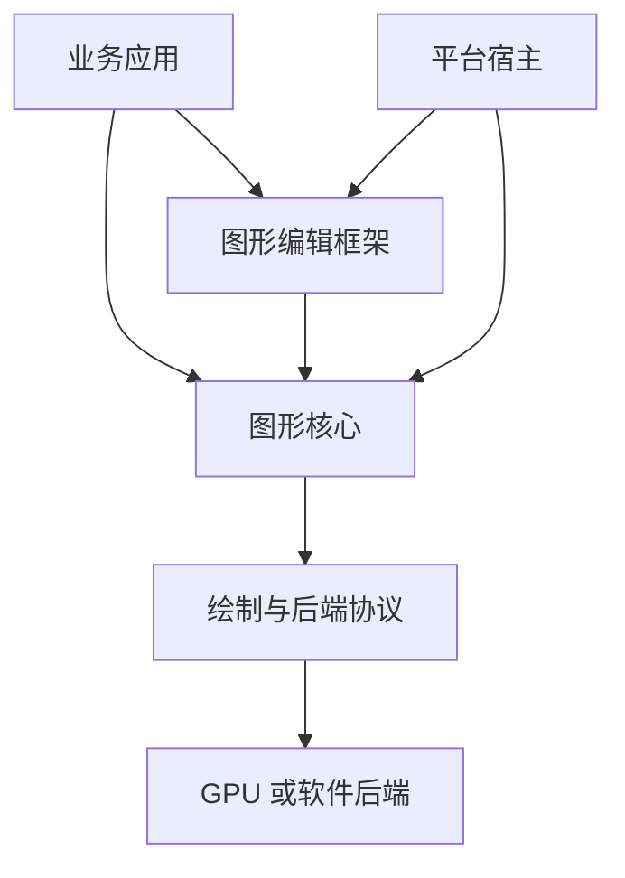
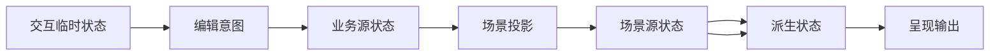
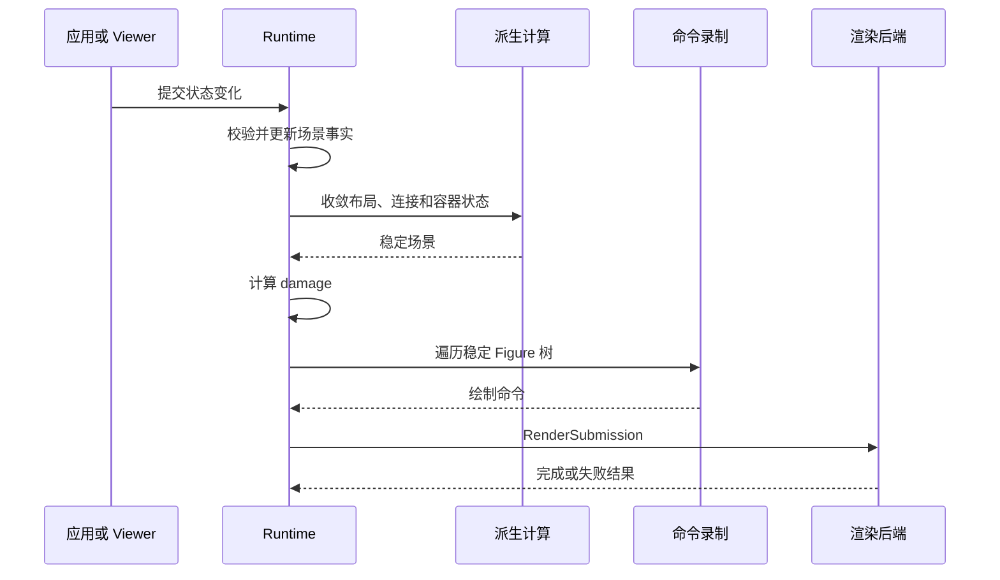
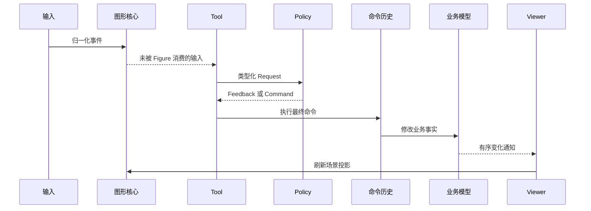

# 1. 图形编辑框架解决什么问题

> **本章解决的问题**：为什么一个图形编辑框架不能只是“画图 API 加鼠标事件”，以及
> Novadraw 用什么统一模型约束业务数据、场景结构、交互和最终像素。

调用 GPU 接口画一个矩形并不困难。真正困难的是：矩形移动以后，布局、连接线、命中
测试、选中框、局部重绘和撤销历史必须同时得到正确答案。

因此，本书从一条核心结论开始：

> 图形编辑框架首先是一套一致性协议，其次才是绘制 API 和交互组件集合。

## 1.1 从一次节点移动开始

设想一个流程编辑器：画布中有两个节点，一条连接线从节点 A 指向节点 B。用户按下
鼠标，拖动节点 A，然后释放。

从用户视角看，这只是一次移动；从框架视角看，它至少跨越以下事实：

| 问题 | 必须得到的结果 |
|---|---|
| 手势目标是谁 | 按下时命中的节点 A 被锁定为本次拖拽来源 |
| 拖拽中的位置 | 临时反馈跟随指针，但业务模型尚未改变 |
| 最终模型位置 | 释放时通过一个可撤销命令提交 |
| Figure 位置 | Viewer 根据新模型刷新投影 |
| 子节点坐标 | 沿父级坐标链重新映射 |
| 连接路径 | 端点依赖变化后重新路由 |
| 选中框与手柄 | 根据节点的新表面几何重新投影 |
| 旧像素 | 旧视觉区域必须被清除 |
| 新像素 | 新视觉区域进入本帧绘制 |
| 撤销 | 恢复模型旧位置，再重新生成整个视图结果 |

如果这些工作由各模块独立完成，就很容易出现局部正确、整体错误：

- 节点画到了新位置，但点击仍命中旧位置；
- 连接已经更新，选中框仍留在原处；
- 模型已撤销，Figure 却保存着另一份位置；
- 新位置被重绘，旧位置留下残影；
- 拖拽途中滚动画布后，反馈与指针分离。

图形框架的首要任务，就是让这些结果来自同一次受控变化。

## 1.2 三个不同层次

“绘图库”“图形核心”和“图形编辑框架”经常被混为一谈，但它们解决的问题不同。

### 绘图库

绘图库回答“如何把路径、文字和图像变成像素”。

它通常提供：

- 路径填充与描边；
- 变换和裁剪；
- 文字与图像绘制；
- GPU 或软件渲染提交。

绘图库不必知道一个矩形是否代表业务节点，也不负责选择、撤销或模型通知。

### 图形核心

图形核心回答“如何长期组织并驱动一组可交互图形”。

它负责：

- Figure 树；
- 节点身份与生命周期；
- 几何和坐标传播；
- 测量与布局；
- 绘制与命中；
- 输入分发；
- damage 和帧准备。

图形核心知道“这是一个可布局、可绘制、可命中的节点”，但不知道它是否代表流程、
类图、组织结构或电路元件。

### 图形编辑框架

图形编辑框架回答“如何把业务模型映射成可编辑视图”。

它负责：

- 模型到 Figure 的投影；
- 选择和编辑焦点；
- 把输入序列解释为编辑意图；
- 生成可撤销命令；
- 管理临时反馈；
- 在模型变化后刷新投影。

三者之间是依赖关系，不是同一层接口的不同名称：



简单展示应用可以绕过 Editor，直接使用 Core。需要选择、创建、连接、撤销和重做时，
Editor 才成为必要层。

## 1.3 为什么需要保留式场景

绘制接口可以分为两种基本使用方式。

**立即式绘制**由应用在每一帧重新发出命令：

```text
开始一帧
-> 画矩形
-> 画文字
-> 画连接线
-> 提交
```

这种方式适合统计图、游戏或状态本来就由应用完整持有的场景。绘图库只消费当前帧，
不需要记住“上一次画过什么”。

**保留式场景**则长期保存图形身份、结构和状态：

```text
创建节点
-> 挂到 Figure 树
-> 修改节点状态
-> 框架计算受影响结果
-> 只重建必要部分
```

图形编辑器需要保留式场景，因为交互依赖跨帧身份：

- 当前悬停的是哪个节点；
- 哪个节点持有指针捕获；
- 哪个 Figure 对应被选中的业务对象；
- 哪条连接依赖哪些端点；
- 哪个子树失效；
- 哪块旧区域需要擦除。

保留式并不意味着“每个 Figure 自己管理一切”。恰恰相反，长期状态越多，越需要统一
所有权和更新协议。

## 1.4 五类状态

理解图形框架的第一步，是区分状态的性质。

### 业务源状态

业务模型保存用户真正编辑的事实，例如节点名称、位置、连接关系和领域属性。它应能
脱离当前 Viewer 和 Figure 树持久化。

### 场景源状态

图形核心保存当前场景的结构事实，例如 Figure 父子关系、边界矩形、可见性和样式。
不使用 Editor 的应用可以直接以它作为显示状态来源；使用 Editor 时，它通常是业务
模型的投影结果。

### 派生状态

派生状态由其他事实计算得到，例如：

- 布局后的子节点边界；
- 连接路径；
- 自由范围容器的内容范围；
- 文本排版结果；
- 投影到表面的视觉边界。

派生状态可以缓存，但必须声明依赖、失效条件和重新计算顺序。

### 交互临时状态

交互状态只在一段会话内存在，例如 hover、capture、拖拽来源、连接预览、文本
preedit 和插入光标闪烁阶段。它不能被误认为持久业务事实。

### 呈现输出

绘制命令、damage、资源增量和后端提交包是稳定场景的输出。它们可以被后端消费，
但不能反向成为场景状态的权威来源。

这五类状态之间只能沿明确方向传播：



最危险的错误通常是反向写入：从像素推断模型、从反馈写业务事实，或者让后端修改
Figure 树。

## 1.5 图形闭环

图形闭环从一个已经接受的状态变化开始，以后端完成反馈结束：



这条链包含两个容易混淆的边界：

1. **场景稳定**：所有必须的派生状态已经闭合，可以生成一致提交；
2. **提交完成**：后端已经处理该 session 和 frame 的提交结果。

场景稳定不等于像素已经呈现。反过来，后端也不能因为提交失败就私自改变场景事实。

## 1.6 编辑闭环

编辑闭环把用户输入变成模型变化，再回到图形闭环：



这里有三个不能合并的概念：

- **输入**描述用户做了什么；
- **请求**描述这段输入可能意味着什么；
- **命令**描述业务模型最终要改变什么。

拖拽移动期间可以不断改变反馈，但只应在提交手势时产生一个模型命令。这样取消不需要
回滚模型，撤销也能保持正确粒度。

## 1.7 Figure 树为什么是共同骨架

一棵 Figure 树同时参与：

- 所有权与生命周期；
- 子节点叠放顺序；
- 绘制遍历；
- 逆序命中；
- 父链坐标转换；
- 布局和失效传播；
- damage 向表面域投影。

如果绘制、命中和坐标分别维护独立结构，三者会在重排、裁剪或销毁后产生漂移。共享
Figure 树不是为了少写一份数据结构，而是为了让多个算法读取同一结构事实。

这不意味着所有信息都塞进树节点。业务模型、选择、命令历史、后端资源和平台对象仍由
各自层拥有。Figure 树只是图形运行时语义的共同骨架。

## 1.8 七条全书不变量

后续章节会逐步推导以下不变量。

### 1. 权威状态唯一

同一业务事实不能同时由模型和 Figure 写入。派生状态必须能够追溯到其来源。

### 2. 身份属于命名空间

运行时 ID 只有在所属 Runtime 或 Viewer 中才有效。槽位相同不表示对象相同。

### 3. 坐标必须带有语义域

点和矩形不能脱离父内容域、节点本地域或表面域解释。跨域转换必须走统一父链。

### 4. 派生状态先稳定，才能绘制和发布

布局、连接和容器范围尚未闭合时，不能计算最终 damage，也不能发布稳定通知。

### 5. 输入由统一状态机仲裁

命中、悬停、捕获、焦点和手势不能由多个 Figure 各自维护冲突状态。

### 6. 扩展不能绕过提交权威

Figure、布局器、路由器和编辑策略可以计算候选结果，但副作用必须由所属 Runtime、
Viewer 或 CommandStack 提交。

### 7. 失败不能伪装成成功

合法缺失、可恢复拒绝、可重试提交和状态未知必须区分。无法证明一致性时，系统进入
明确的故障边界。

## 1.9 完整案例：移动一个已连接节点

现在重新观察开头的拖拽操作。

### 阶段一：建立手势

1. 平台把物理输入转换为逻辑表面事件；
2. 图形核心按绘制顺序的逆序执行命中；
3. 若 Figure 自身没有消费输入，Editor Tool 接管；
4. Tool 锁定来源节点、手势版本和初始指针位置；
5. 指针捕获保证后续移动与释放仍属于同一会话。

### 阶段二：更新预览

1. Tool 根据当前指针构造移动请求；
2. Policy 判断目标是否允许移动；
3. Viewer 在反馈层更新临时轮廓；
4. 业务模型和稳定节点位置保持不变；
5. 视口若自动滚动，Tool 使用同一表面指针重新计算预览。

### 阶段三：提交业务变化

1. 指针释放结束手势；
2. Policy 根据最终请求生成移动命令；
3. 临时反馈被清理；
4. CommandStack 执行命令；
5. 模型提交新位置并产生有序通知。

### 阶段四：刷新场景

1. Viewer 读取稳定模型快照；
2. 对应 EditPart 刷新 Figure；
3. Runtime 保存旧视觉边界并提交新边界；
4. 布局和坐标派生状态失效；
5. 依赖该节点的连接进入待路由集合；
6. 选中框与操作手柄重新投影。

### 阶段五：形成新帧

1. Runtime 收敛布局和连接；
2. 新旧视觉范围合并为 damage；
3. Renderer 遍历稳定 Figure 树；
4. 绘制命令、damage 和资源增量组成提交包；
5. 后端提交并返回结果；
6. Runtime 完成本帧并发布稳定观察结果。

撤销不会反向执行一组像素操作。它恢复模型旧位置，然后重新走阶段四和阶段五。这正是
模型事实与视图投影分离的价值。

## 1.10 常见但错误的简化

### “直接修改 Figure，再通知模型”

这会产生两个写入权威。撤销、重建和多视图无法判断哪个位置才是真的。

### “每个模块各自监听变化”

布局、连接、反馈和重绘会形成无序回调网。系统无法证明通知发生时读到的是稳定状态。

### “每次都全量重绘即可”

全量重绘可以暂时掩盖 damage 错误，却无法修复命中、连接、选择和模型投影的不一致。
性能成本也不能替代正确的状态边界。

### “把所有能力都放进 Figure trait”

基础接口会不断膨胀，大量 Figure 被迫实现无意义方法，新增能力仍然需要修改中心协议。

### “把所有能力都放进动态类型表”

如果没有 typed key、独立消费者和统一失败合同，类型表只会把错误推迟到运行时。

### “回调里直接修改整棵树”

遍历期间重入修改会破坏当前快照、顺序和借用边界。回调应产生拥有数据的效果或候选
更新，由 Runtime 在受控阶段提交。

## 1.11 后续章节如何展开

接下来的章节依次回答：

1. 谁拥有状态和身份；
2. 固定管线如何容纳扩展；
3. Figure 树如何成为共同骨架；
4. 坐标如何贯穿绘制、命中和 damage；
5. 布局与派生状态如何收敛；
6. 稳定场景如何形成提交；
7. 输入如何形成交互会话；
8. 视口和连接如何处理跨节点依赖；
9. 业务模型如何投影为视图；
10. 编辑意图如何形成可撤销命令；
11. Capability 如何保持开放且类型安全；
12. 整个系统如何在失败和演进中维持一致。

## 1.12 思考题

1. 一个节点的颜色属于业务源状态、场景源状态还是派生状态？答案是否取决于应用？
2. 为什么“绘制正确”不能证明坐标系统正确？
3. 为什么拖拽反馈不应该直接修改业务模型？
4. 如果后端提交失败，哪些场景状态可以保持，哪些资源状态必须恢复？
5. 一个新的 Figure 字段在什么条件下才应提升为横切 Capability？
6. 如果为命中测试单独维护一棵空间树，它与 Figure 树之间需要什么一致性合同？
