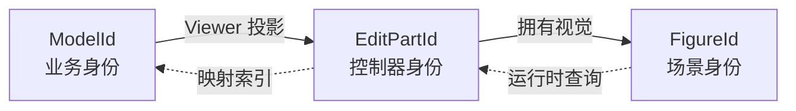
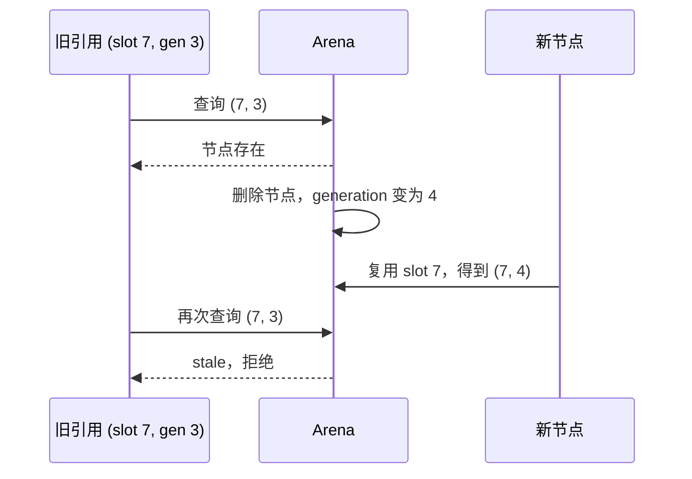
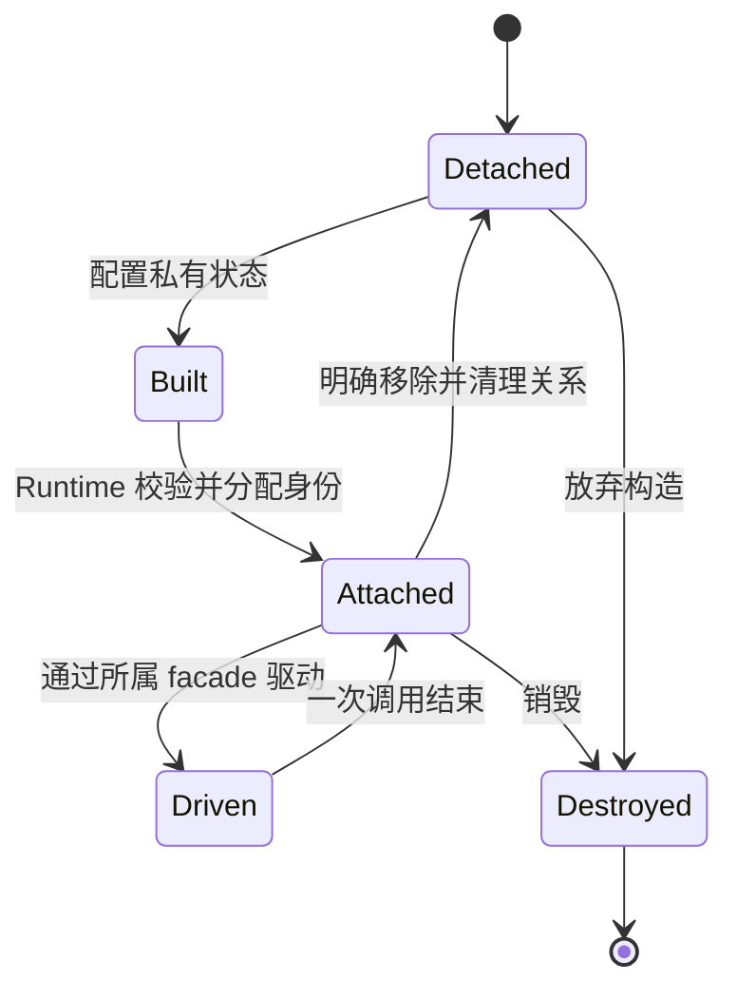
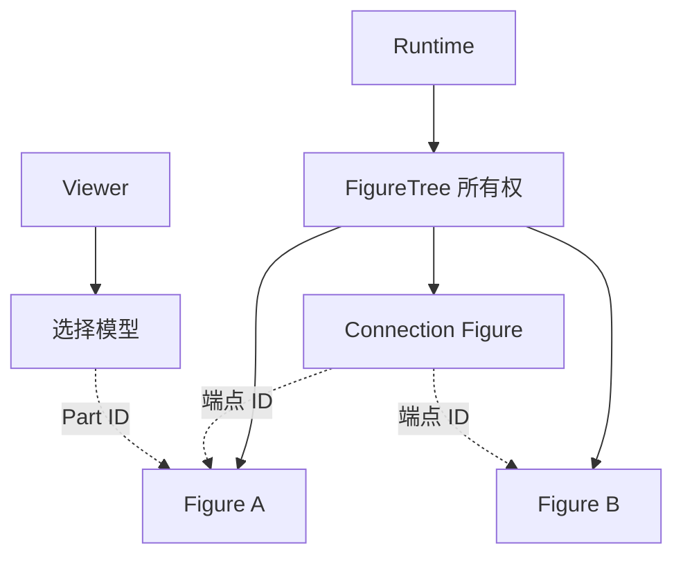

# 2. 状态、身份与所有权

> **本章解决的问题**：当模型、Viewer、Figure、布局器、输入状态机和渲染后端都需要
> “知道同一对象”时，谁有权修改事实，谁只能保存引用或派生结果？

图形框架中的多数一致性错误，并不是某个算法算错了，而是两个模块都认为自己拥有同一
事实。节点位置同时保存在模型和 Figure 中，选择状态同时保存在 Tool 和 Viewer 中，
连接端点同时保存对象引用和运行时 ID。正常路径看似工作，一旦撤销、重建或删除，就会
出现无法裁决的冲突。

本章的核心结论是：

> 状态可以有多种表示，但只能有一个写入权威；身份可以互相映射，但不能互相替代。

## 2.1 “知道”不等于“拥有”

假设一个业务节点正在画布中显示。至少有四个对象需要知道它：

- 业务模型保存节点名称、位置和连接关系；
- EditPart 知道如何把节点投影为视图；
- Figure 保存当前 Viewer 中的图形状态；
- Selection 保存当前是否选中该节点。

这些对象之间有关系，但关系并不赋予写入权。

| 信息 | 权威所有者 | 其他层允许保存什么 |
|---|---|---|
| 业务节点位置 | 业务模型 | 模型 ID、稳定快照、投影后的 Figure bounds |
| 模型到 Part 的映射 | Viewer | 双向 ID 索引 |
| Figure 父子关系 | Runtime | `FigureId` 拓扑 |
| 当前选择 | Viewer 的选择模型 | `EditPartId` 集合 |
| 指针捕获 | 输入状态机 | 捕获目标的运行时 ID |
| 布局结果 | Runtime 管理的场景状态 | 输入摘要、失效标记 |
| 后端资源 | 渲染 session | 资源 ID 与完成状态 |

“权威所有者”有三个含义：

1. 它定义该事实何时改变；
2. 它验证变化是否合法；
3. 它决定变化何时对观察者可见。

只读缓存、索引和投影可以存在，但必须明确由哪个源重建，以及源变化后何时失效。

## 2.2 四种状态角色

第 1 章按业务、场景、交互和呈现区分了状态层次。本章从所有权角度再区分四种角色。

### 权威状态

权威状态是系统接受为事实的内容。它不能依赖另一个可变副本来判断自身是否正确。

例如，在使用 Editor 的应用中，节点业务位置属于模型；Figure 的 bounds 是当前
Viewer 的投影。没有 Editor 时，应用也可以直接把 Figure bounds 作为场景权威。关键
不在于某个字段永远属于某一层，而在于一个具体系统必须选定唯一权威。

### 派生状态

派生状态由权威状态和稳定算法计算得到，例如文本排版、连接路径和表面视觉边界。
派生状态需要声明：

- 输入依赖；
- 计算版本；
- 失效条件；
- 可见时机。

如果这些信息不完整，所谓缓存就只是另一份无法验证的状态。

### 索引与缓存

索引用于快速查找，缓存用于避免重复计算。两者都不是事实来源。它们必须满足：

```text
源状态不变 => 索引或缓存结果等价
源状态变化 => 旧结果不会被当作当前事实
```

索引通常可由身份关系重建；缓存通常可由输入快照和算法版本重建。若一个“缓存”丢失
后无法恢复，它实际上已经成为未声明的权威状态。

### 会话状态

会话状态描述尚未完成的过程，例如拖拽起点、当前 hover、IME preedit 和待提交帧。
它拥有明确的开始、更新、完成和取消路径。会话状态结束后，不能继续作为稳定场景的
依据。

## 2.3 三个身份域

一个业务对象进入编辑器后，通常会产生三种身份：



### ModelId

`ModelId` 标识业务世界中的对象。它应在 Viewer 销毁和重建后保持语义稳定，并能参与
持久化、命令和模型通知。

### EditPartId

`EditPartId` 标识某个 Viewer 中的控制器实例。同一个模型对象可以同时出现在多个
Viewer 中，因此一个 `ModelId` 可能对应多个不同命名空间中的 `EditPartId`。

### FigureId

`FigureId` 标识某个 Runtime 中的 Figure 节点。它用于树关系、输入捕获、布局失效和
渲染查询。它不是业务身份，也不能在另一个 Runtime 中解释。

这三类 ID 不能因为底层表示相同就互换。正确关系是显式映射：

```text
(ViewerId, ModelId) -> EditPartId
(ViewerId, EditPartId) -> ModelId
(RuntimeId, EditPartId) -> FigureId
```

命名空间是身份的一部分。脱离 `ViewerId` 或 `RuntimeId` 的裸槽位编号没有完整语义。

## 2.4 为什么对象地址不能充当身份

对象地址只能表示“这个分配当前位于哪里”，不能表达：

- 对象是否已经销毁；
- 同一槽位是否被新对象复用；
- 对象属于哪个 Runtime；
- 视图重建后是否仍代表同一业务对象；
- 序列化和回放时如何恢复关系。

长期关系保存裸引用还会让所有权图与业务关系图纠缠。连接线只需要知道端点身份，不应
拥有端点对象；输入捕获只需要知道目标身份，不应延长 Figure 生命周期。

因此，跨阶段关系保存稳定 ID，短时间执行才解析成借用：

```text
长期保存：FigureId
执行查询：Runtime::with_figure(FigureId, |figure| ...)
调用结束：借用失效
```

## 2.5 代际身份

运行时通常使用槽位表保存大量节点。删除节点后，为控制内存，槽位可以被后续节点复用。
如果 ID 只有槽位编号，旧引用会静默指向新对象。

代际 ID 把身份写成：

```text
FigureId = (slot, generation)
```

删除时，槽位的 generation 增加。解析 ID 时必须同时匹配槽位和代次。



代际 ID 防止的是“错误命中”，不是自动清理。删除 Figure 时仍需取消捕获、移除选择
投影、清理连接依赖和释放资源。generation 只保证漏清理不会误伤新对象。

## 2.6 身份解析的三种结果

解析 ID 不应只返回“有或没有”。至少要区分：

1. **存在**：命名空间和代次都匹配；
2. **合法缺失**：对象已删除，调用者允许把它视为会话取消；
3. **协议错误**：ID 来自错误 Runtime，或当前操作要求对象必须存在。

例如，pointer move 到达时捕获目标刚被删除，这通常是合法取消；布局提交时目标节点
突然不存在，则意味着准备快照已经过期，必须拒绝整批结果。

错误语义取决于调用阶段，而不是取决于容器查询 API 返回了 `None`。

## 2.7 detached、build、attached、drive

Figure 和 Editor 对象的生命周期应分阶段，而不是一创建就获得全部权限。



### Detached

对象尚未属于 Runtime，可以通过独占所有权自由配置。它不能查询父级、注册输入捕获或
发布 damage，因为这些语义依赖运行时身份。

### Build

构造器把必要组件、能力描述和初始状态组装为可挂载对象。此阶段可以拒绝内部不一致，
例如缺失必需资源或重复能力键。

### Attached

Runtime 分配 ID、校验接纳规则、建立拓扑和索引，然后原子发布对象。挂载后，结构和
共享状态由 Runtime 管理。

### Drive

外部代码通过短生命周期 facade 执行一次查询或修改。facade 可以暴露当前阶段允许的
能力，但不能被长期保存，也不能让内部可变引用逃逸。

这种阶段划分让“不可能的操作”在接口层消失。detached 对象不能触发运行时副作用；
attached 对象不能绕过 Runtime 随意改父级。

## 2.8 为什么挂载后只给短借用

如果扩展长期持有 `&mut Runtime`、`&mut FigureNode` 或子对象引用，会产生三个问题：

- Runtime 无法在其他阶段安全地遍历或提交；
- 回调可能重入修改当前正在读取的结构；
- 对象删除后，外部引用的有效性无法统一裁决。

更稳定的调用方式是：

```text
外部提交拥有数据的意图
-> Runtime 校验身份和当前阶段
-> Runtime 建立短借用
-> 执行局部计算
-> 借用结束
-> Runtime 统一提交副作用
```

扩展需要跨调用保留关系时，保存 ID、不可变描述或拥有的数据，不保存内部借用。

## 2.9 所有权图与关系图

图形系统同时存在两类图：

**所有权图**决定对象由谁销毁，通常应接近树或分层 arena。

**关系图**表达连接、选择、依赖和模型引用，可以包含环和多对多关系。

不能用所有权表达所有关系。例如连接 A 到 B 不意味着连接拥有 A 和 B；选择一个节点
不应阻止节点删除。正确做法是关系图保存身份，所有者在销毁时清理或使关系失效。



虚线关系不改变对象生命周期。

## 2.10 删除不是一次容器操作

删除一个 Figure 的完整过程按因果顺序发生：

1. 检查目标身份属于当前 Runtime；
2. 收集将被删除的子树和稳定旧视觉范围；
3. 校验当前阶段允许结构变更；
4. 从父级拓扑中解除子树；
5. 使相关布局、连接和容器范围失效；
6. 清除 hover、capture、focus 等输入关系；
7. 清除 Viewer 中对应视觉映射和反馈；
8. 使代际 ID 失效；
9. 把旧视觉范围加入 damage；
10. 在场景重新稳定后发布删除结果。

其中任何一步被遗漏，都可能产生没有实体却仍被引用的“逻辑悬空”。代际 ID 能拒绝
访问，但不能代替第 5 至第 9 步。

## 2.11 撤销与视图重建

考虑删除一个业务节点后再撤销。

模型撤销恢复的是业务身份和业务数据。Viewer 可以选择重用仍有效的控制器，也可以
创建新的 `EditPartId` 和 `FigureId`。只要投影确定，最终视觉语义应相同。

因此：

- 命令历史保存 `ModelId` 和业务值，不保存 `FigureId`；
- 选择恢复可以按 `ModelId` 重新解析 Part；
- 连接恢复读取模型端点，再建立新的 Figure 依赖；
- 旧的输入捕获不能随着撤销“复活”。

这说明业务身份具有跨视图稳定性，运行时身份只保证当前实例内的精确引用。

## 2.12 派生状态的版本

派生结果必须绑定输入版本。一个布局结果至少隐含：

```text
父节点身份
父节点几何版本
子节点集合版本
约束版本
布局策略版本
```

Runtime 应在应用结果前确认这些前提仍成立。若准备期间又发生变化，正确结果是丢弃并
重新计算，而不是把旧输出勉强应用到新结构。

版本不一定是一个全局计数器。可以使用局部 epoch、结构 revision 或依赖摘要。关键是
能够证明输出对应当前输入。

## 2.13 必须保持的不变量

### 1. 单一写入权威

每项长期事实都能指出唯一提交者。其他表示要么只读，要么可重建。

### 2. 身份不跨命名空间解释

任何运行时 ID 都必须在所属 Runtime 或 Viewer 中解析。

### 3. 旧 ID 不命中新对象

槽位复用必须改变 generation，stale ID 只能失败。

### 4. 长期关系不保存内部借用

跨帧、跨回调和跨事务的关系保存 ID 或拥有数据。

### 5. 销毁同时终止关系

对象离开所有权图时，所有指向它的会话关系必须清理或进入明确 unresolved 状态。

### 6. 派生结果绑定输入版本

过期计算不得进入稳定场景。

## 2.14 常见错误设计

### “模型和 Figure 各存一份位置，互相同步”

双向同步没有天然终点。通知丢失、顺序变化或撤销都会产生冲突。

### “用指针地址做节点 ID”

地址复用会让旧关系指向新对象，也无法表达 Viewer 或 Runtime 命名空间。

### “Arena 删除已经足够”

容器删除只处理存储，不处理输入、选择、连接、布局和旧像素。

### “所有对象都用引用计数就没有生命周期问题”

引用计数只解决何时释放内存，不解决谁有权修改，也可能让已从场景删除的对象被关系图
意外保活。

### “一个全局 ID 可以贯穿模型到像素”

不同身份域具有不同生命周期和唯一性规则。强行统一会把业务持久化与运行时分配耦合。

## 2.15 与后续章节的关系

本章确定了谁拥有事实、ID 在哪里有效以及对象何时可被驱动。下一章将在此基础上回答：
扩展代码如何参与计算，却不获得跨越所有权边界的任意修改权。

后续所有算法都依赖本章：

- Figure 树用运行时身份维护拓扑；
- 布局和连接输出绑定输入版本；
- 输入状态机用 ID 持有会话目标；
- Viewer 显式维护三种身份映射；
- 帧提交用 session 和 frame identity 管理后端资源。

## 2.16 思考题

1. 同一个业务节点同时显示在主视图和缩略图中时，会产生几个 Figure 身份？
2. 为什么代际 ID 不能替代删除时的关系清理？
3. 一个文本排版缓存要声明哪些输入版本才能安全复用？
4. pointer capture 的目标被删除时，应该返回合法取消还是系统故障？为什么？
5. 哪些场景下 Figure bounds 可以成为权威状态，哪些场景下只能是模型投影？
6. 如果 Viewer 重建后生成了新 `EditPartId`，命令历史为什么仍然有效？
