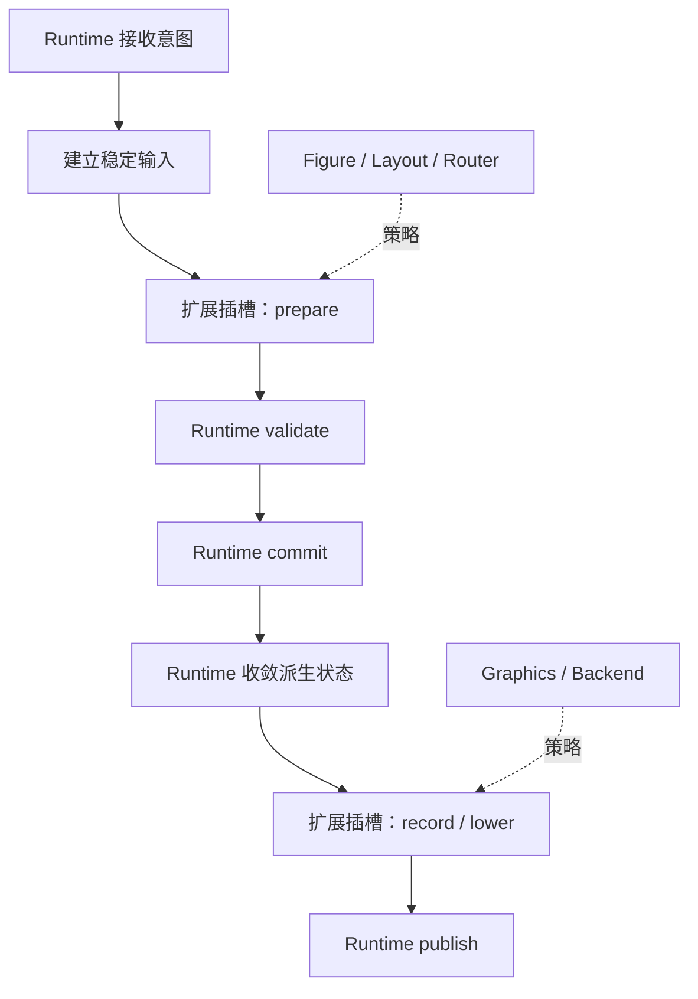
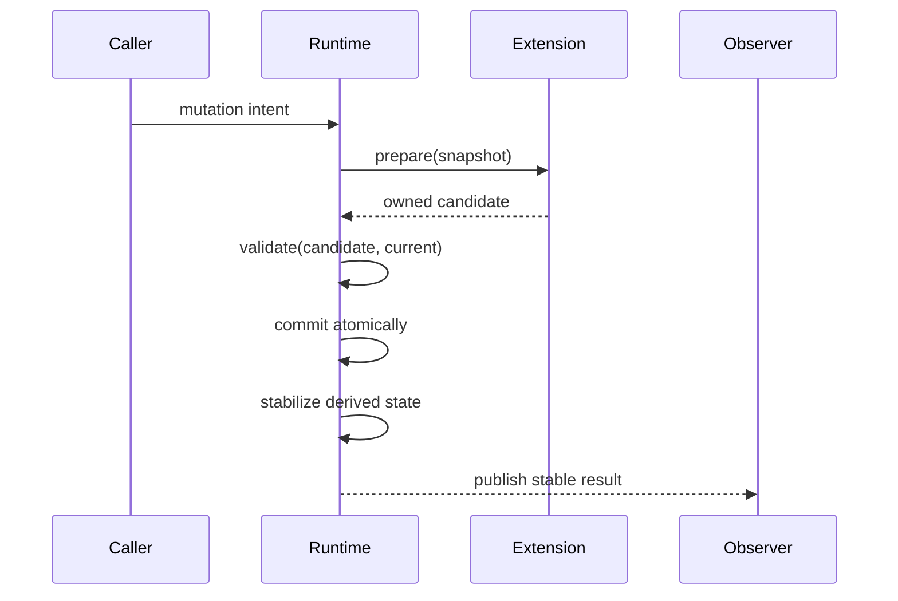

# 3. 固定管线与开放扩展

> **本章解决的问题**：框架怎样允许新的 Figure、布局器、路由器和编辑策略参与工作，
> 同时保证布局、damage、通知和提交仍按统一顺序发生？

扩展性常被误解为“把控制权交给用户代码”。但图形框架的正确性依赖全局顺序：结构先
校验，派生状态再收敛，稳定场景之后才能计算最终 damage，最后才能发布通知和提交
后端。任何扩展如果能跳过这些阶段，都能破坏系统不变量。

本章的核心结论是：

> 框架开放“做什么”的差异能力，同时固定“何时执行、如何提交”的一致性流程。

## 3.1 不变骨架与差异策略

一个可扩展框架包含两类变化。

**稳定变化**由框架统一定义：

- 一个 mutation 何时可以进入；
- 如何读取一致快照；
- 如何验证身份和版本；
- 如何应用多个副作用；
- 何时对观察者发布；
- 失败后处于什么状态。

**差异变化**由扩展提供：

- Figure 如何绘制自身内容；
- LayoutManager 如何计算子节点几何；
- Anchor 如何求连接端点；
- Router 如何生成路径；
- Policy 如何把 Request 解释为 Command；
- 后端如何降低绘制命令。

两者的关系可以表示为固定骨架中的插槽：



扩展决定候选结果的内容，Runtime 决定候选结果是否以及何时成为事实。

## 3.2 为什么主循环不能开放

主循环协调的是多个对象共同依赖的不变量。若每个扩展都能选择自己的执行顺序：

- 布局器可能在结构尚未稳定时读取子节点；
- 连接路由器可能看到一半新、一半旧的端点；
- Figure 可能在绘制回调中改变 bounds；
- 观察者可能在 damage 尚未闭合时收到通知；
- 后端失败可能反向留下部分场景更新。

主循环不是一种可替换业务策略，而是系统的一致性协议。开放主循环，相当于允许扩展
重新定义“稳定状态”的含义。

真正的扩展点应满足：

1. 输入边界明确；
2. 输出拥有数据；
3. 调用阶段固定；
4. 不可绕过统一提交；
5. 失败语义可组合。

## 3.3 控制反转的准确含义

框架调用用户代码，是控制反转；但这不意味着用户代码拥有框架。

```text
Runtime 决定何时调用
-> 扩展读取受限上下文
-> 扩展返回候选结果或效果描述
-> Runtime 恢复控制
-> Runtime 验证并提交
```

这个过程与“把 `&mut Runtime` 交给扩展，让它自行完成工作”有本质区别。前者把差异
计算外包，后者把一致性责任外包。

## 3.4 四阶段事务

跨对象变化通常应拆成 prepare、validate、commit、publish。

### Prepare

Prepare 读取稳定快照并计算候选结果。它可以失败，但失败前不得修改权威状态。

典型输出包括：

- 新的子节点边界列表；
- 候选连接路径；
- 结构变更计划；
- 一组模型命令；
- 待录制的资源引用。

Prepare 最适合使用不可变输入和拥有输出：

```rust
struct LayoutOutput {
    placements: Vec<(FigureId, Rect)>,
    source_epoch: LayoutEpoch,
}
```

这段示意强调输出携带身份和值，而不携带对 Runtime 内部的可变借用。

### Validate

Validate 证明候选结果仍适用于当前状态：

- 输入 revision 是否仍一致；
- 所有目标身份是否仍存在；
- 结构是否保持无环和单一父级；
- 数值是否有限且满足约束；
- 扩展是否返回了重复或越权目标；
- 资源是否属于当前 session。

Prepare 期间状态可能已经变化，因此“计算成功”不等于“可以提交”。

### Commit

Commit 由权威所有者一次性应用已验证结果。此阶段应尽量短小、确定，并避免再次调用
任意扩展。

若一次操作涉及多项状态，Runtime 必须定义原子边界。例如换父操作不能先从旧父移除、
对外发布，再尝试加入新父。观察者只能看到旧结构或新结构。

### Publish

Publish 在状态已经稳定后发出通知、可观察日志和后端提交。观察者读到的必须是完整
新状态，而不是提交中间态。



## 3.5 为什么扩展优先返回候选结果

拥有数据的候选结果带来五个直接收益：

1. 可以在提交前完整验证；
2. 可以丢弃过期结果；
3. 可以记录并进行确定性回放；
4. 可以比较新旧输出生成最小变化；
5. 可以在不借用 Runtime 的情况下测试扩展算法。

相反，直接回调式修改只留下“某些方法已经被调用”的过程痕迹，Runtime 很难证明最终
状态是否完整。

候选结果也不是越大越好。输出应表达扩展负责的事实，而不是复制整个 Runtime。例如
布局器返回子节点 placements，不返回一棵新的 Figure 树。

## 3.6 Facade 是阶段化权限

有些扩展确实需要查询场景，或者在受控范围内提交局部效果。此时应提供 facade，而不是
暴露内部容器。

不同阶段可以使用不同 facade：

| Facade | 允许 | 不允许 |
|---|---|---|
| `SceneQuery` | 读取身份、几何、坐标转换 | 改树、改 bounds |
| `LayoutContext` | 读取测量和子节点约束 | 发布通知 |
| `InputContext` | 请求 capture、focus、effects | 长期保存节点借用 |
| `MutationContext` | 提交类型化局部更新 | 绕过校验改 arena |
| `Graphics` | 录制绘制命令 | 访问业务模型 |

facade 的价值不只是隐藏字段，而是表达当前生命周期阶段的权限。

## 3.7 Trait、descriptor、typed key 和 facade

这些机制解决不同问题，不应被一种“大 trait”替代。

### Trait：可替换算法

当多个实现共享输入输出契约，并且确有替换需求时使用 trait。例如布局、路由和后端
lowering。

### Descriptor：拥有的声明

descriptor 描述可在挂载前构造、克隆或移动的能力配置。它不依赖运行时借用，适合在
build 阶段注册。

### Typed key：类型安全发现

typed key 用于在跨类型对象中发现统一能力。键绑定返回类型，类型擦除只发生在 registry
内部。它不是任意字符串到任意对象的字典。

### Facade：受限执行权限

facade 表达扩展在当前阶段可以读取和提交什么。它通常短生命周期，不允许逃逸。

选择机制时先问问题：

```text
是在替换算法？       -> trait
是在声明挂载配置？   -> descriptor
是在发现横切能力？   -> typed key
是在授予阶段权限？   -> facade
只是具体类型的数据？ -> 普通结构体或组件
```

## 3.8 固定管线中的 Figure

Figure 参与绘制、测量和命中，但不拥有整条执行管线。

以绘制为例：

1. Runtime 确认场景已稳定；
2. Renderer 按树顺序进入节点；
3. Runtime 建立当前变换、裁剪和 Graphics 状态；
4. Figure 只录制自身内容；
5. Runtime 决定何时遍历子节点；
6. Runtime 恢复状态并继续；
7. 最终命令进入统一提交。

如果 Figure 自己递归绘制子节点，它就能改变遍历顺序、遗漏裁剪或绕过统一状态栈。
扩展点应是“画自身”，不是“接管 Renderer”。

同理，Figure 可以回答自身命中或测量，但不能自行决定全局事件目标和布局收敛顺序。

## 3.9 固定管线中的布局与连接

布局器读取父级提供的快照，返回子节点候选几何。Router 读取稳定端点和障碍物，返回
候选路径。两者都不应直接写节点。

```text
收集输入
-> 调用策略纯计算
-> 验证输出身份与数值
-> Runtime 原子应用
-> 标记后继依赖
```

如果布局结果改变了连接端点，连接重算应由依赖图和稳定化队列触发，而不是让布局器
直接调用连接对象。这样两个算法保持独立，执行顺序由 Runtime 统一控制。

## 3.10 固定管线中的 Editor

Editor 也遵循同一原则：

- Tool 管理手势会话；
- Request 表达编辑意图；
- Policy 解释目标并贡献候选 Command；
- CommandStack 提交模型变化；
- Viewer 在模型 revision 发布后刷新投影。

Policy 不应直接改模型，Tool 不应直接改 Figure 作为最终结果，Viewer 也不应在模型
通知之前猜测业务事实。扩展点很多，但提交权威仍然清晰。

## 3.11 扩展注册与冻结

能力发现通常在 attach 前完成注册，在 attach 后冻结结构：

1. detached 对象创建 descriptor；
2. builder 检查重复 typed key；
3. Runtime 挂载对象；
4. registry 成为可查询的稳定集合；
5. 后续调用只能通过公开 mutation 更新能力内部状态；
6. 移除对象时 registry 与对象一起销毁。

冻结不是为了禁止变化，而是区分“能力集合变化”和“能力状态变化”。前者影响可发现
协议和调用路径，应在明确生命周期边界发生；后者可通过 Runtime 事务更新。

如果确实需要运行时增加能力，也应把它建模为结构事务，重新走校验和发布，而不是对
类型表随手插入。

## 3.12 失败如何穿过扩展边界

扩展失败应按阶段解释。

### Prepare 拒绝

输入不适用、约束无解或目标不支持请求。权威状态没有变化，可以返回结构化错误或
“无贡献”。

### Validate 过期

候选结果基于旧 revision。Runtime 丢弃结果，并根据策略重试或等待下一轮。

### Commit 故障

已开始修改权威状态后发生不可恢复失败。此类路径必须被设计为不可发生、可完整补偿，
或把 Runtime 标记为 faulted，不能继续假装稳定。

### Publish 或后端失败

场景可能已经稳定，但外部呈现没有完成。系统要区分场景事务成功与提交生命周期失败，
保留重试或重建资源的依据。

扩展错误不能只用字符串描述。至少要让调用者知道当前状态是否变化、是否可重试，以及
需要取消哪个会话。

## 3.13 三种错误的扩展设计

### 宽接口中的空方法

把绘制、输入、缩放、连接、文本和视口行为都放进基础 Figure trait，会迫使多数类型
实现无意义方法。新增能力仍需修改中心接口，所谓扩展只是继承式覆盖。

### 中心枚举不断扩张

用一个 `FigureKind` 或 `BehaviorKind` 枚举分派所有类型，能获得穷尽匹配，却关闭了
外部扩展。每增加一个类型都要修改中心模块，功能边界不断耦合。

中心枚举适合真正封闭的协议值，不适合开放的 Figure 类型宇宙。

### 扩展持有 Runtime 可变引用

长期 `&mut Runtime` 允许任意阶段重入、让借用逃逸，并把所有权约束变成调用者自律。
这既难测试，也无法阻止扩展绕过校验。

### 动态字符串能力表

字符串键与无类型值把错误推迟到运行时，也无法表达借用和生命周期。注册成功不代表
消费者拿到的是预期语义。

## 3.14 扩展点的验收问题

设计一个新扩展点时，应逐项回答：

1. 谁是独立消费者？
2. 输入快照由谁建立？
3. 扩展返回值是什么？
4. 返回值绑定哪个 revision 或 identity？
5. 谁验证输出？
6. 谁提交副作用？
7. 失败前后权威状态是什么？
8. 能否在没有完整 Runtime 的情况下测试核心算法？
9. 新实现能否在不修改中心枚举或主循环的情况下接入？

回答不了这些问题，通常意味着扩展边界尚未形成稳定协议。

## 3.15 必须保持的不变量

### 1. 调度权属于框架

扩展不能选择跳过稳定化、提交或发布阶段。

### 2. Prepare 不修改权威状态

失败或过期输出可以直接丢弃。

### 3. Commit 只接受已验证候选

提交阶段不重新执行任意用户逻辑。

### 4. 借用不跨调用逃逸

扩展长期保存 ID、descriptor 和拥有数据，不保存 Runtime 内部引用。

### 5. 能力发现保持类型安全

类型擦除隐藏在受控 registry 内，调用者通过 typed key 恢复契约。

### 6. 发布只暴露稳定状态

观察者不能读到半应用结构或未收敛派生状态。

## 3.16 一个端到端例子：自定义布局器

应用提供一个新的时间轴布局器。接入过程不是让它获得父节点并随意修改子节点，而是：

1. build 阶段把布局器作为策略挂到容器；
2. 容器失效后，Runtime 收集子节点身份、测量结果和约束；
3. Runtime 形成不可变 `LayoutSnapshot`；
4. 时间轴布局器计算 placements；
5. Runtime 检查所有目标属于该父级、没有重复、数值有限且 revision 未变化；
6. Runtime 原子更新子节点 bounds；
7. 受影响的连接、freeform 范围和 damage 进入后继队列；
8. 场景收敛后统一发布。

布局器可以完全自定义排列算法，却无法破坏树身份、通知顺序和帧边界。这才是开放扩展。

## 3.17 与后续章节的关系

前两章建立了统一状态模型和所有权边界，本章确定了变化如何穿过这些边界。后续章节会
把固定管线具体化：

- 第 4 章把结构变更建模为树事务；
- 第 6 章把布局建模为 snapshot 与 output；
- 第 7 章把稳定场景转成帧提交；
- 第 8 章把回调效果排队后统一应用；
- 第 10 章把模型投影拆成 plan、validate、commit；
- 第 12 章进一步区分基础协议、Capability 和组件更新；
- 第 13 章统一讨论提交故障和可验证演进。

## 3.18 思考题

1. 为什么“用户实现 trait”不自动意味着架构具有开放扩展性？
2. 哪些验证必须在扩展返回后由 Runtime 完成？
3. 一个 Router 如果直接修改 Connection Figure，会破坏哪些阶段边界？
4. attach 后冻结 capability registry 的主要价值是什么？
5. Publish 阶段失败和 Commit 阶段失败对权威状态的含义有何不同？
6. 什么情况下中心枚举是正确选择，什么情况下它会关闭扩展？
