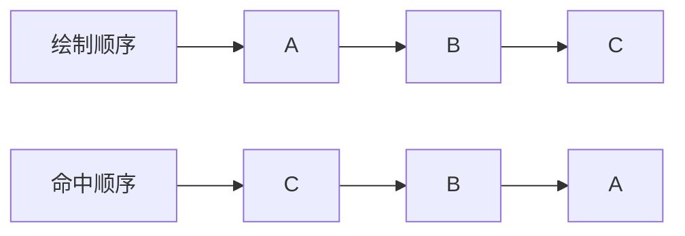
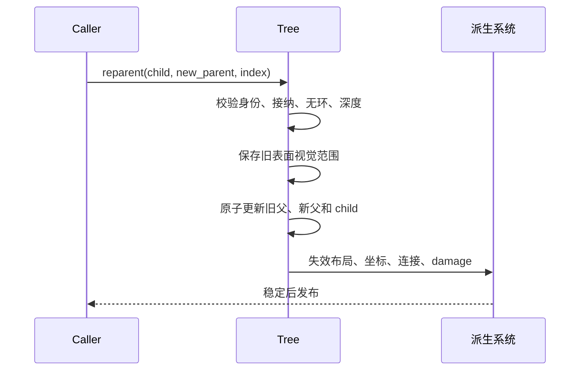

# 4. Figure 树与组合语义

> **本章解决的问题**：为什么绘制、命中、坐标和生命周期必须共享同一棵 Figure 树，
> 以及结构变化怎样才能原子发布？

Figure 树不是一个用于整理对象的普通容器。父子关系同时定义所有权、叠放、坐标传播、
布局范围和事件查找。只要其中一个算法读取了另一份结构，就可能出现“看得到但点不到”
或“已经删除却仍能收到输入”的矛盾。

核心结论是：

> 共享同一棵树不是实现便利，而是绘制、交互和几何结果一致的前提。

## 4.1 三个相互独立的职责

一个 Figure 节点可以拆成三类对象：

```text
FigureTree  - 拥有节点、父子拓扑和顺序
FigureNode  - 保存通用节点状态
Figure      - 实现具体图形行为
```

`FigureTree` 回答“谁是谁的子节点”。`FigureNode` 保存 bounds、可见性、样式引用、
失效标记等通用状态。具体 `Figure` 回答如何绘制自身、测量内容或执行类型特定命中。

分离的原因不是追求抽象，而是三者变化频率不同：

- 新增 Figure 类型不应改变树容器；
- 增加通用节点状态不应修改每个 Figure；
- 换父和重排不应依赖具体图形实现。

## 4.2 树的不变量

任何已发布 Figure 树都必须满足：

1. 一个节点至多有一个父级；
2. 父级的 children 与子节点的 parent 双向一致；
3. 从任意节点沿 parent 不能形成环；
4. children 顺序是稳定且唯一的；
5. 所有 ID 都属于同一 Runtime；
6. 深度不超过框架允许的上限；
7. 根节点没有普通父级；
8. detached 节点不出现在已发布拓扑中。

这些条件必须在结构发布前整体成立。不能先写 parent，再稍后补 children，因为绘制或
命中可能在中间读到不一致状态。

## 4.3 Children 顺序的多重含义

假设父节点的 children 为 `[A, B, C]`。通常：

- 绘制按 A、B、C 进行，后绘制的 C 位于上方；
- 命中按 C、B、A 检查，优先返回最上层目标；
- 布局按稳定顺序读取约束；
- 键盘遍历和辅助功能可基于同一逻辑顺序；
- 同级重排改变视觉叠放，也可能改变事件目标。



因此，Z-order 不是渲染器私有排序字段。若渲染器和命中系统分别排序，两者迟早漂移。

## 4.4 容器接纳规则

不是每个容器都应接受任意子节点。接纳规则可以约束：

- 是否允许添加子节点；
- 允许的子节点角色；
- 最大数量；
- 是否要求布局约束；
- 是否允许连接或反馈进入该层；
- 子节点是否跨越坐标根。

接纳规则只判断候选结构是否合法，不直接改树。结构事务应先收集所有判断，再统一提交。

接纳规则也不能依赖尚未发布的副作用。例如“先插入，再调用父级看看是否接受”会让
拒绝路径承担复杂回滚。

## 4.5 添加节点

添加 detached 节点的完整流程是：

1. 确认父级存在且属于当前 Runtime；
2. 验证 detached 对象内部构造完整；
3. 检查父级接纳规则和插入索引；
4. 计算新深度并验证整个子树深度；
5. 为子树分配运行时身份；
6. 建立 parent 和 children 双向关系；
7. 注册能力与必要索引；
8. 使父级布局和相关派生状态失效；
9. 在稳定化后发布新增结果。

步骤 1 至 4 是 prepare/validate，步骤 5 至 8 是原子 commit。任何前置检查失败，原树
保持不变。

## 4.6 换父

换父不是“删除后再添加”两个可观察操作，而是一个结构事务：



无环检查必须确认新父不在 child 子树内。深度检查必须覆盖整棵移动子树，而不是只看
child 自身。

换父还会改变坐标解释。即使 child 的本地 bounds 数值不变，它的表面位置也可能变化，
因此旧新表面视觉范围都要进入 damage。

## 4.7 同父重排

同一父级内改变 child 索引不会改变所有权，却会改变叠放和命中。重排需要：

- 保持 child 集合不变；
- 原子替换顺序；
- damage 至少覆盖受影响节点的重叠视觉范围；
- 取消或重新判断依赖“最上层目标”的 hover；
- 保持选中对象身份不变。

只更新渲染顺序而不更新命中顺序，会让视觉最上方对象无法获得输入。

## 4.8 移除与销毁

**移除**表示节点离开当前父级，但可能继续以 detached 形式存在。**销毁**表示身份和
对象生命周期结束。二者不能混为一谈。

移除前要明确：

- 子树是否允许重新挂载；
- 运行时 ID 是否继续有效；
- 已注册能力和资源由谁持有；
- 输入捕获和焦点是否必须取消。

一个更简单且安全的合同是：离开 Runtime 即结束运行时身份，重新挂载获得新 ID。这样
旧关系不会跨挂载周期复活。

销毁子树时需要按顺序：

1. 收集子树和旧视觉范围；
2. 终止指向子树的交互会话；
3. 解除连接、选择和反馈关系；
4. 从拓扑中原子移除；
5. 失效父级布局与容器范围；
6. 释放能力、缓存和资源引用；
7. 递增代际并使旧 ID 失效；
8. 稳定化并发布。

## 4.9 生命周期不等于拓扑

树表达“当前挂在哪里”，生命周期表达“对象处于哪个阶段”。两者相关但不同：

- detached 对象存在，但不在树中；
- attached 节点在树中且受 Runtime 驱动；
- 一个已从父级逻辑移除的节点，可能仍等待事务结束后销毁；
- 后端资源可能在 Figure 销毁后等待 GPU 完成才能释放。

因此，不能用 `parent == None` 推断对象一定是根，也不能推断它已经销毁。

## 4.10 复合 Figure

复合 Figure 通过普通父子关系组合内容。例如带图标和文字的节点，可以包含背景、
图标和标签。它不需要建立第二种私有子树。

统一树带来的好处是：

- 子元素自然参与布局和坐标；
- 绘制与命中顺序一致；
- 子元素可以独立失效；
- 容器可以选择是否把事件目标折叠到复合根。

“事件目标折叠”是命中策略，不应通过隐藏真实拓扑实现。

## 4.11 图层仍是 Figure

内容层、连接层、反馈层和手柄层可以具有不同语义，但仍是同一树中的容器节点：

```text
Root
├── ContentLayer
├── ConnectionLayer
├── FeedbackLayer
└── HandleLayer
```

图层提供稳定叠放位置、可见性策略和特定接纳规则。它不是绕开树的平行渲染列表。连接
和反馈仍通过普通坐标链投影到表面。

## 4.12 遍历快照与结构变更

绘制、命中或布局遍历期间，扩展回调不能立即改变当前树。否则会出现：

- child 被跳过或重复访问；
- 当前索引失效；
- 父链在坐标转换中途变化；
- Rust 借用边界被迫扩大到不安全内部可变性。

可行模式是效果排队：

```text
遍历稳定快照
-> 回调产生 TreeEffect
-> 当前遍历结束
-> Runtime 合并和验证 effects
-> 下一事务提交结构变化
```

效果队列保存拥有数据和 ID，不保存当前节点引用。

## 4.13 深度与复杂度

树操作需要显式复杂度合同：

- 查询直接父子：通常为 O(1)；
- 沿祖先链转换坐标：O(depth)；
- 子树绘制或销毁：O(subtree size)；
- 无环检查：O(ancestor depth)；
- 更新整棵子树深度：O(subtree size)。

允许深树时，递归算法必须有明确深度上限和故障路径。达到上限应在结构提交前拒绝，
不能在渲染时栈溢出。

## 4.14 结构通知

结构通知必须描述已经完成的变化，而不是邀请观察者参与提交。通知可以包含：

- 事务 revision；
- 被添加、移除或换父的身份；
- 旧父、新父和索引；
- 是否包含整个子树；
- 稳定化 epoch。

观察者收到通知时，查询 Runtime 应得到完整新结构。若需要审计中间计划，应使用独立
诊断记录，不能把中间态伪装成稳定通知。

## 4.15 常见错误设计

### 父级和子级各自维护关系

没有统一事务时，双向关系会短暂或永久不一致。

### 渲染器维护独立 Z-order

命中、键盘顺序和 damage 仍读取树顺序，最终产生不同答案。

### Figure 自己递归绘制 children

具体 Figure 获得了主循环控制权，统一裁剪、状态栈和生命周期无法保证。

### 删除只从 children 列表移除

输入、选择、连接、缓存和旧像素仍引用已删除身份。

### 用隐藏子列表实现复合图形

隐藏结构无法参与统一坐标、命中、失效和诊断。

## 4.16 必须保持的不变量

1. 所有已发布节点形成一棵无环、单父级的有序树；
2. 绘制和命中读取同一 children 顺序，方向互为镜像；
3. 结构事务只发布旧树或新树，不发布中间树；
4. 跨树关系保存 ID，不改变树所有权；
5. 遍历期间的结构效果延迟到安全阶段提交；
6. 删除身份时同步终止关联会话并保留旧 damage。

## 4.17 与后续章节的关系

树定义了坐标传播的路径。下一章将把每条父子边解释为坐标域转换，并证明绘制下降、
命中上升和 damage 投影必须复用同一条链。之后的布局、输入和连接也都以本章的稳定
拓扑为前提。

## 4.18 思考题

1. 为什么同父重排可能要求重新计算 hover？
2. 换父时只保持本地 bounds 不变，为什么不能保证表面位置不变？
3. 一个图层与普通容器的结构共性和语义差异分别是什么？
4. 如果允许遍历回调立即删除当前节点，哪些算法状态会失效？
5. “移除”和“销毁”是否应共享同一个公开操作？需要什么生命周期合同？
