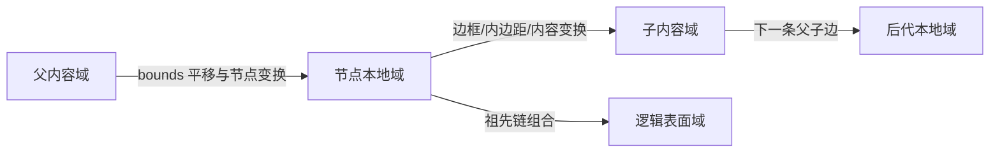

# 5. 几何、坐标域与变换

> **本章解决的问题**：一个点经过嵌套容器、边框、滚动和缩放后，如何保证绘制位置、
> 命中位置与 damage 区域仍然一致？

坐标错误最难发现，因为每个局部公式都可能看起来合理。真正的问题通常是一个模块把
点理解为父坐标，另一个模块把同样的数值理解为节点本地坐标。

核心结论是：

> 坐标不是一对裸数字；每个点和矩形都必须属于明确的坐标域。

## 5.1 五种常用几何

### Bounds

`bounds` 描述节点在**父内容域**中的布局位置和尺寸。它回答父级把节点安排在哪里。

### Local border box

节点进入自身坐标域后，外框通常从局部原点开始：

```text
Rect(0, 0, bounds.width, bounds.height)
```

它与 bounds 尺寸相同，但坐标域不同。

### Client area

client area 是子内容可用区域，通常从 border box 扣除边框和内边距。布局子节点时读取
client area，而不是假设子内容从 `(0, 0)` 开始。

### Visual bounds

visual bounds 覆盖节点真正可能影响的像素，包括描边外扩、阴影、装饰和溢出内容。
它可以大于 border box。

### Projected bounds

projected bounds 是某个本地几何经过祖先变换后，在目标域中的保守轴对齐包围盒。
surface damage 使用的就是投影后的视觉范围。

这五种矩形数值可能相似，但用途不可互换。

## 5.2 四个坐标域

对任一父子边，至少需要区分：

1. **父内容域**：child 的 bounds 所在坐标；
2. **节点本地域**：Figure 绘制自身时使用；
3. **子内容域**：节点为 children 提供的坐标；
4. **逻辑表面域**：平台归一化输入和 damage 使用。



某些 Figure 的本地域与子内容域相同；视口、带内边距容器和坐标根则不同。框架必须允许
这种差异由统一变换链表达。

## 5.3 每条边的变换

从 child 本地到 parent 子内容域的变换可写成：

```text
T_edge = Translate(bounds.x, bounds.y) * T_node
```

若 parent 对子内容施加滚动、缩放或内容偏移，还要组合 parent 的内容变换。完整的
本地到表面变换是沿祖先链累乘：

```text
T_surface_from_local =
    T_root_edge * T_root_content * ... * T_parent_edge * T_parent_content
```

具体采用行向量还是列向量不是重点，重点是整个系统只采用一种约定，并由同一坐标服务
实现组合。

## 5.4 变换不可交换

先平移再缩放，与先缩放再平移结果不同：

```text
Scale(2) * Translate(10) != Translate(10) * Scale(2)
```

前者可能把平移量也放大，后者不会。若视口滚动与缩放次序错误，指针位置和内容会产生
随缩放倍率变化的偏移。

任何手写“先减 scroll，再除 scale”的代码都必须与统一矩阵约定等价。更稳妥的做法是
由坐标查询服务组合正向矩阵，再通过逆矩阵完成命中降域。

## 5.5 一个嵌套场景

考虑以下结构：

```text
Surface
└── Viewport bounds=(20, 30, 400, 300), scroll=(100, 50)
    └── ScalablePane scale=2
        └── Panel bounds=(40, 20, 200, 100), padding=10
            └── Node bounds=(15, 5, 60, 30)
```

Node 局部点 `(x, y)` 投影到表面时，按实际父链依次经过：

1. Node bounds 平移；
2. Panel client-area 偏移；
3. Panel bounds 平移；
4. ScalablePane 缩放；
5. Viewport 内容滚动；
6. Viewport bounds 平移。

这里不能把所有平移简单相加再乘缩放，因为每个量属于不同域。

## 5.6 绘制下降

Renderer 从表面向子树下降：

1. 保存当前 Graphics 状态；
2. 应用当前节点边变换；
3. 应用节点裁剪；
4. 在节点本地域绘制自身；
5. 切换到子内容域；
6. 递归绘制 children；
7. 恢复状态。

Figure 绘制代码只看到稳定本地域，不需要知道祖先滚动和缩放。统一状态栈保证 siblings
不会互相污染变换和裁剪。

## 5.7 命中降域

平台输入首先被归一化到逻辑表面域。命中沿树下降时，对每个候选节点使用正向变换的
逆矩阵，把表面点映射到节点本地：

```text
p_local = inverse(T_surface_from_local) * p_surface
```

然后依次判断：

- 是否被祖先裁剪排除；
- 是否进入节点可命中区域；
- children 是否按逆绘制顺序命中；
- 节点自身是否接受目标。

绘制使用正向链，命中使用同一链的逆变换。这是二者一致的数学基础。

## 5.8 Damage 上投影

节点变化时，Runtime 取得节点本地 visual bounds，沿同一父链投影到表面：

```text
damage_surface = aabb(T_surface_from_local * visual_bounds_local)
```

若 bounds 或祖先变换发生变化，需要分别用旧链和新链计算：

```text
damage = old_projected_visual union new_projected_visual
```

只记录新位置会留下旧像素。只记录 layout bounds 则可能漏掉描边、阴影或连接装饰。

## 5.9 Client area 与子布局

父级把 children 布局在子内容域中。若边框厚 2、padding 为 8，那么 client origin
不是节点本地原点，而是 `(10, 10)`。

布局器输出的 child bounds 应明确属于父内容域。Renderer 进入 child 时再通过父级内容
变换和 child bounds 切换坐标。这样布局器无需知道表面坐标，也不会把边框偏移重复计算。

## 5.10 坐标根

某些节点可以建立新的逻辑坐标根，例如独立画布、嵌套视图或反馈层。坐标根不是切断
数学关系，而是声明：

- 某些查询以这里为边界；
- 本地逻辑单位可能重新定义；
- damage 或输入需要经过显式桥接；
- 跨根引用不能假设共享父内容域。

跨坐标根转换仍应由统一服务完成，不能让调用者拼接两套局部公式。

## 5.11 视口与缩放

滚动可以表示为内容域中的反向平移，缩放可以表示为内容变换。它们应进入普通祖先链：

```text
T_view_content = Translate(-scroll_x, -scroll_y)
T_scale_content = Scale(scale_x, scale_y)
```

这样绘制、命中、连接锚点和反馈都会自然继承同一变换。若视口只在渲染器里特殊处理，
输入和连接仍会读取未滚动坐标。

## 5.12 裁剪

裁剪既是像素约束，也是命中和 damage 的边界信息。

- 绘制时，后代命令与祖先裁剪相交；
- 命中时，点在祖先裁剪外可以提前拒绝；
- damage 可以与表面有效区域相交；
- visual bounds 描述潜在影响，clip 描述实际可见部分。

不能用 bounds 代替 clip。旋转、圆角或自定义路径裁剪可能使实际区域更小，但优化必须
保持保守：宁可多绘制，不可漏绘制。

## 5.13 不可逆变换

scale 为零、矩阵包含非有限数值或行列式接近零时，逆变换不存在或数值不稳定。

框架需要明确策略：

- 构造或提交时拒绝非法变换；
- 不可逆节点不参与命中；
- damage 使用可证明的保守范围，无法证明时提升为更大范围；
- 不能在热路径中静默产生 NaN 并继续传播。

“画不出来”不代表可以忽略，因为旧位置像素仍需要清除。

## 5.14 轴对齐包围盒

旋转矩形投影后通常不再轴对齐。damage 和空间索引常使用其四个角投影后的最小 AABB。
这是保守近似：

```text
projected shape ⊆ projected AABB
```

保守范围可以多覆盖像素，不能少覆盖。描边宽度和滤镜外扩应在正确坐标域加入，不能在
缩放前后重复扩张。

## 5.15 坐标查询为何必须集中

统一坐标服务应回答：

- point/rect 从节点本地到表面；
- 表面到节点本地；
- 两个节点坐标域之间转换；
- local visual bounds 的表面投影；
- 当前变换是否可逆；
- 两节点是否存在可转换关系。

集中不是为了包装矩阵乘法，而是为了统一：

- 父链来源；
- client-area 语义；
- 视口和坐标根；
- 不可逆错误；
- 数值精度与保守取整。

## 5.16 必须保持的不变量

1. 每个几何值都能指出所属坐标域；
2. 绘制、命中和 damage 使用同一父链事实；
3. 变换组合顺序在全系统唯一；
4. 子布局结果属于父内容域；
5. visual bounds 覆盖所有可能像素影响；
6. 不可逆变换不能被命中路径静默接受；
7. 投影包围盒必须保守。

## 5.17 常见错误设计

### 裸 `Point` 在模块间传递

没有域信息，调用者只能靠命名和约定猜测。

### 渲染器单独处理 scroll

画面滚动了，但命中、连接和反馈仍停在旧坐标。

### 用 bounds 作为所有几何

边框、阴影和溢出内容造成 damage 漏算。

### 到处手写坐标加减

每个实现形成不同变换顺序，嵌套缩放后误差暴露。

### 用新位置覆盖旧位置后再算 damage

旧投影链已经丢失，无法清除旧像素。

## 5.18 与后续章节的关系

本章定义了几何事实和坐标链。下一章的布局只在父内容域内产生候选 bounds；第 7 章
利用旧新 visual projection 形成 damage；第 8 章通过逆链执行命中；第 9 章的视口与
连接则复用同一坐标查询。

## 5.19 思考题

1. bounds 与 local border box 数值相似时，为什么仍不能互换？
2. 旋转节点的 visual bounds 应在哪个域中扩张描边？
3. scale 为零的节点如果曾经可见，damage 应如何处理？
4. 为什么连接锚点不应直接返回表面坐标缓存？
5. 一个独立坐标根需要对跨根查询定义哪些失败语义？
