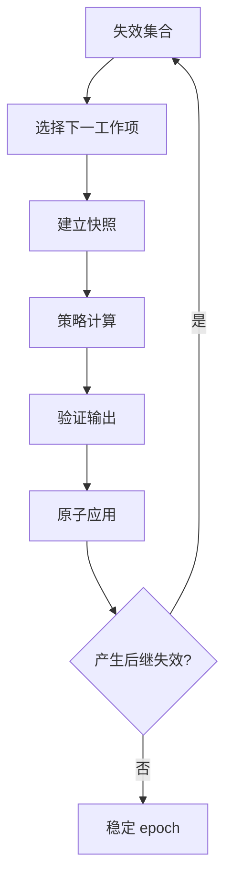

# 6. 测量、布局与稳定化

> **本章解决的问题**：内容、约束和容器相互影响时，怎样从失效状态收敛到一组可绘制、
> 可命中、可发布的稳定几何？

布局不是“调用一次函数给 children 赋 bounds”。文本换行会改变高度，父级宽度会改变
文本换行，子节点移动又会改变自由范围容器的内容范围。布局属于派生状态系统。

核心结论是：

> 布局器计算候选几何，Runtime 验证并提交；稳定化结束前，场景不能对外宣称完成。

## 6.1 测量与排列

**测量**回答：在给定约束下，这个节点希望占多大空间？

**排列**回答：父级最终把每个子节点放在哪里？

两者必须分离，因为同一节点可能在不同宽度提示下得到不同高度；父级也可能在多个子
节点偏好之间分配有限空间。

```text
Measure(child, constraints) -> SizeRange / DesiredSize
Arrange(parent, child measurements, relationship constraints) -> placements
```

Figure 提供自身内容的测量语义，LayoutManager 负责父级对子节点的排列策略。

## 6.2 尺寸约束

一个完整测量请求通常包含：

- 最小宽高；
- 最大宽高；
- 可选精确尺寸；
- 宽度或高度提示；
- 当前样式和内容版本；
- 逻辑单位与文本测量环境。

intrinsic size 是内容在无额外拉伸时的自然尺寸，不等于最终 bounds。最小值限制压缩，
最大值限制扩张，父级约束决定最终选择。

约束必须规范化：最小值不得大于最大值，尺寸必须有限，负尺寸要有统一语义。

## 6.3 布局约束属于父子关系

“在网格第几列”“沿主轴占几份”“锚定父级右边”描述的是 child 在特定 parent 中的
角色。它既不属于 child 的内在属性，也不属于布局器的全局表。

概念上可表示为：

```text
Edge(parent, child) {
    order,
    layout_constraint,
}
```

换父时，旧关系约束不能自动被新父解释。结构事务必须验证或重建约束。

## 6.4 LayoutSnapshot

Runtime 在调用布局器前建立不可变快照：

```rust
struct LayoutSnapshot {
    parent: FigureId,
    parent_client_size: Size,
    children: Vec<ChildLayoutInput>,
    epoch: LayoutEpoch,
}
```

每个 child 输入包含身份、测量结果、可见性和关系约束。快照隔离布局计算与活跃树：

- 布局器无法在计算中改树；
- 输出可以绑定 epoch；
- 测试可以直接构造快照；
- 过期结果可以丢弃。

## 6.5 LayoutOutput

布局器返回拥有数据的候选结果：

```rust
struct LayoutOutput {
    placements: Vec<(FigureId, Rect)>,
    parent_extent: Option<Size>,
    source_epoch: LayoutEpoch,
}
```

Runtime 验证：

- 每个目标确实是当前 child；
- 没有重复或遗漏必需 child；
- bounds 数值有限且满足尺寸合同；
- source epoch 仍匹配；
- 输出没有越权修改其他子树。

通过后才原子应用。

## 6.6 失效传播

变化不会总是导致整棵树重新布局。失效应描述依赖方向。

例如文本变化：

```text
文字内容变化
-> 自身测量失效
-> 父布局失效
-> 自身 bounds 可能变化
-> 后代可用宽度可能变化
-> 连接与 damage 失效
```

样式颜色变化通常只影响绘制，不影响测量。边框厚度变化则同时影响 client area、布局和
visual bounds。失效类型要比一个笼统 `dirty` 标志更精确。

## 6.7 稳定化工作列表

Runtime 使用工作列表处理待计算派生状态：

1. 收集本次 mutation 产生的失效项；
2. 按依赖顺序选择可计算项；
3. 建立稳定输入快照；
4. 调用纯计算策略；
5. 验证并应用结果；
6. 把新产生的后继失效加入队列；
7. 队列为空且无版本漂移时结束 epoch。



稳定化不要求所有算法一次完成，但要求最终达到固定点。

## 6.8 几类布局的共同模型

### 固定坐标

父级尊重 child 提供的位置，只应用约束校验。它仍需要处理 client area、可见性和父级
内容范围。

### 填充布局

父级把可用区域分配给一个或多个 child。测量用于决定父级自然尺寸，排列使用最终尺寸。

### 流式布局

排列依赖可用主轴长度，换行会让宽高相互影响。缓存键必须包含尺寸提示。

### 网格布局

多个 child 共同决定行列尺寸。不能把每个 child 独立布局后简单拼接。

### 自由范围布局

child bounds 可能由外部事实给定，父级派生内容 extent。它看似“不布局”，实际仍维护
容器范围和负坐标策略。

这些算法的差异在快照和计算规则，不在提交协议。

## 6.9 父子测量依赖

典型依赖是自底向上测量、自顶向下排列：

```text
叶节点 intrinsic measure
-> 容器汇总 preferred size
-> 根获得可用尺寸
-> 父级 arrange
-> 子级获得最终约束
```

但文本换行等场景可能需要带宽度提示重新测量。框架应显式表示约束变化，而不是无限
递归“再试一次”。

## 6.10 稳定 epoch

每轮稳定化使用 epoch 标识其输入和发布边界。epoch 完成意味着：

- 所有必需布局工作项已处理；
- 没有待应用的过期输出；
- 连接和容器范围等后继派生状态已闭合；
- 可以计算最终 damage 和生成绘制命令。

epoch 不等于帧号。一次帧准备可能消费多个 mutation 并形成一个稳定 epoch；后端也可能
尚未完成此前帧。

## 6.11 收敛失败

以下情况可能导致不收敛：

- 布局输出每次都改变输入约束；
- 测量包含随机或时变结果；
- 两个容器互相把对方尺寸作为无界依赖；
- 数值误差导致尺寸在两个值之间振荡；
- 扩展在布局回调中继续提交结构变化。

Runtime 需要工作量或迭代上限，并在失败时报告依赖链。不能把最后一次中间结果发布为
“稳定”。

更根本的解决是让算法单调、使用明确固定点规则，或打破循环依赖。

## 6.12 原子应用

布局器返回多个 child placements 时，应整批验证和应用。逐个调用 `set_bounds` 会让
观察者看到部分新布局，也可能重复触发父级失效。

原子应用应：

1. 保存每个受影响节点的旧视觉投影；
2. 更新所有候选 bounds；
3. 合并属性通知；
4. 标记坐标、连接和 damage 后继；
5. 在稳定化完成后统一发布。

移动与 resize 属于一次 bounds 变化，不应拆成互相可见的多个事件。

## 6.13 缓存与重建

测量缓存键至少包含内容版本、样式版本和约束。布局缓存还要包含 child 集合、关系约束
和父级 client size。

缓存命中必须等价于重新计算；缓存缺失只影响性能，不能影响结果。无法说明重建条件的
缓存不应存在。

## 6.14 必须保持的不变量

1. 测量不直接修改场景；
2. 排列输出只作用于快照声明的父子关系；
3. 布局约束属于父子边；
4. 过期 epoch 的结果不得提交；
5. 多 child 布局结果原子应用；
6. 稳定发布前工作列表必须闭合；
7. 收敛失败必须显式暴露。

## 6.15 常见错误设计

### Figure 在 `preferred_size` 中修改自身

查询变成隐式 mutation，测量顺序会改变结果。

### 布局器直接持有 child 可变引用

输出无法整体验证，也无法丢弃过期计算。

### 一个 `dirty` 标记覆盖所有失效

要么过度全量计算，要么漏掉测量、坐标或连接依赖。

### 每改一个 child 都立即发通知

观察者读到半布局状态，且产生通知风暴。

### 达到迭代上限就接受当前值

系统把未证明稳定的几何发布给命中和渲染。

## 6.16 与后续章节的关系

布局稳定化产出最终节点几何。下一章将在稳定 epoch 上计算旧新视觉 damage、录制命令
并构造帧提交。第 9 章的 freeform extent 和连接路由也是同一稳定化系统中的派生工作项。

## 6.17 思考题

1. 为什么文本测量缓存必须包含宽度提示？
2. 换父时，child 的布局约束应自动迁移吗？
3. 一个布局器遗漏了某个 child，Runtime 应如何解释？
4. 哪些样式变化只影响绘制，哪些会继续传播到测量？
5. 如何区分“暂时还有工作项”和“算法永不收敛”？
