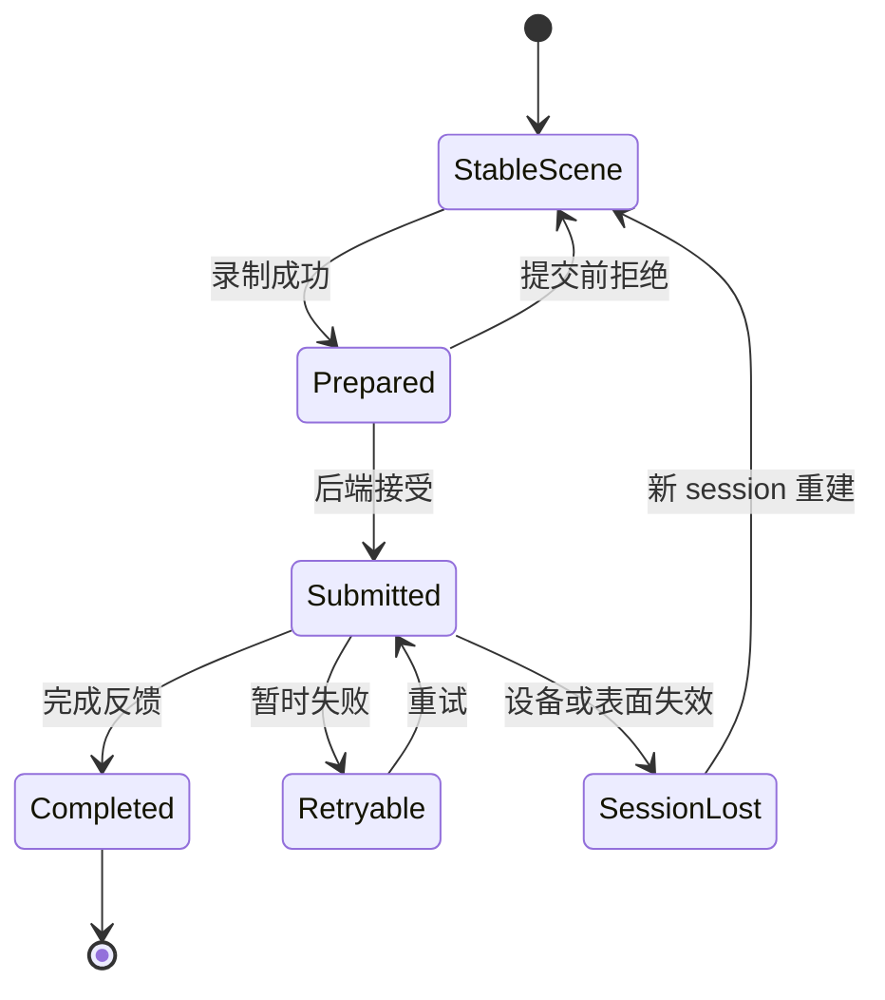

# 7. Damage、绘制与帧提交

> **本章解决的问题**：场景变化后，如何既清除旧像素、生成新内容，又正确管理跨 CPU、
> GPU 和窗口系统的帧生命周期？

绘制正确不等于调用了正确的 path API。节点移动以后，旧位置必须被修复；资源必须属于
当前渲染会话；后端异步完成也不能反向篡改场景。

核心结论是：

> 稳定场景只证明“可以生成这一帧”，后端完成反馈才证明“这一帧的提交生命周期结束”。

## 7.1 Dirty 与 damage

**Dirty** 描述引擎内部哪些事实需要重新计算，例如布局失效、文字排版失效或连接待
路由。

**Damage** 描述逻辑表面上哪些区域的像素可能不再正确。

两者不等价：

- 文本内容变化可能同时产生测量 dirty 和视觉 damage；
- 一个不可见子树可以 dirty，但暂时没有 surface damage；
- 遮挡关系变化可能没有节点几何 dirty，却需要重绘重叠区域。

dirty 驱动稳定化，damage 驱动呈现修复。

## 7.2 旧新视觉范围

节点从 A 移到 B 时，正确 damage 是：

```text
damage = old_projected_visual_bounds
       union new_projected_visual_bounds
```

旧范围用于清除残留像素，新范围用于绘制新内容。visual bounds 必须包含边框、阴影、
装饰和可能溢出的子内容。

如果祖先滚动、缩放或裁剪变化，旧新投影链也不同。Runtime 必须在覆盖状态前保留旧
投影摘要。

## 7.3 Damage 的保守原则

damage 是正确性边界，允许多报，不允许漏报：

```text
所有可能变化的像素 ⊆ damage
```

区域合并可以降低提交数量，但不能通过过度细碎的几何优化冒险漏像素。复杂滤镜或无法
精确界定的效果，应提升到可证明的祖先范围，必要时使用整表面 damage。

全量 damage 是合法降级策略，但不能掩盖场景状态不一致。

## 7.4 稳定场景前不能录制

绘制命令必须读取同一稳定 epoch。若布局只更新了一半，录制结果可能同时包含旧连接和
新节点位置。

帧准备顺序是：

```text
接受 mutation
-> 收敛布局和派生状态
-> 冻结本次稳定场景视图
-> 汇总 damage
-> 录制绘制命令
-> 封装提交
```

“冻结”不一定复制整棵树，但必须保证录制期间结构和相关状态不会被重入修改。

## 7.5 递归绘制

Renderer 按 Figure 树递归执行：

1. 检查可见性和 damage 相交；
2. 保存 Graphics 状态；
3. 应用节点变换；
4. 应用节点裁剪；
5. 绘制节点背景、边框和自身内容；
6. 切换到子内容域；
7. 按 children 顺序绘制；
8. 绘制节点前景或装饰；
9. 恢复 Graphics 状态。

具体阶段可按协议调整，但遍历、状态恢复和 Z-order 必须由统一 Renderer 管理。

## 7.6 Graphics 是命令录制接口

Graphics 提供后端中立的绘制语义：

- 保存与恢复状态；
- 变换和裁剪；
- 填充与描边；
- 图像和文字；
- 透明度与合成；
- 字体指标和测量所需的统一入口。

Figure 调用 Graphics 录制命令，不直接访问 GPU 对象。这样 Figure 行为可以在不同后端
复用，命令也可以被测试、诊断或离线检查。

Graphics 不是场景查询接口。绘制回调不应通过它修改 Figure 树。

## 7.7 状态栈

每个节点进入时保存状态，退出时恢复。否则一个 child 的 transform、clip 或 opacity
会泄漏到 sibling。

状态栈必须满足：

- push/pop 平衡；
- 失败路径也能恢复；
- clip 只会进一步约束当前范围；
- 当前变换与坐标服务约定一致；
- 命令录制结束时回到初始深度。

不平衡应在提交前被诊断为录制错误，而不是交给后端猜测。

## 7.8 RenderSubmission

一次提交至少包含：

```text
RenderSubmission {
    session_id,
    frame_id,
    stable_epoch,
    damage,
    commands,
    resource_delta,
}
```

- `session_id` 区分表面重建前后的资源宇宙；
- `frame_id` 在 session 内单调标识提交；
- `stable_epoch` 关联场景稳定状态；
- `damage` 指示需要修复的表面区域；
- `commands` 是后端中立绘制记录；
- `resource_delta` 声明本帧新增、更新或释放的资源。

后端只消费提交，不获得 Runtime 所有权。

## 7.9 Session 与 Frame

窗口表面重建、设备丢失或后端切换可能开启新 session。旧 session 的迟到完成不能被
当成新 session 当前帧的结果。

```text
(session 4, frame 120) != (session 5, frame 120)
```

frame identity 也用于：

- 对齐资源使用期；
- 忽略重复完成；
- 记录丢帧和重试；
- 关联截图与诊断证据。

身份必须由 Runtime 或呈现协调器分配，不能由后端自行推测。

## 7.10 资源增量

字体、图像和 glyph 轮廓等资源可能跨帧复用。资源管理需要区分：

- 场景引用仍存在；
- 某帧命令仍引用资源；
- GPU 是否完成该帧；
- 新 session 是否需要重新上传。

Figure 销毁不意味着 GPU 资源可以立即释放。资源生命周期通常要等待所有引用帧完成。
反过来，后端缓存也不能成为文字或图像语义的权威来源。

## 7.11 提交状态机



场景稳定和后端完成是两个不同事实。后端失败通常不应回滚业务模型或 Figure 树，而应
重建呈现 session 或重新提交。

## 7.12 完整案例：移动带边框节点

节点原本在 A，具有向外扩张 2 像素的边框，现移动到 B。

1. Runtime 在 mutation 前读取 A 的旧 visual projection；
2. 原子更新 bounds；
3. 布局、连接和相关容器进入失效集合；
4. 稳定化得到最终 B 和新连接路径；
5. Runtime 计算 A 外扩范围与 B 外扩范围的 union；
6. Renderer 以该 damage 为裁剪提示遍历稳定树；
7. 背景或下层内容先修复 A；
8. 节点及其边框在 B 录制；
9. 命令、资源和 damage 封装为新 frame；
10. 后端接受提交；
11. 完成反馈到达后，frame 资源引用才可释放。

如果 B 被其他节点遮挡，damage 仍需覆盖 A；如果节点移动到表面外，旧 A 仍必须修复。

## 7.13 后端边界

后端可以：

- 校验或降低 Render IR；
- 管理设备资源；
- 执行局部或全量呈现；
- 返回完成、可重试失败或 session 丢失。

后端不能：

- 修改 Figure bounds；
- 决定业务模型状态；
- 改写 damage 的场景语义；
- 因为优化方便而重排有可见语义的命令；
- 把后端专有类型暴露回 Core 公共协议。

## 7.14 部分重绘与完整场景

damage 可以限制需要修复的区域，但命令生成仍应保持完整场景语义。实现可以裁剪遍历，
也可以录制完整命令后由后端裁剪，只要结果等价。

局部重绘最危险的假设是“只画发生变化的节点”。旧区域需要重建其下方所有内容，透明、
裁剪和叠放也可能要求绘制未变化对象。

## 7.15 失败与恢复

### 录制失败

尚未提交后端。场景仍稳定，但本帧未生成。错误应携带失败节点或资源上下文。

### 后端拒绝

若提交未被接受，可以保留 damage 并重试或扩大为全量重绘。

### 完成未知

不能假设帧未执行。资源不得提前复用或释放，通常需要重建 session 边界。

### 设备丢失

场景事实保持，后端资源失效。新 session 从稳定场景和源资源重建，而不是让后端恢复
Figure 树。

## 7.16 必须保持的不变量

1. 最终命令只读取稳定场景；
2. damage 保守覆盖所有旧新像素影响；
3. 绘制顺序来自 Figure 树；
4. Graphics 状态栈在任何路径都平衡；
5. 资源与 session/frame identity 绑定；
6. 后端结果不反向成为场景事实；
7. 完成未知时不提前回收相关资源。

## 7.17 常见错误设计

### 只 damage 新 bounds

旧位置留下残影。

### Figure 直接调用后端

后端类型穿透 Core，命令无法统一验证或回放。

### 绘制中修改 Figure

录制读取的快照不再稳定，后续节点看到不同 epoch。

### 后端失败就回滚模型

把呈现故障错误地升级为业务事务失败。

### 以“变化节点列表”代替 damage

透明和叠放要求重建区域内容，不等于重画变化对象。

## 7.18 与后续章节的关系

本章从稳定场景走到像素提交。下一章从平台事件反向进入场景，通过同一树顺序和坐标链
决定目标。第 9 章会展示视口和连接变化如何同时产生派生几何与 damage。

## 7.19 思考题

1. 为什么 dirty 集合不能直接作为后端的 damage？
2. 节点完全移出视口后，为什么仍可能需要一帧提交？
3. 后端已经接受但没有返回完成时，资源可以释放吗？
4. 局部重绘为什么不能只录制发生变化的 Figure？
5. stable epoch、frame ID 和 session ID 分别解决什么问题？
