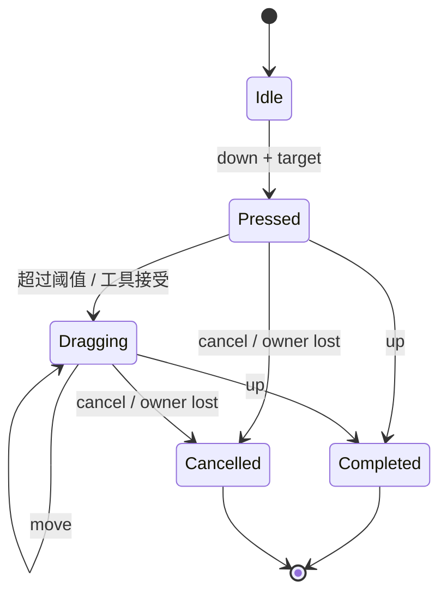

# 8. 命中、输入与交互状态

> **本章解决的问题**：平台产生的离散事件，怎样被解释成具有稳定目标、捕获规则和取消
> 语义的交互会话？

一次拖拽由多个事件组成。按下时命中的对象可能在移动中离开指针，视口可能滚动，目标
甚至可能被删除。如果每个事件都重新独立判断，用户感知到的手势就会断裂。

核心结论是：

> 单次事件没有完整交互语义；交互必须由持有明确身份和取消路径的状态机解释。

## 8.1 平台输入归一化

平台适配层把设备事件转换为 Core 可解释的逻辑事件：

```text
PointerEvent {
    pointer_id,
    phase,
    surface_position,
    buttons,
    modifiers,
    timestamp,
}
```

归一化负责：

- 物理像素到逻辑表面单位；
- 鼠标、触控笔和触摸的统一身份；
- 按键与修饰键语义；
- 窗口焦点和取消事件；
- 文本输入与键盘按键分离。

平台层不执行 Figure 命中，也不决定 Editor 意图。

## 8.2 命中顺序

命中使用绘制顺序的镜像：

1. 从根开始检查祖先可见性和裁剪；
2. 把表面点转换到当前节点本地；
3. 按 children 逆序检查；
4. 若没有 child 成为目标，再判断节点自身；
5. 根据事件接纳规则形成目标路径。

最晚绘制的可命中对象应最先获得机会。命中必须读取稳定树和同一坐标链。

## 8.3 几何命中与事件目标

“几何上包含该点”不一定等于“成为事件目标”。

容器可能：

- 允许 child 成为目标；
- 把 child 命中折叠为容器目标；
- 自身透明但 children 可命中；
- 只接受某类 pointer；
- 因禁用状态拒绝交互。

因此，命中结果通常包含路径和局部坐标，而不是只有一个 ID：

```text
HitPath = root -> ... -> geometric_hit -> event_target
```

路径可用于捕获、冒泡或诊断，但事件分发策略必须统一。

## 8.4 Hover

hover 表示当前无捕获条件下，指针位于哪个目标路径上。pointer move 时：

1. 计算新 hit path；
2. 求旧路径和新路径的最长公共前缀；
3. 对离开的后缀生成 leave；
4. 对进入的后缀生成 enter；
5. 对最终目标生成 move；
6. 回调效果在分发结束后统一提交。

对象销毁、隐藏、裁剪变化或视口滚动也可能改变 hover，即使物理指针没有移动。

## 8.5 Pointer capture

capture 把后续 pointer 事件锁定到手势所有者。它解决拖拽中指针离开目标或窗口边界的
问题。

capture 具有：

- pointer identity；
- owner identity；
- 建立时的 session/version；
- 明确释放和取消条件。

捕获目标被销毁、窗口失焦、平台发送 cancel 或设备序列中断时，状态机必须终止会话。
不能把后续事件重新命中给另一个对象并继续原手势。

## 8.6 Focus

focus 表示键盘和文本输入的逻辑接收者。它不同于 hover 和 capture：

- hover 随指针位置变化；
- capture 属于一个 pointer 会话；
- focus 可以跨多个事件长期保持；
- 文本输入通常依赖 focus，但不是 key event 的字符拼接。

删除或禁用 focus owner 时，需要按协议转移或清空焦点，并终止相关文本组合。

## 8.7 手势状态机

一个基本 pointer 手势可表示为：



状态保存按下目标、初始坐标、当前 pointer、capture owner 和输入 revision。它不能只靠
“当前鼠标是否按下”推断。

## 8.8 Down、Move、Up

### Pointer down

1. 归一化到逻辑表面事件；
2. 在稳定场景中命中；
3. 分发给 Core Figure 能力；
4. 收集 capture、focus 或消费效果；
5. 若未被 Core 消费，交给 Editor Tool；
6. 建立会话并锁定目标身份。

### Pointer move

1. 若存在 capture，优先路由给 capture owner；
2. 否则重新计算 hover；
3. 将表面点转换为会话需要的坐标域；
4. 状态机产生预览或其他效果；
5. 分发结束后统一应用效果。

### Pointer up

1. 发送给当前 capture owner 或命中目标；
2. 状态机决定完成或拒绝；
3. Editor 可生成最终命令；
4. 清理 capture 和临时反馈；
5. 重新计算 hover。

顺序很重要：如果先释放 capture 再路由 up，目标可能错误地变成指针下方的另一个对象。

## 8.9 Cancel 不是 Up

cancel 表示不能再把当前会话解释为成功完成。原因包括：

- 平台取消触摸序列；
- 窗口失去焦点；
- capture owner 被删除；
- 工具切换；
- 模型 revision 使目标语义失效；
- Runtime 进入故障状态。

取消应清理反馈、捕获和临时资源，但不执行最终业务命令。把 cancel 当作 up 会在用户
未确认时提交修改。

## 8.10 回调效果队列

事件回调可能请求：

- 设置或释放 capture；
- 请求 focus；
- 改变 cursor；
- 提交组件更新；
- 触发 Editor 请求；
- 请求重绘。

这些请求应作为 `InputEffect` 收集，而不是在遍历和分发中立即执行：

```text
冻结目标路径
-> 调用处理器并收集 effects
-> 完成当前分发
-> 合并冲突效果
-> 验证目标仍有效
-> Runtime 提交
```

这避免回调删除当前节点、改变父链或重入第二次分发。

## 8.11 Core 与 Editor 的仲裁

Core Figure 可能拥有自身交互，例如滚动条、文本选择或内嵌控件。Editor Tool 则处理
业务编辑，如移动节点和创建连接。

仲裁需要显式结果：

```text
Consumed        - Core 已处理，不进入 Tool
Propagate       - Core 未处理，可交给 Tool
Captured        - Core 建立会话
Rejected        - 目标存在但当前不接受
```

“回调是否返回 true”不足以表达捕获、取消和后续事件归属。

## 8.12 键盘、文本与 IME

键盘事件描述物理或逻辑按键，文本事件描述用户输入的字符，IME 描述组合中的临时文本。
三者不能合并。

一个中文输入过程可能是：

1. focus owner 开始 composition；
2. 多次 preedit 更新临时字符串和选区；
3. 用户确认 composition；
4. 平台发送最终 commit text；
5. 编辑器生成一次文本模型命令。

按键事件可以用于快捷键，但不能通过 key code 自行拼接最终文本。迟到的 preedit 若
session 或 focus 已变化，必须拒绝。

## 8.13 坐标与滚动

手势期间视口可能自动滚动。状态机应保留逻辑来源和当前表面 pointer，每次更新通过
最新坐标链重新求目标域位置。

若只累加 pointer delta，滚动造成的内容位移不会进入计算，反馈会与指针分离。相对量
也必须注明在哪个坐标域中计算。

## 8.14 对象销毁

当 hover、capture 或 focus owner 被销毁：

1. Runtime 在身份失效前识别关联会话；
2. 向状态机发送明确取消原因；
3. 清除反馈和平台 capture；
4. 使旧视觉区域进入 damage；
5. 代际 ID 失效；
6. 后续迟到事件被拒绝。

不能依赖下一次事件查询失败后“顺便清理”，因为平台和视觉状态可能已经泄漏。

## 8.15 多指针

每个 pointer 拥有独立 hover/capture/gesture 状态。全局只有一个 `dragging` 布尔值无法
表达多点触控或鼠标与触控笔并存。

需要全局仲裁的手势，例如双指缩放，可以由 gesture recognizer 显式接管多个 pointer，
并取消它们原有的单指候选会话。

## 8.16 必须保持的不变量

1. 所有 pointer 坐标先归一化到逻辑表面域；
2. 命中顺序与绘制顺序互为镜像；
3. 手势目标由稳定身份锁定；
4. capture、focus 和 hover 是不同状态；
5. 回调副作用在分发结束后提交；
6. cancel 不产生最终业务命令；
7. 迟到事件不能作用于新 session 或复用身份。

## 8.17 常见错误设计

### 每个 move 都重新选择拖拽目标

指针离开原对象后手势跳到别的节点。

### Figure 回调直接删除自己

当前目标路径和遍历借用立即失效。

### 用 key down 生成文字

无法正确处理输入法、组合文本和平台键盘布局。

### 只有全局 hover 和 dragging

多指针、嵌套控件和捕获语义无法表达。

### 把 cancel 当作 up

窗口失焦或目标销毁时错误提交业务修改。

## 8.18 与后续章节的关系

本章建立了 Core 输入会话。第 9 章会说明视口滚动和跨节点连接如何影响同一会话的坐标
与反馈；第 11 章则把未被 Core 消费的输入进一步解释为 Request、Policy 和 Command。

## 8.19 思考题

1. 为什么 hover 在指针不动时也可能变化？
2. pointer up 路由前为什么不能先释放 capture？
3. Figure 销毁时，输入会话应在哪个时刻取消？
4. 自动滚动期间为何不能只使用累计 pointer delta？
5. IME preedit 和最终文本命令分别属于哪类状态？
