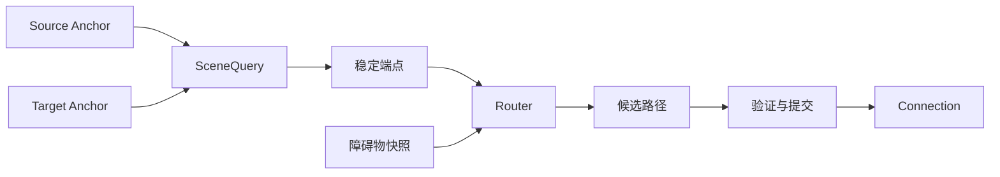

# 9. 图层、视口与连接

> **本章解决的问题**：当一个结果依赖多个节点、祖先变换或可见范围时，如何追踪来源、
> 安排重算，并避免缓存脱离场景事实？

图层、视口和连接看起来是独立功能。它们的共同点是：结果不能只由当前节点自身决定，
而要读取其他节点或祖先状态，因此必须成为可追踪的派生系统。

核心结论是：

> 跨节点能力不应缓存未知来源的几何；它们必须通过可追踪查询读取稳定场景，并在依赖
> 变化后重新计算。

## 9.1 语义图层

图层是具有稳定角色的普通容器：

- 内容层保存业务视觉；
- 连接层保存跨节点连线；
- 反馈层保存手势预览；
- 手柄层保存选中装饰；
- 辅助层保存网格或参考线。

图层仍服从 Figure 树、坐标链、裁剪和生命周期。它的特殊性来自接纳规则、叠放位置和
更新策略，不来自一套平行渲染系统。

## 9.2 为什么反馈单独成层

反馈是交互临时状态，不应写入业务 Figure。单独反馈层可以：

- 保证预览位于内容之上；
- 在取消时整体清理；
- 使用表面或内容坐标投影；
- 独立产生 damage；
- 不改变业务模型和稳定投影。

反馈层仍应由 Viewer 或 Runtime 拥有，Tool 只提交反馈描述。

## 9.3 Freeform 内容范围

自由画布的内容范围通常由 children 的投影范围并集得到：

```text
content_extent =
    union(project_to_container(child.visual_bounds))
    expanded_by(margin)
```

它是派生状态，不是由每个 child 增量写入的全局矩形。删除、移动和缩小 child 都可能
让范围缩小，因此只做“向外扩展”会永久积累旧区域。

正确实现可以增量维护索引，但语义必须等价于对当前稳定 children 重新求并集。

## 9.4 Range model

视口通常使用 range model 表示一维滚动状态：

```text
minimum
maximum
extent
value
```

它必须满足：

```text
minimum <= value
value + extent <= maximum
extent >= 0
```

当内容范围、视口尺寸或缩放变化时，旧 value 可能不再合法。Runtime 应在同一事务中
归一化，而不是让滚动条和内容分别修正。

## 9.5 Viewport 与 ScrollPane

Viewport 负责裁剪和内容偏移；ScrollPane 负责组合 viewport、滚动条和交互策略。二者
不应混成一个拥有所有行为的巨大 Figure。

Viewport 的滚动值进入子内容变换。ScrollPane 监听范围变化并更新控制部件。滚动条
修改 range model，再由统一视口路径改变投影。

这样程序滚动、滚轮、拖动滚动条和自动暴露共享同一事实。

## 9.6 Scalable pane

缩放容器对内容施加比例变换。缩放会影响：

- 内容到表面的投影；
- 可见内容范围；
- 指针降域；
- 连接与反馈位置；
- damage 的表面覆盖。

缩放不应直接重写每个 child 的业务 bounds。业务逻辑坐标保持稳定，比例进入祖先
变换链。

## 9.7 自动暴露

拖拽接近视口边缘时，Editor 可能请求自动滚动。每个 tick：

1. 根据表面 pointer 与 viewport 边缘计算滚动意图；
2. Range model 归一化新 value；
3. Viewport 内容变换更新；
4. 当前手势用同一表面 pointer 重新计算内容位置；
5. 反馈和目标命中重新投影；
6. damage 覆盖旧新反馈区域。

不能先按旧坐标更新反馈，再异步滚动，否则预览会跳动。

## 9.8 Connection 的四个角色

连接能力可拆为：

### Anchor

根据一个拥有者和查询上下文计算端点。Anchor 描述“端点如何依附”，不拥有目标 Figure。

### SceneQuery

提供受限、可追踪的场景查询，如 bounds、坐标转换和可见性。查询结果关联身份与版本。

### Router

根据端点、约束和障碍物计算候选路径。Router 是纯计算策略。

### Connection

保存端点描述、路由策略和当前派生路径，并作为 Figure 绘制。



## 9.9 依赖追踪

SceneQuery 在计算端点时同时记录依赖：

- source owner identity；
- target owner identity；
- 相关祖先坐标版本；
- 可选障碍物集合版本；
- router 配置版本。

节点移动、换父、缩放、隐藏或销毁时，Runtime 根据依赖使对应连接失效。连接不需要
订阅所有 Figure 的泛化通知。

依赖必须来自实际查询或明确声明，不能靠路由器私下保存未知对象引用。

## 9.10 路由稳定化

连接路由进入第 6 章的工作列表：

1. 等待端点节点布局稳定；
2. 通过 SceneQuery 解析 anchors；
3. 构造不可变路由输入；
4. Router 计算候选 path；
5. Runtime 验证有限数值、端点连续性和 source epoch；
6. 原子替换路径；
7. 合并旧新 visual damage；
8. 若路径影响容器范围，继续传播。

连接不能在端点仍布局中时提前发布。

## 9.11 分组路由

某些路由器同时协调多条连接，例如避免重叠或分配公共通道。此时计算单元是 connection
group，而不是单条连接。

分组路由必须定义：

- 分组键；
- 稳定成员顺序；
- 输入 revision；
- 批量输出；
- 一个成员失败时的原子策略。

逐条提交会让后计算连接读取前一条新路径，结果依赖遍历顺序。

## 9.12 自环

source 与 target 指向同一 Figure 时，普通两端点直线路由可能退化为零长度。自环需要
明确语义：

- 两个 anchor 是否允许选择不同侧；
- 最小环绕范围；
- 与节点 visual bounds 的间距；
- 在缩放和旋转下如何投影。

自环仍使用同一 Anchor、SceneQuery 和 Router 协议，不应成为绘制阶段的特判。

## 9.13 Unresolved 状态

端点可能暂时不存在，例如模型连接先于目标投影出现，或目标正在被删除。连接需要显式
状态：

```text
Resolved(path)
Unresolved(reason, dependencies)
Invalid(error)
```

Unresolved 不等于沿用旧路径。框架可以选择隐藏连接、绘制诊断反馈或等待下一 revision，
但必须避免把旧几何误认为当前事实。

## 9.14 三个事件的共同传播

### 节点移动

节点 bounds 变化 -> anchor 依赖失效 -> router 重算 -> connection damage -> 反馈和
手柄重新投影。

### 视口滚动

业务 bounds 不变 -> ancestor transform 变化 -> 可见区域和表面投影变化 -> 连接与反馈
无需改本地路径语义，但需重新生成表面提交。

### 内容缩放

逻辑路径可保持 -> projected visual bounds、描边策略和命中容差重新解释 -> damage
覆盖旧新投影。

这三个事件说明“几何值变化”和“几何投影变化”都可以触发可见结果更新。

## 9.15 图层间坐标

连接层和内容层可能是 siblings。连接锚点不能假设两者共享本地坐标。正确流程是：

```text
source local -> common surface/root -> connection layer local
target local -> common surface/root -> connection layer local
```

统一 SceneQuery 选择公共域并处理坐标根。手写“减去父位置”在嵌套视口和缩放后必然
失效。

## 9.16 必须保持的不变量

1. 图层仍属于统一 Figure 树；
2. freeform extent 等价于当前稳定 children 的范围；
3. range model 始终满足边界约束；
4. 滚动和缩放进入统一坐标链；
5. 跨节点查询记录身份与版本依赖；
6. Router 只返回候选路径，Runtime 提交；
7. unresolved 不复用未经证明的旧几何。

## 9.17 常见错误设计

### 连接缓存端点 Figure 引用

目标删除或换父后引用和坐标上下文失效。

### 滚动直接修改所有 child bounds

业务几何被呈现状态污染，命令和持久化失去稳定含义。

### Freeform 范围只增不减

删除或移回节点后滚动范围永久过大。

### 反馈直接挂在业务节点下

预览改变布局、裁剪或业务层叠放。

### 单条顺序提交分组路由

最终路径依赖遍历顺序，无法确定性回放。

## 9.18 与后续章节的关系

至此，图形核心已经形成从树、坐标、布局、damage、输入到跨节点派生状态的闭环。下一
部分进入 Editor：业务模型如何确定性投影为这些 Figure，以及连续交互如何最终产生
模型命令。

## 9.19 思考题

1. 为什么 freeform extent 不能只在 child 变大时更新？
2. 视口滚动后，连接的逻辑 path 和表面投影分别发生什么变化？
3. SceneQuery 为什么既要返回值，也要记录依赖？
4. 分组路由为何需要批量原子提交？
5. unresolved 连接在什么条件下可以自动恢复？
