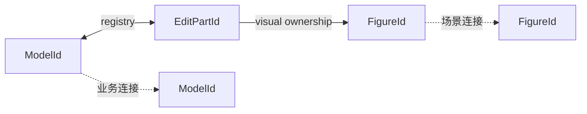

# 10. 模型、EditPart 与确定性投影

> **本章解决的问题**：业务对象如何被稳定地映射成 Figure 树，而不让视图成为第二份
> 模型？

图形编辑器必须允许关闭并重开 Viewer、同时显示多个视图、撤销业务修改和重建渲染
Runtime。若业务事实保存在 Figure 中，这些操作都会改变语义。

核心结论是：

> Viewer 可以被销毁和重建，而业务事实、命令语义和最终投影结果必须保持不变。

## 10.1 模型与 Figure 的不同生命周期

业务模型需要：

- 持久化和序列化；
- 参与命令和撤销；
- 独立于窗口存在；
- 被多个 Viewer 读取；
- 使用领域身份表达关系。

Figure 需要：

- 适应当前视口、主题和 DPI；
- 保存布局与绘制派生状态；
- 参与命中和输入；
- 随 Runtime 创建和销毁。

因此，Figure 是模型在某个 Viewer 中的可交互投影，不是模型本身。

## 10.2 ModelAdapter

Editor 不应假设所有业务模型都使用同一种对象系统。`ModelAdapter` 提供最小稳定读取：

```text
snapshot() -> ModelSnapshot
subscribe(after_revision) -> ordered changes
apply(command) -> new revision
```

快照应提供：

- 稳定 `ModelId`；
- containment 关系；
- connection 关系；
- 创建 Part 所需的领域属性；
- 单调或可比较的 `ModelRevision`。

Adapter 是业务系统与 Editor 的边界，不应把 Figure 或 Runtime 类型写回模型。

## 10.3 EditPart 的职责

EditPart 是控制器，负责：

- 选择适当 Figure 构造；
- 把模型属性刷新到 Figure；
- 建立 child Part；
- 安装编辑 Policy；
- 管理该投影的视觉所有权。

EditPart 不应复制整份业务模型。它可以缓存最近应用 revision 或派生展示值，但模型
变化后应从稳定快照刷新。

## 10.4 三个身份域

Viewer 显式维护映射：



- ModelId 跨 Viewer 稳定；
- EditPartId 只在一个 Viewer 中有效；
- FigureId 只在一个 Runtime 中有效。

视觉事件从 FigureId 找到 Part，再由 Part 找到 ModelId；命令只保存业务身份和值。

## 10.5 Visual ownership

一个 EditPart 可以拥有主 Figure、标签、手柄或连接视觉。Visual ownership 回答：

- 谁负责创建和销毁 Figure；
- Figure 事件映射回哪个 Part；
- Part 删除时清理哪些视觉；
- 哪些临时反馈不属于稳定 Part。

树父级不一定等于视觉所有者。例如连接 Figure 可以挂在连接层，却由 ConnectionPart
拥有。所有权和拓扑必须分别记录。

## 10.6 Containment projection

业务 containment 决定 Part 树的主要结构。投影过程：

1. 从模型快照读取根身份；
2. 为每个模型对象选择 Part 类型；
3. 建立 ModelId 到 EditPartId 映射；
4. 按稳定业务顺序规划 child Part；
5. 为 Part 创建或复用 Figure；
6. 把 Figure 挂到目标图层或父 Figure；
7. 刷新属性；
8. 发布完整 Viewer revision。

Part 树与 Figure 树通常相关，但不要求完全同构。图层、装饰和连接会引入额外 Figure。

## 10.7 Connection projection

业务连接通常引用 source/target ModelId。Viewer 只有在端点 Part 可解析后，才能建立
连接投影。

过程是：

1. 读取连接模型及端点身份；
2. 解析 source/target Part；
3. 选择 anchor 描述；
4. 创建 ConnectionPart 和 Figure；
5. 挂到连接层；
6. 注册端点依赖；
7. 由 Core 稳定化路径。

端点暂时缺失时，投影应进入显式 pending/unresolved，而不是把任意现有 Figure 当作
端点。

## 10.8 稳定快照

投影必须基于单一 model revision。若读取 children 后模型又变化，再读取连接会得到
混合快照。

ModelAdapter 应提供：

- 不可变快照；
- 或带 revision 的多次读取，并在结束时验证 revision 未漂移；
- 或能重试的一致读取事务。

Viewer 不能把“每次查询都成功”误认为整体一致。

## 10.9 Plan、Validate、Commit、Publish

投影同样采用四阶段事务。

### Plan

比较当前 Viewer 状态与目标快照，形成操作计划：

- create parts；
- update parts；
- reorder children；
- remove parts；
- create/remove connections；
- restore or clear selection。

Plan 不修改现有 Viewer。

### Validate

检查：

- ModelId 唯一；
- containment 无环；
- Part 类型可创建；
- 视觉父级可接纳；
- connection 端点可解析或允许 pending；
- source revision 仍有效。

### Commit

按能保持引用完整的顺序应用：

1. 创建新 Part 和基础视觉；
2. 建立 containment；
3. 刷新属性；
4. 建立连接；
5. 删除不再存在的连接；
6. 删除旧 Part 和视觉；
7. 修复选择、焦点和工具会话。

具体顺序可以变化，但不能让已发布关系指向未创建或已销毁对象。

### Publish

投影和 Core 场景稳定后，Viewer 发布新 revision、选择变化和可观察事件。

## 10.10 为什么投影要确定

给定同一模型快照、Viewer 配置和主题，投影应得到语义等价结果：

```text
project(snapshot, config) -> equivalent view
```

确定性要求：

- child 顺序有明确来源；
- Part 类型选择不依赖哈希遍历偶然顺序；
- 相同关系不重复创建；
- connection 分组和路由输入稳定；
- ID 分配差异不影响可见语义。

这使重建、测试和回放具有可比较结果。

## 10.11 节点重排

模型只改变同一父级 children 顺序时，Viewer 应：

1. 读取新 revision；
2. 识别身份集合未变；
3. 生成 reorder 计划；
4. 保留 Part 和 Figure 身份；
5. 原子更新 Part 顺序和 Figure Z-order；
6. 重新计算受影响命中与 damage；
7. 发布一个投影 revision。

不应销毁并重建所有节点，否则选择、工具目标和缓存会无谓失效。

## 10.12 删除

删除模型节点时，计划必须同时处理：

- containment descendants；
- 以其为端点的连接；
- Viewer 选择；
- 活跃 Tool 会话；
- Part registry；
- Figure visual ownership；
- Core 输入和 damage。

模型通知只描述业务事实，Viewer 负责把影响扩展到当前投影。删除不能依赖各 Part 收到
无序回调后自行清理。

## 10.13 撤销和重建

撤销恢复模型 revision 后，Viewer 从模型事实重新投影。旧 FigureId 不需要恢复；需要
恢复的是业务语义：

- 同一 ModelId 再次出现；
- 属性和 containment 恢复；
- 连接端点恢复；
- 可选地按 ModelId 恢复选择。

因此，Command 绝不能保存 FigureId 作为业务目标。

## 10.14 Revision 连续性

增量通知应声明前后 revision：

```text
ChangeBatch { from_revision, to_revision, changes }
```

Viewer 只有在 `from_revision` 等于当前已应用 revision 时才能增量执行。若丢失批次或
顺序不连续，应放弃增量并从新快照重建。

“尽量应用剩余事件”会让 Viewer 永久偏离模型。

## 10.15 重复身份

同一快照中若两个对象声明相同 ModelId，Viewer 无法建立双射。正确结果是拒绝该投影，
保留上一稳定 Viewer 或进入明确故障状态。

自动给其中一个对象换 ID 会篡改业务语义，不能由视图层完成。

## 10.16 读取期间漂移

若 Adapter 不能提供不可变快照，Viewer 应：

1. 读取起始 revision；
2. 收集完整投影输入；
3. 读取结束 revision；
4. 若不一致，丢弃计划并重试；
5. 达到重试预算后报告模型繁忙或一致性失败。

不能把不同 revision 的 containment 和 connection 拼在一起。

## 10.17 多 Viewer

多个 Viewer 可以共享同一模型，但各自拥有：

- Part registry；
- Figure Runtime；
- 选择和工具状态；
- viewport 和主题；
- 投影 revision。

一个 Viewer 的销毁不影响模型，也不使另一个 Viewer 的 Part/Figure ID 失效。模型
Command 完成后，各 Viewer 独立消费同一业务 revision。

## 10.18 必须保持的不变量

1. 模型是业务事实的唯一权威；
2. Viewer 投影基于单一稳定 revision；
3. 每个 Viewer 内 ModelId 到主 Part 唯一；
4. Command 不保存 PartId 或 FigureId；
5. visual ownership 与 Figure 拓扑分别明确；
6. 投影只发布完整新 revision；
7. revision 断裂时重建，不猜测。

## 10.19 常见错误设计

### Figure 直接保存并修改业务对象

多 Viewer 和撤销会产生多个写入路径。

### 每个模型事件立即修改局部视图

事件批次的中间态对外可见，连接可能先于端点创建。

### 用 FigureId 作为命令目标

Viewer 重建后命令历史失效。

### Part 保存完整模型副本

需要双向同步，Part 变成第二份模型。

### revision 断裂仍继续应用

Viewer 无法证明自己对应任何真实模型快照。

## 10.20 与后续章节的关系

本章解释模型如何形成稳定视图。下一章从反方向说明输入如何经 Tool、Request 和 Policy
形成只修改模型的 Command，再由本章的投影闭环返回 Figure。第 12 章则处理 Figure 和
Part 如何通过类型化扩展保持开放。

## 10.21 思考题

1. 为什么 Part 树与 Figure 树不必完全同构？
2. 节点重排时保留 Part/Figure 身份有什么价值？
3. connection 端点缺失时，为什么不能选择“最近的 Figure”代替？
4. 多 Viewer 共享模型时，哪些状态绝不能共享？
5. revision 断裂后全量重建为何比补猜事件更可靠？
