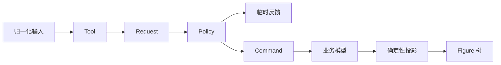

# 11. Tool、Request、Policy 与 Command

> **本章解决的问题**：连续、可取消的平台输入，如何转化为可验证、可撤销的业务模型
> 修改？

拖拽过程包含数十个 move 事件，但用户通常期望一次撤销恢复整个操作。连接预览可以
不断变化，却不能提前创建业务连接。要满足这些要求，输入、意图、反馈和提交必须分层。

核心结论是：

> 输入不是命令，反馈不是模型，Figure 变化也不是业务提交；四者必须由明确协议连接。

## 11.1 四个角色

### Tool

Tool 是手势状态机。它解释事件序列，持有来源目标、初始位置、当前阶段和模型 revision。

### Request

Request 是平台无关的编辑意图，例如“把这些对象移动到候选位置”或“尝试连接到该目标”。
它不包含鼠标按钮等设备细节。

### Policy

Policy 在目标上下文中解释 Request，判断是否允许，生成反馈和候选 Command。它是编辑
规则的扩展点。

### Command

Command 描述对业务模型的最终改变，支持执行、撤销和重做。它不操作 Figure。



## 11.2 Tool 是有版本的状态机

Tool 开始会话时应锁定：

- source Part/Model 身份；
- 起始 model revision；
- pointer 或 focus identity；
- 初始表面位置；
- 当前模式和修饰键语义。

后续事件先验证会话仍有效。模型删除目标、工具切换或 capture 丢失时，应取消，而不是
继续把新事件应用到旧假设。

## 11.3 Request 的设计

好的 Request 表达“想做什么”，而不是“如何修改”：

```text
MoveRequest {
    subjects: [ModelId],
    candidate_delta: Vector,
    phase: Preview | Commit,
}
```

Request 应：

- 使用稳定业务或 Part 身份；
- 明确坐标域；
- 包含解释意图所需上下文；
- 不携带内部可变引用；
- 可在测试中直接构造。

若 Request 直接包含“把 Figure bounds 改成某值”，它已经越过模型和 Policy 边界。

## 11.4 Policy 的职责

Policy 回答：

- 目标是否支持该请求；
- 需要哪些模型对象共同参与；
- 当前约束是否允许；
- 预览应显示什么；
- 提交时贡献什么 Command。

多个 Policy 可以参与同一 Request，但组合规则必须稳定。例如父容器负责接纳，节点
负责移动约束，连接 Policy 负责相关业务关系。

Policy 不应执行 Command，也不应直接持久化模型。

## 11.5 Feedback

Feedback 是对候选结果的临时可视化：

- 移动轮廓；
- 对齐线；
- 连接预览；
- 插入位置；
- 拒绝指示；
- 文本 preedit。

它由 Viewer 的反馈层持有，可在每次 move 后替换，并在完成或取消时清理。Feedback
不是模型，也不应被命令历史记录。

若预览需要计算布局或坐标，应使用稳定场景查询和候选数据，不能先改真实 Figure 再
观察效果。

## 11.6 Command

Command 保存执行和撤销所需的业务身份和值：

```text
MoveNodes {
    nodes,
    before_positions,
    after_positions,
    expected_revision,
}
```

它应满足：

- 只修改模型权威；
- 可判断当前是否可执行；
- 执行后产生明确 revision；
- undo 恢复业务语义；
- redo 重放已确认意图；
- 不保存 Viewer 或 Runtime 私有身份。

Command 不负责刷新 Figure。模型变化发布后，Viewer 走第 10 章的投影流程。

## 11.7 移动案例

### 开始

1. pointer down 命中 Figure；
2. Viewer 解析到 Part 和 ModelId；
3. Tool 锁定选择集合与起始 revision；
4. 建立 capture。

### 预览

1. pointer move 转换为稳定坐标域中的 delta；
2. Tool 构造 `MoveRequest::Preview`；
3. Policy 应用网格、边界和父级规则；
4. 返回候选位置与反馈；
5. Viewer 替换反馈层内容。

### 提交

1. pointer up 形成 `MoveRequest::Commit`；
2. Policy 基于最终模型快照重新验证；
3. 生成一个 Move Command；
4. 清理反馈；
5. CommandStack 执行；
6. Viewer 消费新 revision 并刷新 Figure。

整个拖拽只产生一个业务命令。

## 11.8 创建连接案例

连接工具开始于 source anchor 候选，移动时不断查询 target：

1. down 锁定 source ModelId 和 source role；
2. move 命中候选 target Part；
3. Policy 检查类型、方向、重复连接和业务约束；
4. Feedback 显示 resolved 或 rejected 预览；
5. up 时再次验证 source、target 和 revision；
6. Command 创建业务连接；
7. Viewer 投影新的 ConnectionPart；
8. Core 计算 anchor 和 route。

预览连接可以是 Figure，但它位于反馈层，不是最终业务连接的提前实例。

## 11.9 直接文本编辑案例

文本编辑包含 focus、IME 和业务提交：

1. Tool 进入 direct-edit 会话并锁定 ModelId；
2. 编辑控件维护临时字符串、选区和 preedit；
3. 模型原值保持不变；
4. commit text 更新临时编辑值；
5. 用户确认时 Policy 校验格式和业务规则；
6. 生成 ReplaceText Command；
7. 模型发布新 revision；
8. Viewer 关闭编辑反馈并刷新文本 Figure。

取消只丢弃临时编辑值，不需要执行反向模型命令。

## 11.10 CommandStack

CommandStack 是命令历史的权威，负责：

- 执行；
- undo；
- redo；
- 保存点或 dirty 标记；
- 合并连续兼容命令；
- 阻止重入执行。

栈中保存的是成功提交的命令。prepare 失败或被拒绝的候选不能进入历史。

## 11.11 CompoundCommand

一个业务意图可能包含多个原子子命令，例如移动节点并更新业务容器顺序。

CompoundCommand 需要：

1. 在执行前验证所有子命令；
2. 按稳定顺序执行；
3. 任一失败时按逆序补偿已执行部分，或由模型事务保证原子性；
4. undo 按执行的逆序进行；
5. redo 使用确定的原顺序。

如果无法证明补偿完整，就不应把多个独立副作用包装成“原子命令”。

## 11.12 版本冲突

Tool 开始后模型可能被其他来源修改。提交时应比较起始假设和当前 revision：

- 不相关变化可由 Policy 重新解释；
- 目标属性已改变时可以拒绝或重新计算；
- 目标被删除时取消；
- 不能静默覆盖新事实。

是否允许 rebase 由业务策略决定，但必须显式，不得由 Figure 当前位置猜测。

## 11.13 Selection 与操作对象

选择状态属于 Viewer，不等于模型属性。Tool 可以读取当前 selection 构造多对象请求，
但命令仍保存 ModelId 集合。

模型变化后，Viewer 按身份修复选择：

- 仍存在的对象保持选择；
- 删除对象移出集合；
- 新建对象是否选中由操作结果明确决定；
- 多 Viewer 的选择互不影响。

## 11.14 Policy 组合

当多个 Policy 贡献结果时，需要明确组合代数：

- 全部允许才执行；
- 任一拒绝终止；
- 多个 Command 按稳定顺序组成 CompoundCommand；
- Feedback 按语义层合并；
- 重复目标或冲突修改在 commit 前拒绝。

不能依赖注册顺序偶然决定谁覆盖谁。

## 11.15 取消路径

以下事件都应进入统一 cancel：

- Escape；
- pointer cancel；
- capture owner 丢失；
- Tool 切换；
- Viewer 销毁；
- model target 删除；
- revision 冲突不可重基；
- Runtime fault。

取消过程只清理会话、capture、feedback 和临时资源。若模型命令尚未执行，不能调用
undo 伪装成取消。

## 11.16 测试边界

四层可以分别测试：

- Tool：事件序列到 Request；
- Policy：Request 和快照到反馈/Command；
- Command：模型 before/after/undo/redo；
- Viewer：模型 revision 到 Figure 投影。

端到端测试再验证完整闭环。分层后，核心业务规则不需要窗口或 GPU 才能测试。

## 11.17 必须保持的不变量

1. Tool 锁定稳定目标和会话版本；
2. Request 不携带平台或 Runtime 私有可变状态；
3. Policy 计算候选，不直接提交模型；
4. Feedback 不成为业务事实；
5. Command 只引用业务身份；
6. 历史只记录成功提交；
7. cancel 不产生最终模型变化；
8. Viewer 只通过模型 revision 刷新稳定投影。

## 11.18 常见错误设计

### Tool 直接改 Figure

拖拽完成后模型、撤销和多 Viewer 都无法同步。

### 每个 move 执行一个 Command

命令历史粒度错误，取消和撤销产生大量中间状态。

### Policy 内直接写模型

多个贡献无法整体验证，CommandStack 也无法管理历史。

### Feedback 复用业务 Figure

预览污染稳定场景，取消需要猜测如何恢复。

### Command 保存 EditPart

Viewer 重建后历史失效，也可能意外延长视图生命周期。

## 11.19 与后续章节的关系

Editor 闭环至此完成。下一章讨论这些层中的扩展对象如何分类：哪些属于基础协议，哪些
是可发现 Capability，哪些只是具体 Figure 的共享数据或 typed update。第 13 章再统一
处理命令和 Runtime 事务的失败证据。

## 11.20 思考题

1. 为什么移动预览和最终移动命令可能使用不同的校验时机？
2. Tool 应保存 ModelId、EditPartId 还是 FigureId？答案取决于什么？
3. CompoundCommand 在什么条件下才能声称原子？
4. 直接文本编辑为什么不能每次 preedit 都写模型？
5. 多个 Policy 同时贡献 Command 时，需要定义哪些冲突规则？
