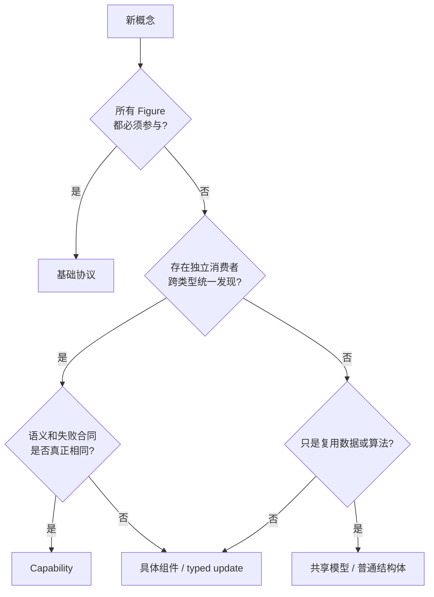

# 12. 类型化 Capability 与组件更新

> **本章解决的问题**：一个新概念应进入基础 Figure 协议、横切 Capability、共享数据
> 模型，还是具体组件更新？

可扩展框架容易走向两个极端：把所有行为塞进一个宽 Figure trait，或把所有对象塞进
动态类型表。前者要求中心接口不断修改，后者丢失类型和语义边界。

核心结论是：

> Capability 用于跨类型发现统一语义；结构体和组件更新用于表达具体类型的数据与变化。

## 12.1 四类扩展对象

### 基础协议

所有 Figure 为参与场景运行必须具备的最小语义，例如绘制自身、基本测量或类型诊断。
基础协议由主循环直接调用。

### 横切 Capability

多个无继承关系的 Figure 可以选择提供，且存在独立消费者需要统一发现和调用的行为。
例如输入处理、连接锚点提供或某类生命周期回调。

### 共享数据模型

多个具体类型复用的数据结构或算法材料，例如 PointList、文本段、边框样式和路径数据。
共享不代表可发现行为。

### 具体组件与 typed update

只属于某类 Figure 的状态和变化，例如设置折线路径点、替换 TextFlow 文本、调整某种
仪表图刻度。调用者通过类型化更新表达意图，Runtime 负责找到组件并提交。



## 12.2 基础协议为什么必须小

基础协议每增加一个方法，所有 Figure 都必须理解其语义，主循环也可能需要新的调用
阶段。因此，进入基础协议需要同时满足：

1. 所有 Figure 都有有意义的实现；
2. Runtime 主流程必须调用；
3. 缺失该行为就不能作为 Figure；
4. 语义长期稳定。

“未来也许有用”不是理由。默认空实现会隐藏概念并不普遍这一事实。

## 12.3 Capability 的消费者判据

一个概念成为 Capability，必须找到**独立消费者**：

- 消费者不知道具体 Figure 类型；
- 消费者需要在运行时发现能力；
- 多个 Figure 类型提供相同语义；
- 统一调用和失败合同有实际价值。

例如输入分发器需要询问任意 Figure 是否提供输入处理，这是跨类型消费。相反，只有
Polyline 编辑器需要修改 PointList，不存在“任意 Figure 的点列表消费者”，PointList
就不是 Capability。

## 12.4 语义同名不等于同一能力

两个类型都有 `scale` 字段，不代表它们共享 Scale Capability。一个可能表示视口内容
缩放，另一个表示图标内部几何比例。若消费者、坐标语义和失败合同不同，把它们放进
同一能力只会制造错误通用化。

判断依据不是字段名，而是：

- 谁消费；
- 在哪个阶段调用；
- 输入输出是否同构；
- 副作用由谁提交；
- 缺失能力如何处理。

## 12.5 CapabilityKey

类型化 key 把发现身份与返回类型绑定：

```rust
struct CapabilityKey<C: ?Sized> {
    stable_id: CapabilityId,
    _type: PhantomData<fn() -> C>,
}
```

调用者持有 `CapabilityKey<dyn InputCapability>` 时，只能获得该契约。registry 内部可以
类型擦除，但注册和解析时必须验证 stable ID 与类型身份一致。

字符串名称只用于诊断显示，不能成为行为身份。重命名展示文本不应改变协议。

## 12.6 Owned descriptor

挂载前，Figure 以拥有数据的 descriptor 声明能力：

```text
InputDescriptor { handler, options }
AnchorDescriptor { provider, roles }
```

descriptor 在 detached/build 阶段构造，Runtime attach 时验证：

- key 不重复；
- descriptor 类型匹配；
- 必需依赖存在；
- 生命周期与线程约束合法；
- 能力集合可以冻结。

运行时调用通过 ID 和短借用访问，descriptor 不暴露 Runtime 内部引用。

## 12.7 Registry 冻结

attach 后冻结 registry 有三个目的：

1. 消费者可以稳定缓存“是否提供某能力”；
2. 调用期间不会因重入注册而使迭代失效；
3. 能力集合变化被提升为明确结构事务。

能力内部状态仍可变化，但变化必须通过 Runtime mutation。冻结的是发现结构，不是对象
永远不可变。

## 12.8 类型擦除边界

开放类型集合通常需要内部类型擦除。安全边界应做到：

- 注册时由 typed key 和 descriptor 建立类型证明；
- 存储层只隐藏具体类型；
- 查询时凭同一 typed key 恢复正确接口；
- 不向应用暴露 `Any` 强转；
- 失败区分“未注册”和“registry 损坏”。

类型擦除是实现机制，不是公共语义。公共 API 仍应保持类型化。

## 12.9 借用与调用

Capability 被调用时，不应同时把整个 Figure 和 Runtime 的可变引用交给实现。更稳妥
的边界是：

```text
Runtime 解析 FigureId 和 CapabilityKey
-> 建立受限 context
-> 调用 capability
-> capability 返回 owned effect
-> 借用结束
-> Runtime 验证并提交 effect
```

这样能力不能在回调中递归修改 registry、删除当前 Figure 或长期保存内部引用。

## 12.10 Typed component update

具体 Figure 的状态变化可以用类型化更新表达：

```text
SetPolylinePoints { points: PointList }
ReplaceTextRuns { runs: TextRuns }
SetViewportRange { axis, value }
```

调用形式概念上是：

```text
runtime.figure(id)?.update_component(update)
```

Runtime 负责：

- 校验目标身份和组件类型；
- 验证输入；
- 原子应用；
- 产生属性通知；
- 触发布局、连接和 damage 失效。

这比给每种数据定义一个“Behavior trait”更准确，因为更新的目标是具体组件状态，不是
跨类型统一调用的行为。

## 12.11 PointList 为什么不是 Capability

PointList 是折线、多边形和自由路径可能复用的几何数据结构。它可以提供：

- 点序列存储；
- bounds 计算；
- 插入、删除和替换；
- 路径转换辅助。

但它没有天然独立消费者需要从任意 Figure 动态发现“点列表能力”。不同 Figure 对闭合、
插值、端点和命中也可能有不同语义。

因此，PointList 应作为共享模型复用；具体 Figure 通过 `SetPolylinePoints` 等更新暴露
变化。把它命名为 `PointListFigureBehavior` 只是在用 trait 包装字段。

## 12.12 TextFlow 为什么通常不是 Capability

TextFlow 包含文本段、样式、换行和布局数据。它首先是具体文本 Figure 的领域模型。
其他模块若需要测量文字，应依赖统一 Graphics/Text 服务，而不是发现任意 Figure 的
TextFlow 内部结构。

只有当出现独立消费者，需要跨多种 Figure 统一执行“文本可编辑”语义时，才应定义
TextEditing Capability；它也不等于暴露 TextFlow 数据。

## 12.13 Viewport 的分类

Viewport 通常是具体组合组件：它拥有裁剪、range model 和内容变换。设置滚动位置适合
typed update。

若输入系统需要跨类型发现“可滚动目标”，可以另定义小型 Scroll Capability。该能力
表达统一滚动语义，而不是暴露 Viewport 全部内部状态。

一个对象可以同时是具体组件并提供某个横切 Capability，两者不冲突。

## 12.14 Connection 的分类

Connection Figure 保存路径并参与基础绘制。Anchor provider 或可连接端点可以成为
Capability，因为连接系统需要跨节点类型统一发现。

但 Connection 的 bendpoints、router 配置和路径模型仍是具体组件数据。不能因为一个
功能叫“连接”，就把所有相关字段塞进单一 Connection Capability。

## 12.15 Input 与 Lifecycle

Input 符合 Capability 判据：

- 消费者是统一输入分发器；
- 多种 Figure 可选择提供；
- 调用阶段和处理结果统一；
- 缺失表示不消费。

Lifecycle 是否成为 Capability 要更谨慎。如果所有 Figure 都必须经历 attach/detach，
该阶段属于基础协议或 Runtime 所有权；只有某类可选资源需要独立生命周期回调时，才
需要附加能力。

不要用 Capability 重复表达 Runtime 已经统一拥有的生命周期。

## 12.16 Scale 的两种含义

若 Scale 表示 ScalablePane 的具体内容变换，它是组件状态和 typed update。若存在独立
控制器需要跨多种实现统一设置逻辑缩放，并且合同一致，则可以抽象 Zoom Capability。

关键仍是消费者和语义，而不是数据字段。

## 12.17 Mutation 的统一路径

无论变化来自基础 Figure、Capability 还是具体组件，都应形成统一 mutation：

```text
Typed intent
-> resolve target and component
-> prepare candidate
-> validate identity/value/phase
-> commit state
-> enqueue invalidation
-> stabilize
-> publish typed property changes
```

扩展分类不同，不意味着每类对象拥有不同副作用管线。

## 12.18 属性身份

属性通知也需要类型化身份：

```text
PropertyKey<V>
ErasedPropertyKey
```

`PropertyKey<V>` 让生产者和消费者对值类型达成编译期契约；擦除形式用于异构日志、
合并和诊断。字符串只用于显示。

类型化属性可以支持：

- 同一事务内合并多次变化；
- 比较 before/after；
- 驱动动画或观察者；
- 避免不同模块使用同名字符串冲突。

## 12.19 公开与私有边界

不是所有组件都必须公开。公开边界可分为：

- 稳定基础协议；
- 经过语义审查的公共 Capability；
- 面向应用的 typed update；
- crate 内私有组件和实现缓存。

公开“可修改的任意组件表”会让内部布局无法演进。应用需要表达意图，而不是依赖所有
内部字段。

## 12.20 决策示例

| 概念 | 分类 | 原因 |
|---|---|---|
| Paint | 基础协议 | 每个可见 Figure 都参与主流程 |
| Input | Capability | 输入分发器跨类型发现 |
| Anchor provider | Capability | 连接系统跨类型查询统一语义 |
| PointList | 共享模型 | 复用数据，无独立动态消费者 |
| TextFlow | 具体组件/共享模型 | 文本 Figure 的领域数据 |
| Viewport range | 具体组件更新 | 属于 Viewport 状态 |
| Scroll action | 可选 Capability | 若存在跨实现统一消费者 |
| Polyline points update | typed update | 面向具体组件的变化 |
| Attach/detach | Runtime 生命周期 | 不应重复为可选行为 |

## 12.21 必须保持的不变量

1. 基础协议只包含普遍且由主循环调用的职责；
2. Capability 必须有独立跨类型消费者；
3. 共享数据不因复用而自动成为行为 trait；
4. registry 的行为身份使用 typed key；
5. attach 后发现结构稳定；
6. Capability 回调不持有 Runtime 长借用；
7. 所有副作用回到统一 mutation 管线；
8. 公共更新表达意图，不暴露任意内部存储。

## 12.22 常见错误设计

### 每个字段都建一个 Behavior trait

接口数量增加，却没有独立消费者，只把具体类型拆碎。

### 一个万能 `Any` 组件表

调用者依赖运行时强转，语义和版本边界消失。

### Capability 直接返回内部可变引用

调用方可以绕过 Runtime 的验证、失效和通知。

### 为可选能力扩张基础 Figure trait

所有类型被迫实现空方法，中心协议无法稳定。

### 用字符串作为属性或能力身份

重命名、冲突和类型不匹配只能在运行时暴露。

## 12.23 与前后章节的关系

第 3 章定义了固定管线与扩展插槽，本章进一步给出扩展对象的分类规则。Figure 树、
输入、连接和 Editor Policy 都可以应用这些规则。下一章将回答：当这些扩展失败或协议
演进时，怎样用原子性和证据证明系统仍然正确。

## 12.24 思考题

1. 一个概念被多个类型使用，为什么仍可能不适合做 Capability？
2. Viewport 是组件，而 Scroll 可以是 Capability，这一区分依赖什么？
3. typed update 相比公开组件可变引用提供了哪些控制点？
4. attach 后动态增加能力需要被建模为什么类型的操作？
5. PropertyKey 的类型参数解决了什么，擦除形式又解决了什么？
