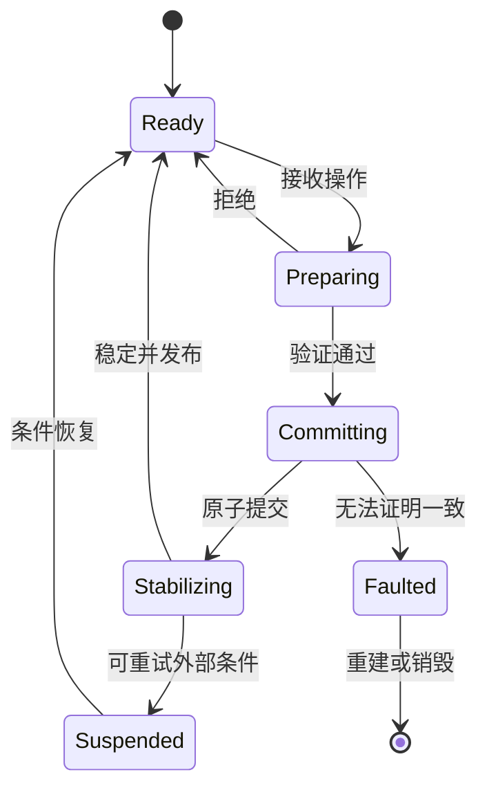

# 13. 原子性、故障与可验证演进

> **本章解决的问题**：框架在拒绝、取消、提交故障、后端失败和持续演进中，如何证明
> 自己仍保持同一组不变量？

正常路径能够显示画面，只能证明一个样例工作。框架质量取决于失败发生在任意阶段时，
能否准确描述哪些事实已改变、哪些结果可重试，以及观察者看到的状态是否完整。

核心结论是：

> 只有能够描述失败前后状态、提供确定性证据并保持扩展边界的变化，才是可持续的框架
> 演进。

## 13.1 三类结果

一次操作至少可能产生：

### 接受

候选通过验证，权威状态原子改变，并在稳定后发布。

### 拒绝

输入不合法、目标不支持或版本过期。权威状态没有变化，调用者可以修正、取消或重试。

### 故障

系统在承诺提交后无法证明一致性。此时不能伪装成普通拒绝，应进入受限或 faulted 状态。

“返回 Error”并没有说明是哪一种。错误类型必须携带状态语义。

## 13.2 Prepare rejection

Prepare 阶段只读取稳定快照并构造候选。典型拒绝包括：

- Figure 接纳规则不允许 child；
- 布局约束无解；
- Policy 不允许连接；
- model revision 已过期；
- typed update 的值非法；
- 后端提交前资源不完整。

拒绝后应满足：

```text
authoritative_state_after == authoritative_state_before
```

这使调用者可以安全重试或取消。

## 13.3 Commit failure

Commit 已开始修改权威状态后再失败，风险完全不同。应优先设计为：

1. commit 只执行不会失败的内存交换；
2. 所有可失败工作在 prepare/validate 完成；
3. 多项修改封装为单一事务；
4. publication 和外部 I/O 放在 commit 之后。

如果提交阶段仍可能失败，必须提供完整补偿，或把系统标记为 faulted。不能返回普通
错误后继续接受操作。

## 13.4 原子边界

原子不一定表示数据库事务，而是对观察者只存在两个合法状态：

```text
旧稳定状态
新稳定状态
```

以下中间态不能发布：

- child 已从旧父移除但尚未加入新父；
- 部分布局 placements 已应用；
- connection 已创建但端点 registry 未建立；
- 模型已变而 Viewer 声称应用了新 revision，实际只刷新一半；
- property change 已通知但 damage 尚未闭合。

原子边界应围绕权威状态和其必须同步维护的索引定义。

## 13.5 补偿

当底层模型不支持原子事务，CompoundCommand 可能使用补偿：

1. 记录已成功步骤；
2. 后续步骤失败；
3. 按逆序执行补偿；
4. 验证恢复后的 revision 和值；
5. 只有完整恢复才返回可恢复失败。

补偿本身也可能失败。因此，比补偿更可靠的策略仍是把可失败验证前移，并缩小 commit
为不可失败状态交换。

## 13.6 半发布结构

最危险的故障不是内存中存在临时状态，而是临时状态已经被外部观察：

- 通知已经发出；
- callback 已读取；
- 后端已经提交；
- 平台 capture 已改变；
- 资源句柄已交给外部系统。

一旦跨越发布边界，简单内存回滚不再恢复事实。系统需要新的补偿事件、session 重建或
进入故障状态。

因此 publication 必须尽量晚，并携带事务/revision 身份。

## 13.7 状态机

运行时可抽象为：



`Suspended` 表示场景事实仍可证明，但当前不能继续某类工作，例如表面暂不可用。
`Faulted` 表示内部一致性无法证明，只允许诊断、导出可恢复事实或销毁重建。

## 13.8 Retry

重试必须有幂等边界和身份：

- prepare 可直接重算；
- backend submission 需要 session/frame identity；
- model command 若完成状态未知，不能盲目重复；
- projection revision 断裂应重建，不重放猜测事件。

每个可重试错误都应说明：

```text
是否改变权威状态
是否可能产生外部效果
重试应复用还是分配新 identity
```

## 13.9 稳定通知

通知应在 commit 和必要稳定化完成后发布。一个属性批次至少可表达：

- transaction/revision；
- typed property identity；
- before/after；
- source；
- 合并后的最终值。

同一事务多次修改同一属性，应按合同合并。观察者不应被迫重建中间变化过程来猜最终
状态。

诊断日志可以记录内部阶段，但必须与稳定通知区分。

## 13.10 确定性回放

确定性回放验证同一输入序列产生语义等价状态。可记录：

- 初始模型快照；
- 归一化输入；
- Command 序列；
- model revisions；
- stable epochs；
- RenderSubmission 摘要。

回放不要求运行时分配出相同裸 ID，但要求身份映射、树顺序、几何、命令和可见输出
等价。

随机数、时钟和平台尺寸必须作为显式输入注入。

## 13.11 分层验证

### 单元测试

验证纯算法：矩阵、测量、路由、命令和 typed key。

### 契约测试

验证跨实现共同语义：树事务、坐标往返、输入取消、布局原子性、投影 revision。

### 集成测试

验证 Runtime、Viewer、后端或平台适配的组合边界。

### Headless replay

在无窗口环境重放稳定场景和输入，检查命令、damage、状态摘要和确定性。

### 平台验收

验证真实窗口、DPI、IME、GPU 完成和呈现时序。这些事实无法完全由 headless 测试替代。

分层测试不是重复覆盖，而是分别证明纯逻辑、协议和真实环境。

## 13.12 不变量驱动测试

示例驱动测试回答“这个案例是否通过”，不变量测试回答“所有合法变化是否保持约束”。

关键不变量包括：

- 树无环且父子一致；
- stale ID 不命中新对象；
- 坐标往返在容差内一致；
- old/new damage 覆盖变化；
- cancel 不修改模型；
- revision 断裂不做增量投影；
- registry 的 typed key 不发生类型错配。

属性测试和状态机测试适合生成大量操作序列，特别是添加、换父、删除、撤销和重做组合。

## 13.13 故障注入

故障路径必须被主动验证：

- prepare 中策略拒绝；
- validate 时 revision 漂移；
- commit 前资源不足；
- backend 接受后完成未知；
- capture owner 在 move 前删除；
- projection 批次中发现重复 ModelId；
- CompoundCommand 中间步骤失败。

每个注入点都应断言：

1. 哪些权威状态未变；
2. 哪些会话被取消；
3. 哪些 damage 或资源仍待处理；
4. Runtime 是否仍可服务。

## 13.14 性能预算

性能优化应从复杂度和测量开始。典型预算包括：

- 坐标转换 O(depth)；
- 绘制 O(visible subtree)；
- 删除 O(subtree + dependent relations)；
- 独立连接重算 O(changed dependencies)；
- 属性通知与实际变化数量近似线性；
- 无变化帧避免重复布局和资源上传。

预算不等于固定毫秒数。它先约束工作量增长方式，再由基准记录具体平台数据。

## 13.15 证据驱动优化

优化流程应是：

1. 定义用户可感知问题；
2. 建立可重复场景；
3. 记录时间、工作计数和资源数据；
4. 定位主导成本；
5. 修改局部算法；
6. 重新验证不变量和结果等价；
7. 比较前后证据。

不能因为“迭代通常比递归快”就替换已经正确的主循环，也不能用缓存掩盖失效协议缺陷。

## 13.16 架构增量

架构增量是一次可以独立评审和验证的长期边界变化。它应包含：

- 当前问题和反例；
- 新不变量；
- 权威所有者；
- 公开契约；
- 失败语义；
- 迁移顺序；
- 可执行证据；
- 旧路径移除条件。

架构文档不能只描述理想终态，也要说明如何避免迁移期间出现两个权威。

## 13.17 公共 API 稳定性

公共 API 的稳定不只是名字不变，还包括：

- 身份和生命周期语义；
- 错误分类；
- 线程和重入约束；
- 坐标域；
- 原子提交范围；
- 通知时机；
- 类型是否暴露第三方实现。

新增一个返回内部可变引用的方法，即使没有删除旧 API，也可能破坏整个所有权模型。

## 13.18 演进顺序

跨层重构应遵循：

```text
定义目标契约
-> 建立新骨架
-> 添加契约测试
-> 迁移一个完整调用链
-> 比较行为证据
-> 迁移其余使用者
-> 删除旧权威
-> 收紧公开边界
```

最危险的阶段是新旧路径同时可写。迁移计划必须明确哪一步切换权威，而不是长期双写。

## 13.19 可观察性

诊断信息应帮助重建因果链：

- mutation/transaction ID；
- model revision；
- stable epoch；
- session/frame ID；
- 目标身份及命名空间；
- 失败阶段；
- 失效和工作量计数。

渲染热路径不应通过同步日志证明正确性。结构化计数、按需追踪和测试证据更可靠，也不
改变性能特征。

## 13.20 全书不变量的汇合

一次节点移动的完整证明是：

1. Command 只修改模型权威；
2. 模型发布连续 revision；
3. Viewer 从单一快照规划投影；
4. Runtime 原子更新 Figure 状态；
5. 布局和连接在稳定 epoch 内收敛；
6. 坐标链统一投影旧新 visual bounds；
7. Renderer 读取稳定树生成命令；
8. RenderSubmission 绑定 session/frame；
9. 后端完成与场景提交分别记录；
10. 任一失败点都有明确不变状态或故障边界。

任何一步无法说明，端到端一致性就只是偶然。

## 13.21 常见错误设计

### 所有错误都映射为一个字符串

调用者无法知道是否可重试、是否已改变状态。

### Commit 中继续调用可失败扩展

事务进入一半后才发现无法完成。

### 发布后再尝试回滚内存

外部观察者和后端已经看到结果，回滚不能消除历史。

### 只测最终截图

截图无法证明身份、通知、取消和资源生命周期正确。

### 无基线地“优化架构”

复杂度和正确性风险增加，却无法证明收益。

### 新旧路径长期双写

两个权威产生分歧，迁移永远无法结束。

## 13.22 最终检查表

评审任何框架变化时，至少回答：

1. 权威状态是谁？
2. 输入、候选、提交和发布分别在哪里？
3. 使用哪些身份和 revision？
4. 失败发生前后状态是什么？
5. 取消与重试是否明确？
6. 扩展能否绕过 Runtime 或 CommandStack？
7. 哪些不变量由自动化测试证明？
8. 哪些行为必须由真实平台验收？
9. 性能结论是否有基线和工作量证据？
10. 旧路径何时彻底删除？

## 13.23 结语

Novadraw 的核心不是某个渲染算法或某组 Figure 类型，而是一组贯穿模型、场景、交互和
呈现的因果约束：

- 单一事实来源；
- 命名空间化身份；
- 固定事务管线；
- 稳定后发布；
- 类型化开放扩展；
- 明确失败边界；
- 可重复验证。

这些约束让新 Figure、新布局器、新后端和新编辑能力能够进入系统，而不必重新发明整套
一致性规则。框架真正可扩展的标志，不是“任何地方都能改”，而是新增差异能力后，原有
不变量仍然成立。

## 13.24 思考题

1. 哪些错误可以安全重试，哪些必须开启新 session？
2. 为什么 publication 之后的失败不能只靠内存回滚解决？
3. 一个性能优化需要证明哪些结果等价？
4. 架构迁移期间如何避免新旧 API 同时成为写入权威？
5. 如果一个测试只验证最终像素，它遗漏了哪些框架事实？
