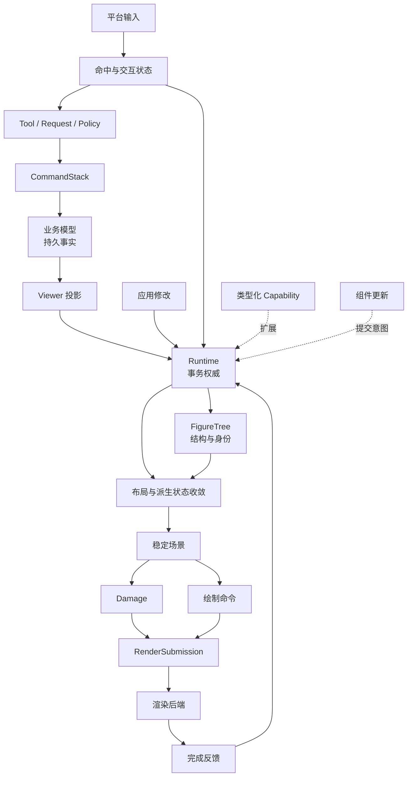

# 附录：核心概念关系图

本图用于回顾全书概念，不替代各章中的因果解释。

```mermaid
flowchart TD
    Model[业务模型<br/>持久事实] --> Projection[Viewer 投影]
    Input[平台输入] --> Interaction[命中与交互状态]
    Interaction --> Editing[Tool / Request / Policy]
    Editing --> Command[CommandStack]
    Command --> Model

    Projection --> Runtime[Runtime<br/>事务权威]
    App[应用修改] --> Runtime
    Interaction --> Runtime

    Runtime --> Tree[FigureTree<br/>结构与身份]
    Runtime --> Stabilize[布局与派生状态收敛]
    Tree --> Stabilize
    Stabilize --> Stable[稳定场景]

    Stable --> Damage[Damage]
    Stable --> Record[绘制命令]
    Damage --> Submission[RenderSubmission]
    Record --> Submission
    Submission --> Backend[渲染后端]
    Backend --> Completion[完成反馈]
    Completion --> Runtime

    Capability[类型化 Capability] -.扩展.-> Runtime
    Component[组件更新] -.提交意图.-> Runtime
```

## 三本书的概念边界

| 问题 | 阅读入口 |
|---|---|
| 如何调用和组合这些能力 | 《Novadraw 应用开发与扩展指南》 |
| 为什么必须采用这些关系 | 《深入理解 Novadraw》 |
| 如何在当前仓库中修改它们 | 《Novadraw 贡献者指南》 |
