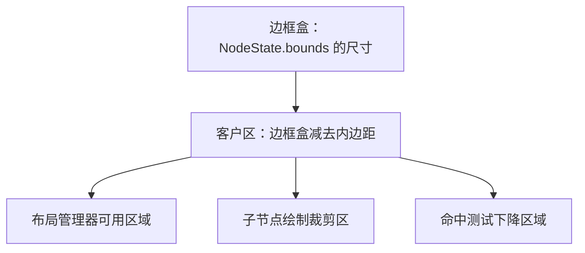
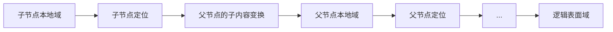

# 2. 几何、边界矩形与坐标协议

## 2.1 四种不同的矩形

图形引擎中最常见的错误，是把所有矩形都叫作边界矩形（bounds）。这里的“坐标域”
是指一组坐标数值所依附的参照空间；同样的 `(x, y)` 位于不同坐标域时表示不同位置。
Novadraw 明确区分：

| 中文名称（英文原名） | 所属坐标域 | 含义 |
|---|---|---|
| 布局边界（layout bounds） | 父内容域 | `NodeState.bounds`，记录布局位置与边框盒尺寸 |
| 本地边框盒（local border box） | 节点本地域 | `(0, 0, width, height)` |
| 视觉边界（visual bounds） | 节点本地域 | 包含描边、阴影等效果后的保守可见范围 |
| 投影边界（projected bounds） | 逻辑表面域 | 沿父链变换后的保守轴对齐包围盒 |

核心公式：

```text
local_border_box = Rect(0, 0, bounds.width, bounds.height)
client_box = local_border_box inset by insets
```

`bounds` 不是世界坐标中的轴对齐包围盒（Axis-Aligned Bounding Box，简称 AABB），
也不包含阴影、模糊等视觉外扩。

## 2.2 边界矩形为什么是统一几何真源

`NodeState.bounds` 同时参与：

- 布局结果；
- 默认矩形命中；
- 父子节点定位；
- 客户区推导；
- 新旧重绘区域；
- 视口与自由范围；
- 连接所属图形的几何计算。

实际节点访问：

```rust
pub fn figure_bounds(&self) -> Rectangle {
    self.state.bounds
}

pub(crate) fn client_area(&self) -> Rectangle {
    let bounds = self.state.bounds;
    let (top, left, bottom, right) = self.state.insets;
    Rectangle::new(
        left,
        top,
        (bounds.width - left - right).max(0.0),
        (bounds.height - top - bottom).max(0.0),
    )
}
```

代码锚点：
[`FigureNode::figure_bounds/client_area`](../../novadraw-scene/src/graph/mod.rs#L472-L505)。

注意，“统一真源”不表示只有一个矩形概念，而表示其他矩形必须由明确协议从
`bounds` 和 `Figure` 能力推导，不能由各模块私存一份位置真相。

## 2.3 盒模型：内边距不只是装饰

**盒模型**是用边框盒、内边距和客户区共同描述一个图形占用空间的方法。
**内边距**（insets）是边框内侧为内容预留的上、左、下、右距离。**客户区**
（client area）是本地边框盒扣除内边距后，布局和绘制子节点可使用的区域。



边框的内边距影响子节点可用区域，因此边框变化可能触发布局，而不仅是请求重绘。
如果布局、绘制和命中分别计算客户区，就会出现“看得见但点不到”或子节点侵入边框
的错误。

## 2.4 坐标域

Novadraw 的二维核心包含五个常用坐标域。

### 物理表面域（Physical Surface Domain）

窗口后备存储（backing store）中的物理像素坐标，只出现在平台输入和渲染后端边界。

```text
logical = physical / scale_factor
physical = logical * scale_factor
```

### 逻辑表面域（Logical Surface Domain）

设备无关的根坐标。平台输入会先从物理像素换算到这个坐标域，再进入 `Runtime`。

### 父内容域（Parent Content Domain）

节点 `bounds` 所属的坐标域，也就是父节点放置子节点的内容空间。它可能已经包含
视口滚动、缩放等子内容变换。

### 节点本地域（Node Local Domain）

节点自身绘制、精确命中和局部脏区使用的坐标域，原点为自身边框盒左上角。

### 子内容域（Child Content Domain）

子节点定位所使用的坐标域，由客户区原点与额外的子内容变换共同定义。

## 2.5 每条父子边的变换

**坐标变换**把一个坐标域中的点映射到另一个坐标域。父子边需要组合“节点放置位置”
与“父节点对子内容施加的额外变换”。

对节点 `N`：

```text
node_local_to_parent_content(N)
    = Translate(N.bounds.origin)

child_content_to_node_local(N)
    = Translate(N.insets.left, N.insets.top)
      * N.figure.child_transform
```

完整链路：



实现中 `FigureNode::child_transform()` 将内边距与容器额外变换组合：

```rust
Affine2D::from_translation(left, top) * figure_transform.affine()
```

代码锚点：
[`FigureNode::child_transform`](../../novadraw-scene/src/graph/mod.rs#L496-L505)。

## 2.6 矩阵组合顺序

Novadraw 使用列向量语义，也就是把点写成列向量，并由矩阵从左侧相乘：

```text
world = parent_world * local
```

`A * B` 表示先应用 `B`，再应用 `A`。这不是书写风格问题，而是坐标正确性的核心。
例如“先局部缩放，再父级平移”：

```rust
let parent = Transform::from_translation(10.0, 0.0);
let child = Transform::from_scale(2.0, 2.0);
let combined = parent * child;
```

实际实现与非交换测试见
[`Transform`](../../novadraw-geometry/src/transform.rs)。

## 2.7 从节点到绘制表面

`local_to_surface_transform` 从当前节点向根组合节点定位与父级子内容变换：

```rust
let mut transform = Affine2D::IDENTITY;
loop {
    transform = Translate(current.bounds.origin) * transform;
    let Some(parent) = current.parent else { break };
    transform = parent.child_transform().affine() * transform;
    current = parent;
}
```

实际实现见
[`FigureTree::local_to_surface_transform`](../../novadraw-scene/src/graph/mod.rs#L3996-L4019)。

逆向变换必须显式处理不可逆矩阵：

```rust
let inverse = local_to_surface_transform(id)?.inverse()?;
```

不可逆分支不能伪造坐标，也不能被命中。

## 2.8 视口与缩放仍是普通坐标协议

**视口**（Viewport）是显示大型内容中的一个可见窗口；**缩放**（scale）是内容单位
到视口单位的比例。视口的典型映射为：

```text
viewport_point = (content_point - origin) * scale
content_point = viewport_point / scale + origin
```

但代码不会在命中测试、事件或连接处理中重复这个公式。视口与可缩放容器都通过
`ChildTransform` 进入统一父链。

- **范围模型**（`RangeModel`）：保存单个滚动轴的合法范围、可见长度和当前位置；
  其中 `value` 是视口原点的真源。
- **可缩放面板**（`ScalablePane`）：对子内容统一施加缩放变换，是内容缩放比例的
  真源。
- **缩放管理器**（`ZoomManager`）：协调视口原点和内容缩放，不保存第二份状态。

代码锚点：

- [`ViewportHandle`](../../novadraw-scene/src/container/viewport.rs)
- [`ScalableLayeredPaneFigure`](../../novadraw-scene/src/container/scalable.rs)
- [`DefaultRangeModel`](../../novadraw-scene/src/container/range_model.rs)

## 2.9 几何变更事务

运行期修改边界矩形必须走带更新语义的入口：

```text
记录旧视觉边界
-> 清除父内容域中的旧区域
-> 原子设置新边界矩形
-> 发出几何与坐标通知
-> 使布局或自由范围失效
-> 请求重绘新视觉边界
```

实际实现见
[`FigureTree::set_bounds_with_update`](../../novadraw-scene/src/graph/mod.rs#L3875-L3933) 和
[`FigureEditor::set_bounds`](../../novadraw-scene/src/runtime/runtime.rs)。

父节点移动时，后代的 `bounds` 不会被重写；父链变换的结果发生变化，并产生
`CoordinateSystemChanged`。这避免与子树规模成正比的存储改写，也保持父级局部
几何语义。

## 2.10 保守轴对齐包围盒

矩形经过旋转或错切（skew）后，不能只变换左上与右下角。正确做法是变换四个角，
再取：

```text
left   = min(all x)
top    = min(all y)
right  = max(all x)
bottom = max(all y)
```

该原则用于投影边界和重绘区域。实现辅助函数见
[`transform_rectangle`](../../novadraw-scene/src/graph/mod.rs#L40-L69)。

## 2.11 失败模式

| 错误 | 典型症状 |
|---|---|
| 把边界矩形当作表面坐标 | 嵌套或滚动后命中漂移 |
| 忽略内边距 | 子内容覆盖边框，裁剪偏移 |
| 手写视口换算 | 缩放后反馈、事件、连接不一致 |
| 矩阵乘法顺序反了 | 父级缩放与子节点定位交换 |
| 只变换两个角 | 旋转后的重绘区域太小，留下残影 |
| 修改父节点时改写后代边界矩形 | 状态重复传播，布局事实失真 |
| 逆变换失败后继续 | 不可预测命中或非有限坐标扩散 |

## 2.12 验证入口

- [`m4_coordinate_contract.rs`](../../novadraw-scene/tests/m4_coordinate_contract.rs)
- [`m8_viewport_contract.rs`](../../novadraw-scene/tests/m8_viewport_contract.rs)
- [`bounds_test.rs`](../../novadraw-scene/src/graph/bounds_test.rs)
- 规范唯一事实来源：
  [`coordinate-system.md`](../../doc/design/coordinates/coordinate-system.md)
