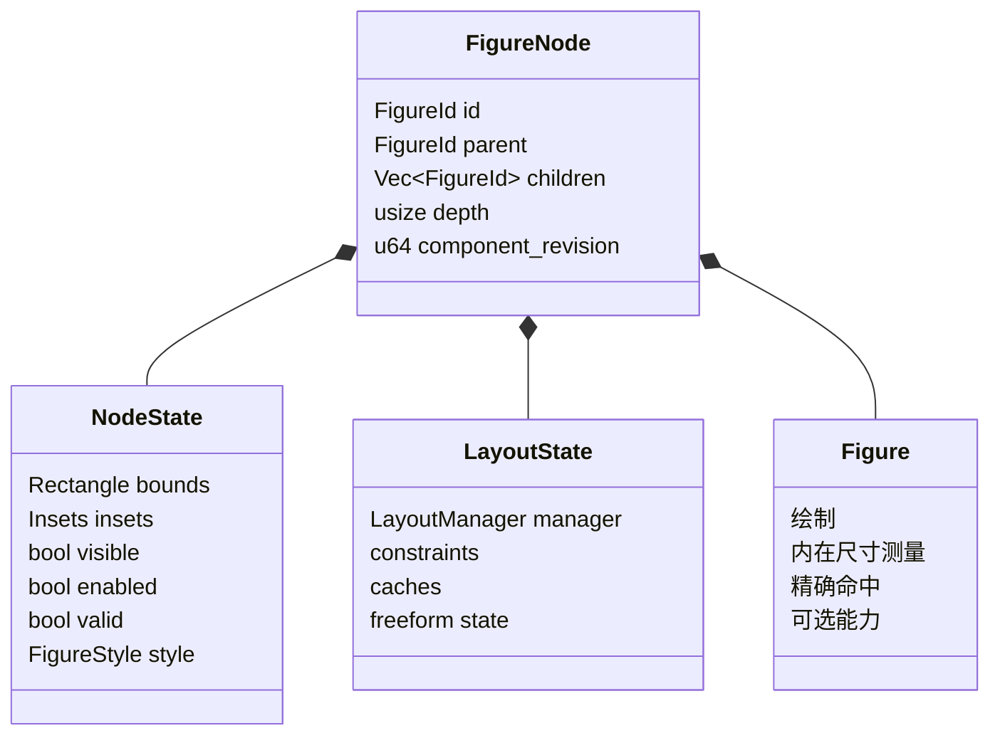
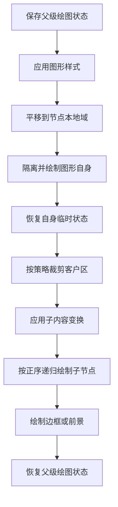
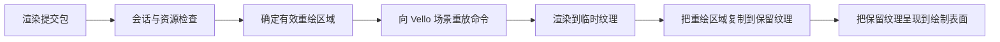

# 3. 图形树、生命周期与绘制遍历

## 3.1 图形行为、节点状态与树的分离

本章所说的**图形对象**（Figure）是可绘制、可命中的轻量对象；**图形节点**
（`FigureNode`）是图形对象在树中的运行时容器；**节点状态**（`NodeState`）保存
所有图形共有的几何与可见性。Novadraw 不复制 Java Draw2D 职责很宽的 `IFigure`
对象，而把一个运行时节点拆成三类信息：



这样拆分的原因：

- 树算法无需向下类型转换（downcast）即可读取通用几何和状态；
- 新的 `Figure` 类型只实现差异行为；
- 拓扑、状态和行为有清晰的所有权；
- Runtime 可以在统一边界上验证和提交变更。

代码锚点：

- [`FigureNode`](../../novadraw-scene/src/graph/mod.rs#L403-L432)
- [`NodeState`](../../novadraw-scene/src/graph/mod.rs)
- [`LayoutState`](../../novadraw-scene/src/graph/mod.rs)
- [`Figure`](../../novadraw-scene/src/figure/mod.rs#L369-L573)

## 3.2 图形对象的小能力模型

`Figure` 的基础职责是：

```rust
pub trait Figure: AsAny {
    fn initial_bounds(&self) -> Rectangle;
    fn name(&self) -> &'static str;
    fn paint_figure_in_bounds(&self, gc: &mut NdCanvas, bounds: Rectangle);
    fn intrinsic_size(&self) -> (f64, f64);
    fn precise_hit(&self, x: f64, y: f64, bounds: Rectangle) -> bool;
}
```

其他能力通过显式可选入口提供：

```text
Figure
├── FigureContainer
├── FigureEventHandler
├── FigureLifecycle
├── AccessibleFigure
├── ConnectionFigureBehavior
├── PointListFigureBehavior
├── BorderedFigure
└── ClickableBehavior
```

**可选能力**是具体图形按需提供的窄接口，例如事件处理或无障碍信息；没有该能力的
图形无需实现空方法。这比给所有 `Figure` 强加一组空回调更容易保持接口稳定，通用
状态也不在每个具体图形中重复。

## 3.3 树不变量

`FigureTree` 负责：

- 父子关系双向一致；
- 子节点顺序与叠放顺序（Z-order）一致；
- 防止循环、重复挂接和跨 `Runtime` 使用 ID；
- 单子节点容器、普通容器、分层容器等接纳规则（admission policy）；
- 深度上限 10,000；
- 挂接、换父节点和销毁时维护相关关系。

构建期可以通过 `FigureTreeBuilder` 直接组装新树。进入 `Runtime` 后，结构变化必须
走运行时命名操作或回调修改队列，不能绕过交互、布局、重绘区域和连接清理。

## 3.4 生命周期不是拓扑修改的附带动作

**生命周期**是图形从挂接、运行、换父节点到最终销毁所经历的状态过程；**拓扑**
则只描述节点之间的父子连接关系。两者相关，但不能把生命周期简化成一次列表删除。

删除一个节点不只是从 `children` 中移除 ID。它还可能拥有：

- 指针捕获、焦点或手势引用；
- 作用域监听器；
- 布局约束；
- 图层键；
- 连接、锚点或定位器的绑定；
- 资源依赖；
- 编辑框架的视觉对象注册表与选择状态。

规范顺序可概括为：

```text
准备并校验
-> 记录旧几何
-> 提交拓扑修改与绑定清理
-> 在结构提交之外执行必要的生命周期回调
-> 收敛派生工作
-> 发布稳定场景
-> 发送外部通知
```

同一 `Runtime` 内更换父节点会保留 `FigureId`；销毁会使旧 ID 失效；跨 `Runtime`
默认从模型重建。

参考：
[Figure 生命周期规范](../../doc/design/architecture/figure-lifecycle.md)。

## 3.5 绘制是受控模板

当前主线是递归绘制，遍历顺序固定：



实际主循环见
[`render_recursive.rs`](../../novadraw-scene/src/graph/render_recursive.rs#L57-L257)。

代码中的关键隔离：

```rust
self.gc.push_state();
self.gc.translate(bounds.x, bounds.y);

self.gc.push_state();
node.figure.paint_figure_in_bounds(self.gc, local_border_box);
self.gc.pop_state();

self.paint_client_area(figure_id, depth);
node.figure.paint_border_snapshot_in_bounds(...);
self.gc.pop_state();
```

图形自身临时改变颜色、透明度、变换或裁剪区时，不能污染子节点和同级节点。

## 3.6 叠放顺序与命中顺序

**叠放顺序**（Z-order）决定图形前后遮挡关系。子节点列表是其唯一事实源：

- 绘制：`children.iter()` 正序；
- 命中：`children.iter().rev()` 逆序；
- 后绘制的子节点优先成为事件目标。

如果图层另外维护一套叠放顺序，就会出现视觉层级与命中层级分裂。图层键只能映射到
子节点 ID，真正顺序仍保存在 `FigureTree`。

## 3.7 裁剪策略

**裁剪**（clip）是把绘制、命中或重绘计算限制在指定区域内。容器对子节点有三种
策略：

| 策略 | 语义 |
|---|---|
| `ClipToChildBounds` | 使用父客户区裁剪，并追加每个子节点的边界裁剪 |
| `DoNotClipChildBounds` | 保留父客户区裁剪，不追加子节点边界裁剪 |
| `OverflowVisible` | 继承祖先裁剪，不应用当前客户区或子节点边界裁剪 |

`OverflowVisible` 用于自由范围（Freeform）场景。它不是“完全没有裁剪”：最近的普通
裁剪祖先或视口仍会截断内容。

同一策略必须同时影响：

- 绘制；
- 命中测试向子树下降；
- 重绘区域投影。

只修改其中一条链路会造成不可见内容仍可命中，或可见内容无法刷新。

代码锚点：

- [`ChildClippingStrategy`](../../novadraw-scene/src/figure/mod.rs)
- [`FigureRenderer::paint_client_area`](../../novadraw-scene/src/graph/render_recursive.rs#L146-L193)
- [`repair::collect_parent_chain_steps`](../../novadraw-scene/src/runtime/update/repair.rs#L109-L159)

## 3.8 命令画布（NdCanvas）

`NdCanvas` 是只记录绘制操作、不直接提交 GPU 的平台无关命令画布。`Figure` 不直接
访问 Vello、Metal、WebGPU 或绘制表面，而是向 `NdCanvas` 写入命令：

```text
PushState / PopState
ConcatTransform
Clip
FillRect / StrokeRect
Ellipse / Polyline / Path
Image
DrawGlyphRun
```

`NdCanvas` 同时维护逻辑绘图状态（graphics state）和命令流。变换使用
`state.transform.post_concat(local)`，确保记录语义与坐标协议一致。

代码锚点：

- [`NdCanvas`](../../novadraw-render/src/context.rs)
- [`RenderCommandKind`](../../novadraw-render/src/command.rs)

## 3.9 渲染提交包（RenderSubmission）

`RenderSubmission` 是一次完整帧提交给后端的数据包，集中携带绘制命令、重绘范围、
资源同步信息、绘制表面信息和帧身份：

```rust
pub struct RenderSubmission {
    pub commands: Vec<RenderCommand>,
    pub damage: DamageSet,
    pub resources: ResourceSync,
    pub surface: SurfaceInfo,
    pub session_id: BackendSessionId,
    pub frame_id: FrameId,
}
```

实际定义：
[`RenderSubmission`](../../novadraw-render/src/submission.rs#L365-L373)。

它分离“画什么”与“如何提交到设备”。渲染后端声明自身能力，`Runtime` 在提交前
检查命令需要的字形组（`GlyphRuns`）、图像资源（`ImageResources`）等能力。永久
不支持是显式错误，不能无限重试。

## 3.10 Vello 后端如何消费命令

Vello 是 Novadraw 默认使用的 GPU 二维渲染库。Vello 后端不是另一套场景树；它按
提交包中的顺序重放 `RenderCommand`，维护独立的变换与裁剪状态，并且只在后端边界
应用从逻辑单位到物理像素的缩放系数。



当前的局部重绘策略先在临时纹理中重建命令结果，再只把重绘区域复制到保留纹理，
最后将保留纹理呈现到绘制表面。这样重绘区域外的像素保持上一帧结果，满足增量更新
的不变量。

提交前还会：

- 校验后端会话与资源全量快照/增量；
- 缺少字形或图像资源时返回 `Retry`；
- 合并并应用待处理的窗口尺寸变化；
- 零尺寸绘制表面返回 `Skipped`；
- 对重绘边界按物理像素向外取整；
- 绘制表面丢失或过期时走结构化恢复。

代码锚点：
[`VelloRenderer::submit`](../../novadraw-render/src/backend/vello/mod.rs#L1114-L1306)。

## 3.11 递归深度策略

当前渲染主线是递归遍历，不是旧大纲中的迭代跳板（trampoline）方案。项目约束：

- 树深度上限为 10,000；
- 渲染和关键递归路径周期性使用 `stacker::maybe_grow`；
- `render_iterative.rs` 已归档到
  `archive/render-iterative-poc-20260617`；
- 性能专项开始前不得重新引入迭代主线。

这是一项已验证的工程取舍。书稿不能把归档 POC 写成当前架构。

## 3.12 失败模式

| 错误 | 后果 |
|---|---|
| `Figure` 保存第二份运行时边界 | 改变尺寸后绘制与命中读取不同几何 |
| 子节点自己决定全局叠放顺序 | 绘制与命中顺序不一致 |
| 绘图状态不隔离 | 同级节点继承错误颜色、裁剪或变换 |
| 自由范围取消所有祖先裁剪 | 内容越过视口 |
| 删除只改拓扑 | 指针捕获、监听器、锚点等引用悬空 |
| 后端对象进入 `Figure` | 无窗口测试和后端替换失效 |

## 3.13 验证入口

- [`m2_product_existence.rs`](../../novadraw-scene/tests/m2_product_existence.rs)
- [`d1_tree_search_contract.rs`](../../novadraw-scene/tests/d1_tree_search_contract.rs)
- [`d2_freeform_contract.rs`](../../novadraw-scene/tests/d2_freeform_contract.rs)
- [`r8_extension_boundaries.rs`](../../novadraw-render/tests/r8_extension_boundaries.rs)
- `cargo xtask run workspace.test`
