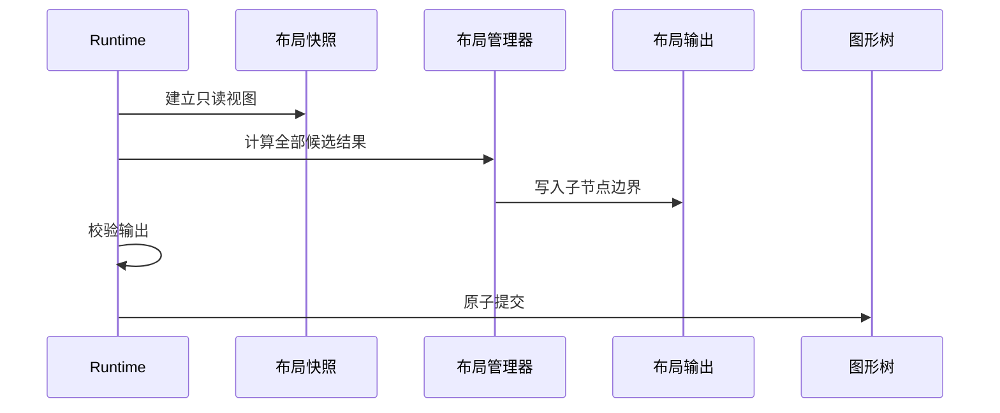

# 4. 布局与更新：从尺寸计算到稳定帧

> **本章解决的问题**：应用应如何选择和配置布局，状态变化后引擎又如何得到一份可
> 安全呈现的新帧。

核心顺序只有一条：

```text
源状态变化
-> 测量与布局
-> 派生状态收敛
-> 计算重绘区域
-> 录制绘制命令
-> 提交并确认一帧
```

应用开发者重点阅读 4.1-4.6。实现自定义 Figure、LayoutManager、平台宿主或后端时，
再继续阅读 4.7-4.12 的协议细节。

## 4.1 失效与重绘不是一回事

状态变化后，Runtime 记录两类事实：

- **失效**（invalid）：布局、连接或其他派生状态已经过期，需要重新计算；
- **脏区**（dirty region）：某个节点本地区域的像素可能变化，需要重新绘制。

失效回答“哪些数据要重算”，脏区回答“哪些像素要重画”。只有颜色变化时可能只需
重绘；文本或边框改变首选尺寸时通常还需要重新布局。

正确顺序必须是先收敛几何，再投影脏区。否则重绘区域会使用旧位置，造成残影或漏绘。

## 4.2 布局器只计算，不直接改树

**布局管理器**（`LayoutManager`）根据容器、直接子节点和布局约束计算位置与尺寸。
Runtime 向它提供只读的 `LayoutSnapshot`，布局器把候选结果写入 `LayoutOutput`：

```rust
pub trait LayoutManager {
    fn layout(
        &mut self,
        container: FigureId,
        snapshot: &LayoutSnapshot<'_>,
        out: &mut LayoutOutput,
    ) -> Result<(), LayoutError>;
}
```



布局器不能直接持有或修改 `FigureTree`。这样 Runtime 才能在任何可见变化发生前检查：

- 目标是不是当前容器的直接子节点；
- 坐标和尺寸是否有限；
- 约束类型是否匹配；
- 一组输出能否整体提交。

## 4.3 布局约束属于父子关系

布局约束描述“父容器如何放置这个子节点”，不是子节点自身的固有属性：

```text
LayoutState(container)
├── LayoutManager
└── child FigureId -> LayoutConstraint
```

因此：

- 约束由直接父容器解释；
- 换父节点时必须清理旧约束；
- 更换布局器前必须验证已有约束是否兼容；
- 约束类型错误应被拒绝，不能静默忽略。

构建期配置：

```rust
use novadraw::layout::XYConstraint;
use novadraw::prelude::*;

let mut tree = FigureTree::new();
let root = tree
    .builder()
    .set_contents(Box::new(RectangleFigure::new(0.0, 0.0, 800.0, 600.0)));

tree.builder()
    .set_layout_manager(root, Box::new(XYLayout::new()))?;

let child = tree.builder().add_child(
    root,
    Box::new(RectangleFigure::new(0.0, 0.0, 120.0, 80.0)),
)?;
tree.builder().set_layout_constraint(
    child,
    XYConstraint::at_size(64.0, 48.0, 120.0, 80.0),
)?;
tree.builder().validate_subtree(root)?;
```

运行期配置：

```rust
runtime
    .container(root)?
    .set_layout_manager(Box::new(GridLayout::new(3)))?;
runtime
    .figure(child)?
    .set_layout_constraint(GridConstraint::fill())?;
```

两条路径使用同一布局契约，但只有 Runtime 路径会维护已挂载场景的失效、damage 和
通知。

## 4.4 如何选择布局器

应用通常只需要从意图出发选择：

| 需求 | 布局器 | 说明 |
|---|---|---|
| 业务模型给出明确坐标 | `XYLayout` | 支持固定尺寸或回退到首选尺寸 |
| 自由分布并推导整体范围 | `FreeformLayout` | 常用于大型自由画布 |
| 一个内容填满容器 | `FillLayout` | 只排列第一个子节点 |
| 多层内容完全重叠 | `StackLayout` | 所有子节点占满客户区 |
| 上下左右中五区 | `BorderLayout` | 主区、侧栏、标题栏 |
| 自然排列并允许换行 | `FlowLayout` | 标签组、按钮组 |
| 固定行列、跨格和对齐 | `GridLayout` | 表单、属性面板 |
| 单行或单列并允许压缩 | `ToolbarLayout` | 工具栏、菜单条 |
| 一个可滚动内容 | `ViewportLayout` | 由 Viewport 自动安装 |
| 视口加滚动条 | `ScrollPaneLayout` | 由 ScrollPane 自动安装 |

`ViewportLayout` 和 `ScrollPaneLayout` 是容器内部协议，应用通常不直接构造。滚动缩放
场景见[第 6 章](06-layers-and-viewport.md)。

完整布局示例集中在
[`examples/scenes/src/layout.rs`](../../examples/scenes/src/layout.rs)。阅读时优先看场景构造
函数，不需要从 native 应用的窗口代码开始。

## 4.5 测量先于排列

**测量**（measure）回答“希望占多大”，**排列**（arrange）回答“最终放在哪里、占
多大”。父布局必须先测量子节点，再计算轨道、换行和对齐。

尺寸查询包括：

| 查询 | 含义 |
|---|---|
| `preferred_measurement` | 空间充足时的首选宽高与可选文本基线 |
| `minimum_size` | 压缩时仍应保留的尺寸 |
| `maximum_size` | 拉伸时允许达到的上限 |

首选尺寸按以下顺序解析：

```text
显式首选尺寸
-> 容器 LayoutManager 的测量结果
-> Figure 的内在测量
-> Figure 初始尺寸回退
```

`MeasureConstraints` 用 `Some(value)` 表示某一轴的有限上限，用 `None` 表示无约束。
零尺寸是合法结果，不是“没有结果”的特殊值。

### 应用何时需要关心测量

- 使用内置 Figure 和固定尺寸布局时，只需设置约束；
- 文本、图片或内容驱动尺寸时，应让 Figure 提供内在测量；
- 自定义容器布局时，通过 `LayoutSnapshot` 查询子节点，不读取上一次排列结果作为
  内容尺寸；
- 需要文本基线对齐时，读取 `FigureMeasurement`，不要只取宽高。

约束文本是典型例子：

```text
父级提供最大宽度
-> 文本按宽度完成换行测量
-> 返回高度和基线
-> 父布局安排最终边界
-> 绘制复用同一呈现快照
```

如果到绘制阶段才决定换行，父布局已经拿不到正确高度，当前帧就无法一次收敛。

测量缓存以布局代数和约束为键。结构、约束、显式尺寸或相关内容变化时，Runtime
使缓存失效；应用不需要手工清理。

代码入口：

- [`MeasureConstraints` 与 `FigureMeasurement`](../../novadraw/src/figure/mod.rs)
- [`LayoutSnapshot` 与 `LayoutOutput`](../../novadraw/src/layout/mod.rs)
- [约束文本测量测试](../../novadraw/tests/d4_constrained_measurement.rs)

## 4.6 应用运行期如何触发更新

常见修改都通过 scoped mutable facade：

```rust
runtime.figure(node)?.set_bounds(new_bounds)?;
runtime.figure(label)?.set_label_text("Ready")?;
runtime.figure(node)?.set_visible(false)?;
runtime.container(panel)?.bring_child_to_front(node)?;
```

这些操作会按契约自动记录所需失效与重绘。只有自定义组件内部状态改变，而 Runtime
无法从操作类型推断影响范围时，才显式调用：

```rust
runtime.figure(node)?.revalidate()?;
runtime.figure(node)?.repaint(None)?;
```

应用业务代码不应直接访问 `UpdateManager`，也不应自己拼装 `DamageSet`。

## 4.7 派生状态如何收敛

一次源状态变化可能依次影响内在尺寸、布局、连接、自由范围、视口和最终呈现。
Runtime 使用固定优先级工作列表：

```text
内在尺寸与资源
-> 布局
-> 依赖失效传播
-> 连接路由
-> 路由后的几何
-> 最终显示状态
```

后置阶段产生新的高优先级工作时，调度器回到前面继续处理。全部队列排空后，
`stable_epoch` 才能晋升。

单个阶段有反馈预算。超过预算返回 `FramePreparationError::DidNotConverge`，不会
发布只完成一部分的场景或提交包。

实现入口：
[`Runtime::stabilize`](../../novadraw/src/runtime/runtime.rs)。

## 4.8 重绘区域如何得到

一个脏矩形最初位于节点本地域。Runtime 沿父链逐级处理：

```text
与节点视觉边界求交
-> 应用节点位置
-> 应用父节点的子内容变换
-> 按裁剪策略收紧
-> 重复直到逻辑表面
-> 合并为 DamageSet
```

这条链与绘制和命中测试使用同一变换与裁剪规则。

`DamageSet` 有三种状态：

```text
None
Full
Partial { union, regions }
```

区域过多时可以安全合并为包围矩形；后端无法保留区域外像素时必须升级为全量重绘。
真正的不变量是：

> 帧提交后，重绘区域外的可见像素必须与提交前等价。

实现入口：
[`repair.rs`](../../novadraw/src/runtime/update/repair.rs)。

## 4.9 帧准备状态

`Runtime::prepare_submission` 用明确状态表示当前能否产生一帧：

```rust
pub enum FramePreparation {
    Ready(RenderSubmission),
    Idle,
    Suspended,
    AwaitingCompletion,
    Error(FramePreparationError),
}
```

| 状态 | 宿主处理 |
|---|---|
| `Ready` | 交给后端，并回传完成结果 |
| `Idle` | 当前没有像素或资源变化 |
| `Suspended` | 表面不可用，恢复后重试 |
| `AwaitingCompletion` | 等待前一帧完成，不能并发提交下一帧 |
| `Error` | 记录并按错误类型恢复或停止 |

宿主必须显式区分暂停、等待、无工作和错误，不能把它们统一折叠成“没有提交包”。

## 4.10 渲染提交与完成反馈

稳定场景产生两条结果：

- `UpdateManager` 计算 `DamageSet`；
- `FigureRenderer` 递归遍历图形树，向 `NdCanvas` 录制 `RenderCommand`。

它们与资源同步、绘制表面、会话 ID 和帧 ID 组成 `RenderSubmission`。后端只消费
提交包，不能反向修改 FigureTree。

宿主的概念流程：

```rust
let submission = match runtime.prepare_submission(surface, backend.capabilities()) {
    FramePreparation::Ready(submission) => submission,
    FramePreparation::Idle => return,
    FramePreparation::Suspended => return,
    FramePreparation::AwaitingCompletion => return,
    FramePreparation::Error(error) => return handle_frame_error(error),
};

let session_id = submission.session_id;
let frame_id = submission.frame_id;
let outcome = backend.submit(&submission);
assert!(runtime.complete_submission(session_id, frame_id, outcome));
```

完成反馈不能省略：

- `Presented` 确认资源增量和当前帧完成；
- `Retry`、`Skipped` 或 `Unsupported` 会触发相应恢复；
- 会话和帧身份防止迟到结果污染新绘制表面。

## 4.11 通知为什么最后发布

内部变化按因果顺序写入通知日志，但监听器只在稳定版本形成后收到记录。否则监听器
可能看到：

- 边界已改但连接尚未重新路由；
- 内容范围已改但视口尚未钳制；
- 文本度量已改但最终显示状态仍旧。

应用读取需要一致性的场景数据时使用稳定查询。不要把普通 Figure 回调或布局计算
当作“本帧已经完成”的通知。

## 4.12 常见问题

| 症状 | 原因 |
|---|---|
| 图形尺寸没有按内容变化 | Figure 没有内在测量，或父布局给了固定尺寸 |
| 换布局器后约束报错 | 旧约束类型与新布局器不兼容 |
| 修改后没有重排 | 绕过 scoped mutable facade，或自定义更新没有请求 revalidate |
| 移动后留下残影 | 旧视觉边界没有进入 damage |
| 绘制需要第二帧才正确 | 在绘制阶段才改变测量或布局事实 |
| 一直返回 `AwaitingCompletion` | 宿主没有回传前一帧的完成结果 |
| 一直返回 `Suspended` | surface 为零尺寸或当前不可呈现 |
| 返回 `DidNotConverge` | 扩展在布局或派生阶段形成循环失效 |

排查时沿本章开头的因果链从前向后检查，不要先修改渲染主循环。

## 4.13 验证入口

- [`m5_layout_contract.rs`](../../novadraw/tests/m5_layout_contract.rs)
- [`d4_constrained_measurement.rs`](../../novadraw/tests/d4_constrained_measurement.rs)
- [`d4_component_update.rs`](../../novadraw/tests/d4_component_update.rs)
- [`d4_notification_epoch.rs`](../../novadraw/tests/d4_notification_epoch.rs)
- [`runtime_resize_contract.rs`](../../novadraw/tests/runtime_resize_contract.rs)
- `cargo xtask verify core.runtime`
