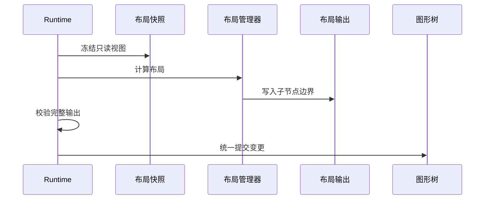
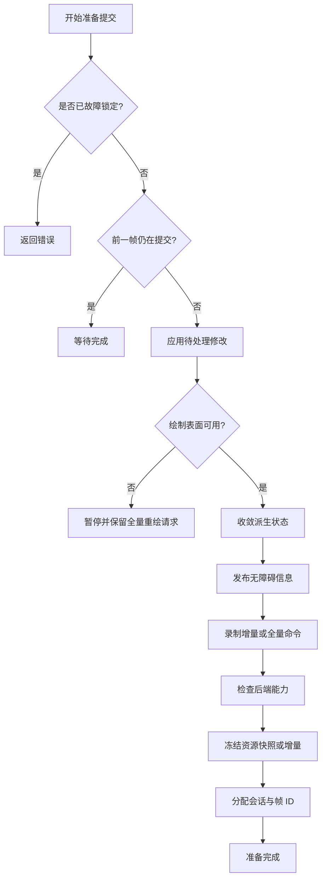

# 4. 布局、校验收敛、重绘区域与帧提交

## 4.1 更新不是立即绘制

**帧**是引擎为一次屏幕呈现准备并提交的完整结果。修改发生时不立即绘制，而是先
记录需要重新计算和重新绘制的事实。

一次修改通常只声明两类事实：

- **失效**（invalid）：几何、布局或派生状态已过期，需要重新计算；派生状态是由
  源状态计算得到、可以重新生成的状态；
- **脏区**（dirty）：某个节点本地区域的可见像素可能变化，需要纳入重绘。

失效描述“数据需要重算”，脏区描述“像素需要重画”，两者不能混为一谈。

它们被延迟合并，在帧边界执行：


严格顺序是关键：如果在布局稳定前计算重绘损伤区域（damage），脏区会基于旧几何
传播，造成漏绘。

## 4.2 布局管理器的读写隔离

**布局管理器**（`LayoutManager`）负责根据容器、子节点和布局约束计算几何结果。
它不能直接修改 `FigureTree`。`Runtime` 先建立只读的**布局快照**
（`LayoutSnapshot`），布局器再把候选变更写入**布局输出**（`LayoutOutput`）：

```rust
pub trait LayoutManager {
    fn layout(
        &mut self,
        container: FigureId,
        snapshot: &LayoutSnapshot<'_>,
        out: &mut LayoutOutput,
    ) -> Result<(), LayoutError>;
}
```

`LayoutOutput` 可记录子节点边界、可见性、失效请求和少量封闭的内建效果。`Runtime`
先完整校验输出，再统一提交。



代码锚点：

- [`LayoutSnapshot`](../../novadraw-scene/src/layout/mod.rs)
- [`LayoutOutput`](../../novadraw-scene/src/layout/mod.rs)
- [`LayoutManager`](../../novadraw-scene/src/layout/mod.rs)
- [`FigureTree::validate_layout_output`](../../novadraw-scene/src/graph/mod.rs#L1991-L2036)

## 4.3 布局约束属于父子关系

**布局约束**（constraint）描述父容器如何放置某个子节点，因此不是子节点的固有
属性，而是父节点与子节点之间的关系：

```text
LayoutState(container)
├── LayoutManager
└── child FigureId -> LayoutConstraint
```

因此删除子节点或更换父节点时，必须原子清理旧父节点中的约束。约束使用受控类型
擦除，布局管理器必须显式验证类型；错误类型不能被静默忽略。

`XYLayout` 的示例：

```rust
fn validate_constraint(
    &self,
    container: FigureId,
    child: FigureId,
    constraint: &dyn LayoutConstraint,
) -> Result<(), LayoutError> {
    if constraint.as_any().is::<XYConstraint>()
        || constraint.as_any().is::<Rectangle>()
    {
        return Ok(());
    }
    Err(LayoutError::ConstraintTypeMismatch { /* ... */ })
}
```

代码锚点：
[`XYLayout`](../../novadraw-scene/src/layout/xy_layout.rs)。

## 4.4 当前具体布局管理器

`LayoutManager` 是可替换的布局策略接口。父容器持有一个具体布局器，布局器只管理
该容器的直接子节点。当前产品代码共有 10 个实现：8 个位于 `layout` 模块，另外
2 个由视口和滚动面板容器专用。测试中的故障注入布局器不属于产品能力。

进入运行期后，应通过 `Runtime` 的受控接口同时安装布局器和子节点约束。例如：

```rust
runtime.set_layout_manager(
    panel,
    Box::new(GridLayout::new(2).with_spacing(8.0, 8.0)),
)?;
runtime.set_layout_constraint(field, GridConstraint::fill())?;
```

构建新树时可以使用 `FigureTree::set_block_layout_manager`；场景进入运行期后不能绕过
`Runtime`，因为替换布局器还需要触发约束校验、失效传播和重绘。

### 六个 Draw2D 对标布局器

以下六个布局器构成产品交付清单中的通用布局基线：
这里的“对标”表示职责和主要使用方式对应，不表示每个边界行为已经与 Draw2D 完全
等价；精确语义状态仍以
[`Draw2D API 语义覆盖账本`](../../doc/parity/draw2d/api-coverage.md) 为准。

| 布局器 | 子节点约束 | 实际作用 | 典型用途 |
|---|---|---|---|
| `XYLayout` | `XYConstraint` 或兼容的 `Rectangle` | 按每个子节点的显式 `(x, y, width, height)` 放置；宽或高为负数时使用首选尺寸；没有约束的子节点保持原位 | 图形编辑器画布、需要精确坐标的节点 |
| `StackLayout` | 不接受约束 | 让每个子节点都占满容器客户区；多个子节点按照图形树叠放顺序相互覆盖 | 分层面板、多个互相覆盖的内容层 |
| `BorderLayout` | `BorderConstraint` 或兼容的 `Rectangle` | 把客户区分成上、下、左、右、中五个区域；边缘区域可指定厚度，中心使用剩余空间 | 主内容区加标题栏、状态栏或侧栏 |
| `FlowLayout` | 不接受约束 | 按子节点顺序沿水平或垂直主轴排列；空间不足时自动换行或换列；可配置元素间距和行列间距 | 标签组、按钮组、可换行项目列表 |
| `GridLayout` | `GridConstraint` | 按固定列数自动分配网格单元；支持跨行跨列、边距、间距、对齐、填充、尺寸提示、缩进、等宽列和剩余空间分配 | 表单、属性面板、规则对齐的控件矩阵 |
| `ToolbarLayout` | 不接受约束 | 只生成一行或一列；空间不足时按各子节点可压缩量，从首选尺寸收缩到最小尺寸；副轴可拉伸或按起点、居中、终点对齐 | 工具栏、菜单条、单行或单列操作区 |

这些布局器的代码入口：

- [`XYLayout`](../../novadraw-scene/src/layout/xy_layout.rs)
- [`StackLayout`](../../novadraw-scene/src/layout/stack_layout.rs)
- [`BorderLayout`](../../novadraw-scene/src/layout/border_layout.rs)
- [`FlowLayout`](../../novadraw-scene/src/layout/flow_layout.rs)
- [`GridLayout`](../../novadraw-scene/src/layout/grid_layout.rs)
- [`ToolbarLayout`](../../novadraw-scene/src/layout/toolbar_layout.rs)

### 两个引擎辅助布局器

| 布局器 | 子节点约束 | 实际作用 | 与相近布局器的区别 |
|---|---|---|---|
| `FillLayout` | 不接受约束 | 只让第一个子节点占满客户区，其余子节点保持原位 | `StackLayout` 会让所有子节点占满；`FillLayout` 适合只有一个有效内容节点的简单容器 |
| `FreeformLayout` | `FreeformConstraint` | 按自由坐标放置有约束的子节点，宽高可省略并回退到首选尺寸；无约束子节点保持当前边界；测量结果取全部子节点边界的并集 | `XYLayout` 关注显式位置和尺寸；`FreeformLayout` 还负责从自由分布的子节点推导整体内容范围 |

代码入口：

- [`FillLayout`](../../novadraw-scene/src/layout/fill_layout.rs)
- [`FreeformLayout`](../../novadraw-scene/src/layout/freeform_layout.rs)

`FillLayout` 是 Novadraw 的本地便利策略，不属于六个 Draw2D 对标布局器。
`FreeformLayout` 与自由范围容器协作，但“自由范围”不表示跳过视口等祖先裁剪。

### 两个容器专用布局器

| 布局器 | 所属容器 | 实际作用 |
|---|---|---|
| `ViewportLayout` | `ViewportFigure` | 安放唯一内容节点，计算可滚动范围，并让当前滚动位置始终可用 |
| `ScrollPaneLayout` | `ScrollPaneFigure` | 同时排列视口、水平滚动条和垂直滚动条；根据“总是显示、从不显示、按需显示”策略求解滚动条可见性，并扣除滚动条厚度后确定最终视口大小 |

这两个布局器由对应容器在构造时安装，通常不由应用单独创建：

- [`ViewportLayout`](../../novadraw-scene/src/container/viewport.rs)
- [`ScrollPaneLayout`](../../novadraw-scene/src/container/scroll_pane.rs)

滚动条会互相影响可用空间：显示垂直滚动条可能导致水平空间不足，继而需要水平
滚动条。因此 `ScrollPaneLayout` 会执行两轮可见性求解，让两个轴得到一致结果。

#### ViewportLayout 到底做什么

可以把 `ViewportFigure` 看作一块固定大小的观察窗，把它的唯一直接子节点看作窗外的
内容。`ViewportLayout` 在每次 layout 时完成四件事：

1. 决定内容在内容坐标域中的宽和高；
2. 求出内容中哪些坐标可以被这扇窗看到；
3. 将该范围写入水平和垂直 `RangeModel`；
4. 若窗口变小或内容范围缩小，修正已经无法看到完整窗口的旧滚动位置。

这里的“唯一”不是便利约定，而是 Viewport 的结构约束：它只变换、裁剪和滚动一个
contents。多个需要重叠的图层应先组合成一个 LayeredPane 或其他内容根，再作为这个
唯一 contents 放入 Viewport。

**跟踪视口宽高**指内容是否随观察窗的可用尺寸重新测量和分配：

- `tracks_width = true`：把视口客户区宽度作为内容的宽度 hint。普通内容会占用这份宽度，
  但不会被压到小于自己的最小宽度。典型用途是表单、文本流或纵向列表，希望窗口变宽时
  内容跟着变宽，通常不需要水平滚动。
- `tracks_width = false`：内容按自己的首选宽度计算；若首选宽度大于视口，就保留这个
  更宽的内容，从而产生水平滚动范围。典型用途是画布、表格或不能随窗口压缩的图形。
- 高度的 `tracks_height` 使用同一规则。两个开关彼此独立，例如常见的纵向列表会跟踪
  宽度但不跟踪高度。

对于普通内容，设视口客户区宽度为 `W`、内容首选宽度为 `P`、最小宽度为 `M`：

```text
跟踪宽度：内容宽度 = max(W, M)
不跟踪宽度：内容宽度 = max(W, P)
```

因此“跟踪”不等于无条件拉伸，也不等于关闭裁剪；它只改变内容采用视口尺寸还是首选尺寸
作为布局依据。

**结合内容缩放和自由范围**只发生在 contents 明确同时具有 Freeform 与 Scalable
能力时。普通内容不需要这条规则。

- 自由范围（`freeform_extent`）是内容子树实际占据的内容坐标范围，可能从负坐标开始，
  也可能大于 contents 的 presentation bounds。
- 缩放比例 `scale` 属于 contents。视口在屏幕上宽 `client_width`，在内容坐标中实际能
  看到的宽度是 `client_width / scale`；例如屏幕窗口宽 400、`scale = 2` 时，窗口只
  能看到 200 个内容单位。
- 因此布局器先构造一个以内容原点 `(0, 0)` 为起点的“视口基线”，再与
  `freeform_extent` 求并集。这个并集就是可滚动内容范围。基线确保内容比窗口小时仍有
  一个完整窗口大小的范围；并集确保负坐标和越过右下角的自由内容也能滚到。

```text
视口基线 = Rect(0, 0, client_width / scale, client_height / scale)
可滚动范围 = union(freeform_extent, 视口基线)
```

**滚动原点的合法区域**是：原点表示视口左上角正在看的内容坐标，不能滚到窗口右侧或
下侧没有任何内容的位置。对每个轴，`RangeModel` 保存：

```text
minimum  = 可滚动范围起点
maximum  = 可滚动范围终点
extent   = 当前视口在内容坐标中的可见长度
origin   = 当前视口左上角坐标

合法 origin = [minimum, maximum - extent]
```

例如水平方向的内容范围是 `[-100, 600]`，可见窗口宽为 `200`，则原点只能在
`[-100, 400]` 之间。请求滚到 `500` 会被钳制为 `400`，因为此时窗口右边缘正好到
`600`；继续向右只会显示空白。若内容或窗口尺寸变化使原来的 origin 超出新区间，
`ViewportLayout` 会在同一 layout 提交中钳制它，并触发坐标变换更新和视口重绘。

### 如何选择

1. 子节点位置来自业务模型中的明确坐标：使用 `XYLayout`。
2. 子节点自由分布，并且容器需要从其几何推导内容范围：使用 `FreeformLayout`。
3. 容器只有一个内容节点需要铺满：使用 `FillLayout`。
4. 多个语义层需要完全重叠：使用 `StackLayout`。
5. 界面天然分成上、下、左、右、中：使用 `BorderLayout`。
6. 子节点按顺序自然排列，并允许换行或换列：使用 `FlowLayout`。
7. 子节点需要规则的行列、跨格和对齐：使用 `GridLayout`。
8. 子节点必须保持单行或单列，并在空间不足时压缩：使用 `ToolbarLayout`。
9. 需要滚动内容：使用 `ViewportFigure` 或 `ScrollPaneFigure`，由容器安装专用布局器。

布局约束只属于对应布局器与直接子节点之间的私有协议，不能跨布局器复用。没有约束
并不等于“使用默认约束”：例如 `XYLayout` 和 `FreeformLayout` 会跳过无约束子节点，
而 `GridLayout` 会为无约束子节点使用默认的 `GridConstraint`。所有布局器仍只向
`LayoutOutput` 写入候选结果，不直接修改图形树。

## 4.5 Demo 中的实际用法

`apps/native/*` 负责窗口、输入和场景切换，具体可复用场景集中在
`novadraw-demo-scenes`。例如 `layout-app` 的入口只加载
`novadraw_demo_scenes::layout::suite()`，布局器的安装代码实际位于
[`novadraw-demo-scenes/src/layout.rs`](../../apps/scenes/src/layout.rs)。

### Demo 覆盖情况

| 应用 | 场景 | 使用的布局器 | 证明的行为 |
|---|---|---|---|
| `layout-app` | `xy-layout` | `XYLayout` | `Rectangle` 兼容约束控制每个子节点的位置与尺寸 |
| `layout-app` | `fill-layout` | `FillLayout` | 第一个子节点铺满客户区，后续子节点保持原位 |
| `layout-app` | `flow-layout` | `FlowLayout` | 水平顺序排列、元素间距和自动换行 |
| `layout-app` | `nested-layouts` | 外层和区域容器均使用 `XYLayout` | 父子两级布局依次生效，子节点约束只由直接父容器解释 |
| `layout-app` | `constraint-update` | `XYLayout` | 多个子节点使用独立位置约束，并通过重新校验得到布局结果 |
| `layout-app` | `grid-layout` | `GridLayout` | 三列等宽网格、边距、间距和填充对齐 |
| `layout-app` | `toolbar-layout` | `ToolbarLayout` | 水平单行、主轴压缩、副轴拉伸与最小尺寸 |
| `layout-app` | `stack-layout` | `StackLayout` | 所有子节点占用同一客户区并按叠放顺序覆盖 |
| `layout-app` | `border-layout` | `BorderLayout` | 使用兼容的 `Rectangle` 约束表达上、下、左、右、中五区 |
| `layout-app` | `root-viewport-resize` | `BorderLayout` | 使用 `BorderConstraint`，窗口变化后重新分配五区 |
| `update-app` | `validation` | `XYLayout` | 布局失效后重新校验显式坐标约束 |
| `update-app` | `stress` | `GridLayout` | 32 列、1,024 个图形的布局与更新事务 |
| `clip-app` | `responsive_nested_clip` | `BorderLayout` | 根尺寸变化后重排五区，并继续验证嵌套裁剪 |

以下 demo 通过容器构造间接使用专用布局器：

| 应用 | 构造入口 | 自动安装的布局器 |
|---|---|---|
| `viewport-app` | `add_viewport_to` | `ViewportLayout` |
| `scroll-pane-demo` | `add_scroll_pane_to` | `ScrollPaneLayout`，以及内部视口的 `ViewportLayout` |
| `node-editor-demo` | `GraphicalViewer::new` | 编辑框架根图层拓扑中的多个 `StackLayout` |

当前没有 demo 直接安装 `FreeformLayout`。`scroll-pane-demo` 中的
`FreeformLayerFigure` 用于自由范围和溢出语义，不等同于使用 `FreeformLayout`。
这是阅读 demo 时需要明确区分的两项机制。

下面的代码均从当前 demo 提炼，省略颜色、图形构造和错误处理，只保留布局协议相关
调用。

### 示例一：显式坐标布局

`layout-app` 的 `xy-layout` 场景先给容器安装 `XYLayout`，再给每个直接子节点设置
矩形约束：

```rust
scene.set_block_layout_manager(
    container_id,
    Box::new(novadraw::XYLayout::new()),
);

let child_id = scene.builder().add_child_to(container_id, Box::new(rect));
scene.set_constraint(
    child_id,
    novadraw::Rectangle::new(x, y, width, height),
);
scene.revalidate(container_id);
```

这里的 `Rectangle` 是 `XYLayout` 为兼容 Draw2D 接受的约束类型，不是子节点当前
边界的第二份独立真源。重新校验时，布局器读取约束并生成新的子节点边界。

### 示例二：网格与工具栏

`grid-layout` 场景创建三列等宽网格，并让每个子节点填满其单元格：

```rust
scene.set_block_layout_manager(
    container_id,
    Box::new(
        novadraw::GridLayout::new(3)
            .with_equal_column_widths(true)
            .with_margins(40.0, 40.0)
            .with_spacing(20.0, 20.0),
    ),
);

let child_id = scene.builder().add_child_to(container_id, Box::new(rect));
scene.set_constraint(child_id, novadraw::GridConstraint::fill());
```

`toolbar-layout` 场景则强调空间不足时的压缩行为：

```rust
scene.set_block_layout_manager(
    container_id,
    Box::new(
        novadraw::ToolbarLayout::horizontal()
            .with_spacing(16.0)
            .with_stretch_minor_axis(true),
    ),
);
scene.set_minimum_size(child_id, Some((100.0, 40.0)));
```

两者的差别是：网格布局先求行列轨道，再把子节点放入单元格；工具栏布局始终保持
单行或单列，并在主轴空间不足时参考最小尺寸压缩。

`fill-layout` 场景目前还给第一个子节点写入了一个 `Rectangle` 约束，但
`FillLayout` 不读取子节点约束；实际铺满行为只由“第一个子节点”这一顺序决定。该
约束不能作为使用 `FillLayout` 的必要步骤。

### 示例三：五区布局与窗口变化

`root-viewport-resize` 使用类型明确的 `BorderConstraint`。根客户区变化时，不需要
应用手工重算每个子节点：

```rust
scene.set_block_layout_manager(
    contents,
    Box::new(novadraw::BorderLayout::with_sizes(
        HEADER_HEIGHT,
        FOOTER_HEIGHT,
        SIDEBAR_WIDTH,
        SIDEBAR_WIDTH,
    )),
);

scene.set_constraint(
    child,
    novadraw::BorderConstraint::with_size(
        novadraw::BorderRegion::North,
        HEADER_HEIGHT,
    ),
);
scene.revalidate(contents);
```

同一模式也用于 `clip-app` 的 `responsive_nested_clip`：布局器负责尺寸变化后的五区
重排，裁剪测试继续验证重排后的父子几何。

### 示例四：容器自动安装专用布局器

`scroll-pane-demo` 不直接构造 `ScrollPaneLayout`。构建器创建滚动面板时会同时建立
视口、两个滚动条及其专用布局器：

```rust
let pane = graph
    .builder()
    .add_scroll_pane_to(
        root,
        Rectangle::new(PANE_X, PANE_Y, PANE_WIDTH, PANE_HEIGHT),
    )?;

pane.set_contents(&mut graph, &mut updates, Box::new(contents))?;
graph.revalidate(pane.pane_id());
```

因此应用只表达“创建滚动面板并设置内容”，`ScrollPaneLayout` 和 `ViewportLayout`
负责滚动条可见性、视口尺寸、内容范围和滚动范围的一致更新。

相关入口：

- [`layout-app`](../../apps/native/layout-app/src/main.rs)
- [`layout` demo 场景](../../apps/scenes/src/layout.rs)
- [`update` demo 场景](../../apps/scenes/src/update.rs)
- [`clip` demo 场景](../../apps/scenes/src/clip.rs)
- [`viewport` demo 场景](../../apps/scenes/src/viewport.rs)
- [`scroll-pane-demo`](../../apps/native/scroll-pane-demo/src/main.rs)
- [`node-editor-demo`](../../apps/native/node-editor-demo/src/main.rs)

## 4.6 测量顺序

尺寸解析遵循：

```text
显式指定的尺寸
-> 布局管理器测量
-> 图形自身的内在尺寸测量
-> 回退到当前边界尺寸
```

`None` 表示没有结果；零尺寸是合法结果，不能把 `Size::ZERO` 当作哨兵值
（sentinel，即用特殊值表示“无结果”）。

约束文本测量必须在布局阶段完成：

```text
父级宽度约束
-> 子节点按约束测量
-> 得到高度、基线和不可变布局快照
-> 排列子节点
-> 放置最终显示内容
```

如果把换行推迟到仅绘制阶段的显示逻辑，父布局无法得到正确高度，只能依赖第二次
全量重绘修补，破坏单帧收敛。

## 4.7 校验阶段如何收敛

**校验**（validation）是把失效的布局和派生状态反复重算，直到没有待处理工作的
过程，并不只是遍历一次。布局提交可能产生新的失效项、自由范围或视口范围更新，
因此 `Runtime` 使用固定优先级工作列表（worklist）：

```text
内在尺寸
-> 布局
-> 依赖失效传播
-> 连接路由
-> 路由后的几何更新
-> 最终显示状态
```

后置阶段产生高优先级工作时，调度器回到高优先级继续处理。全部队列排空才形成
稳定版本。

实际调度见
[`Runtime::stabilize`](../../novadraw-scene/src/runtime/runtime.rs#L3533-L3614)。

为避免错误扩展无限失效，单个阶段有反馈预算。超过预算返回
`FramePreparationError::DidNotConverge`：

- 不生成只完成一部分的渲染提交包；
- 保留待处理工作；
- 请求后续诊断或重试；
- 不在渲染热路径打印日志。

## 4.8 两阶段更新管理器

**更新管理器**（`UpdateManager`）汇总失效项和脏区，并按“先校验、后计算重绘区域”
的两阶段协议准备一帧。它先完成校验，再冻结脏区快照：

```rust
self.perform_validation_phase(graph)?;
self.update_queued = false;
let snapshot = self.take_dirty_snapshot();
let damage = prepare_damage_set(graph, canvas, snapshot.iter());
if damage.is_some() {
    graph.render_to(canvas);
}
```

实际实现见
[`UpdateManager::perform_update_transaction`](../../novadraw-scene/src/runtime/update/deferred.rs#L517-L550)。

冻结快照的意义是：计算重绘区域或绘制期间新产生的脏区不会被当前遍历意外消费，
而会保留到下一事务。

## 4.9 重绘区域如何传播

一个图形对象的脏矩形位于节点本地域。最终重绘区域的计算如下：

```text
本地脏区
-> 与当前视觉边界求交
-> 应用节点定位
-> 应用父节点的子内容变换
-> 与父级有效裁剪区求交
-> 重复直到根节点
-> 归一化多个区域
-> 得到逻辑表面域的 DamageSet
```

概念伪代码：

```rust
for step in parent_chain {
    dirty.transform(step.transform);
    if let Some(clip) = step.clip {
        dirty = dirty.intersection(clip)?;
    }
}
```

实际实现：
[`propagate_damage_through_parent_chain`](../../novadraw-scene/src/runtime/update/repair.rs#L63-L84)。

这条链必须与绘制和命中测试使用同一子内容变换与裁剪策略。

## 4.10 重绘区域合并与正确性

`DamageSet` 是本帧需要重绘区域的集合，有三种状态：

```text
None
Full
Partial { union, regions }
```

`regions` 是用于优化的分散区域，`union` 是包围所有区域的单一矩形。区域过多时可以
安全退化为 `union`；后端无法可靠保留重绘区域外像素时必须升级为全量重绘（`Full`）。

真正的不变量是：

> 帧提交后，重绘区域外的可见像素必须与提交前等价。

它不强制所有后端使用同一种局部呈现（partial present）技术。

代码锚点：

- [`DamageSet`](../../novadraw-render/src/submission.rs)
- [`normalize_damage_regions`](../../novadraw-scene/src/runtime/update/repair.rs)

## 4.11 帧准备状态机

**帧准备状态机**用明确状态表示当前能否产生一帧。`prepare_submission_state`
不用 `Option` 混淆所有情况，而是区分：

```rust
pub enum FramePreparation {
    Ready(RenderSubmission),
    Idle,
    Suspended,
    AwaitingCompletion,
    Error(FramePreparationError),
}
```

完整顺序：



实际实现见
[`Runtime::prepare_submission_state_inner`](../../novadraw-scene/src/runtime/runtime.rs#L3653-L3745)。

## 4.12 后端会话与资源基线

**后端会话**（backend session）表示一段连续使用同一后端资源基线的提交序列。新
会话必须先收到资源全量快照（`Snapshot`），之后才能消费资源增量（`Delta`）。提交
携带：

- `BackendSessionId`
- `FrameId`
- `ResourceSync`

后端入口可以拒绝旧代数或缺失快照的切换。提交失败时 `Runtime` 恢复资源增量，或
重新要求全量快照，并将下一帧提升为全量重绘。

这解决了“旧 `Runtime` 的迟到帧污染新绘制表面”与“新后端不知道已有资源”的问题。

## 4.13 通知为什么最后发布

内部变化按因果顺序写入通知日志（notification journal），但监听器只在稳定版本形成
后收到记录。否则监听器可能观察到：

- 边界已改但连接尚未重新路由；
- 路径已改但定位器尚未更新；
- 内容范围已改但视口范围尚未钳制到合法区间；
- 文本度量已改但最终显示状态仍旧。

通知记录保留 `source_epoch` 与 `sequence`，查询上下文指向发送通知时最新的稳定场景。

## 4.14 失败模式

| 错误 | 后果 |
|---|---|
| 重绘区域计算先于校验 | 重绘区域基于旧几何，产生残影 |
| 布局管理器直接改树 | 可变借用重入，无法原子校验 |
| 绘制阶段反向改变布局 | 帧无法稳定，依赖第二次重绘 |
| 脏区不记录来源图形 | 无法正确应用变换与裁剪 |
| 局部重绘后端不保留旧像素 | 重绘区域外内容丢失 |
| 资源切换没有全量快照 | 后端缓存缺少基线 |
| 监听器在中间状态执行 | 外部观察到半提交场景 |

## 4.15 验证入口

- [`m5_layout_contract.rs`](../../novadraw-scene/tests/m5_layout_contract.rs)
- [`d4_constrained_measurement.rs`](../../novadraw-scene/tests/d4_constrained_measurement.rs)
- [`d4_component_update.rs`](../../novadraw-scene/tests/d4_component_update.rs)
- [`d4_notification_epoch.rs`](../../novadraw-scene/tests/d4_notification_epoch.rs)
- [`runtime_resize_contract.rs`](../../novadraw-scene/tests/runtime_resize_contract.rs)
- `cargo xtask run core.runtime`
- 规范 SSOT：
  [`update-manager.md`](../../doc/design/rendering/update-manager.md)
