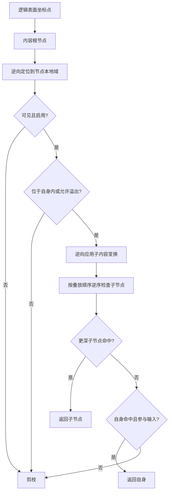
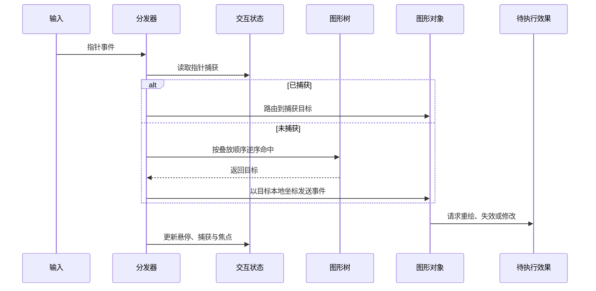
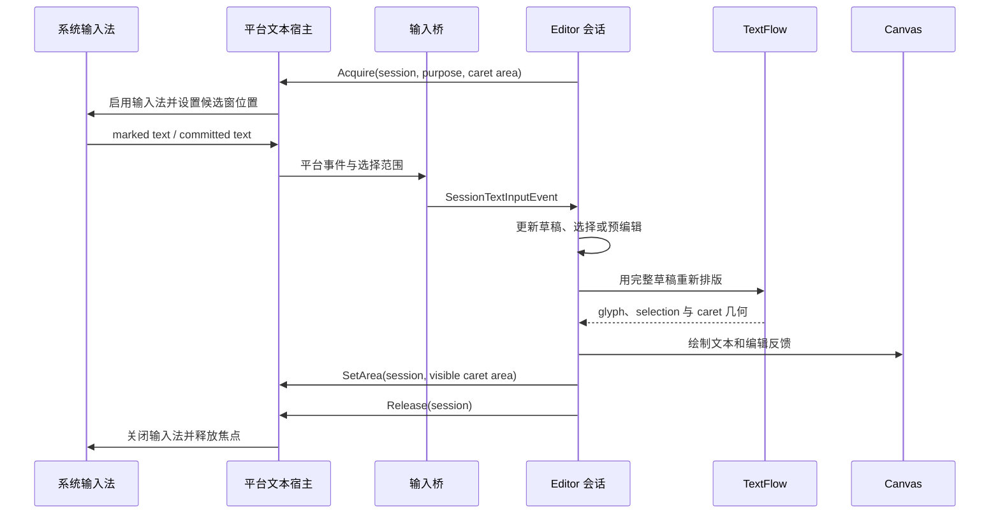

# 5. 输入与交互：从平台事件到图形行为

> **本章解决的问题**：窗口系统产生的鼠标、触控板、键盘和输入法事件，如何稳定地
> 找到同一个图形目标，并在拖拽、滚动、文本输入和焦点切换期间保持连续状态。

应用侧的边界很窄：**平台层归一化，Runtime 负责命中与状态，Figure 只返回效果，
Editor 只接管未被图形核心消费的输入。**

## 5.1 平台只负责归一化

**输入归一化**是把不同平台的鼠标、触控板和键盘事件转换成引擎统一事件与逻辑坐标
的过程。输入边界如下：

```text
平台原始事件
-> 平台输入适配器
-> 使用逻辑单位的统一输入事件
-> 场景运行时分发
```

平台适配器处理按键、按钮、指针 ID、物理/逻辑坐标换算和事件阶段；它不执行图形
命中测试，不保存指针捕获或焦点，也不直接调用图形对象。

## 5.2 命中测试与绘制互为镜像

**命中测试**（hit-test）根据一个坐标找出应该接收输入的最前方图形对象。绘制按
子节点正序，命中按子节点逆序：



实际核心：

```rust
let local_point = self
    .parent_to_local_transform(id)?
    .transform_point(point.0, point.1);
let self_hit = node.figure.precise_hit(...);

let mut child_point = local_point;
if node.child_transform().apply_inverse_to(&mut child_point) {
    for &child_id in node.children.iter().rev() {
        // recurse
    }
}
```

代码锚点：
[`FigureTree::hit_test_from_with_inner`](../../novadraw/src/graph/search.rs#L227-L277)。

## 5.3 容器命中与自身命中是两件事

图层等透明结构节点要允许命中后代，但不应成为事件目标。因此
`HitParticipation` 区分：

- `SelfAndDescendants`：自身和后代都可成为事件目标；
- `DescendantsOnly`：只允许后代成为目标，自身保持输入透明。

不能简单用 `hit_test = false` 表示透明容器，否则算法可能直接剪掉整个子树。

自由范围容器的 `OverflowVisible` 也会放宽“必须先命中父边界才能下降”的条件，但
仍继承祖先裁剪。

## 5.4 交互状态保存跨事件信息

`InteractionState` 是场景运行时保存跨事件交互信息的状态集合。一次命中测试只能
回答当前点下是什么，不能表达持续状态。**状态机**根据当前状态和新事件决定下一
状态与动作，因此 `Runtime` 还需要维护：

- 鼠标目标；
- 光标目标；
- 悬停来源；
- 焦点所有者；
- 指针捕获；
- 滚动/缩放手势会话目标。

这些状态独立于 `FigureTree`，但都使用 `FigureId` 引用节点。节点退休时 `Runtime`
必须清理所有悬空引用。

## 5.5 指针事件的分发顺序

**指针事件**（pointer event）统一表示鼠标、触控笔或触摸点的按下、移动、释放等
输入。



普通事件只回调一个目标，不使用文档对象模型（DOM）式通用冒泡。

## 5.6 悬停状态的因果顺序

**悬停**（hover）表示指针当前停留在哪个图形上。目标变化时：

```text
旧目标接收 MouseExited
-> 应用旧回调产生的效果
-> 保存新悬停目标
-> 新目标接收 MouseEntered
-> 应用新回调产生的效果
-> 分发主事件
```

顺序不能倒置，否则回调查询交互状态时会看到错误的所有者。

## 5.7 指针捕获

**指针捕获**（capture）表示后续移动和释放事件固定发送给某个图形，不再随指针位置
重新命中。按下事件被图形处理后，分发器建立捕获：

```rust
let handled = ctx.dispatch_to_target(target, &event);
if handled {
    ctx.set_captured(target);
    // pressed/focus updates
}
```

后续移动和释放事件优先发给已捕获图形，即使指针已离开其边界。释放或取消时清理
捕获，再重新计算悬停目标。

实际实现见
[`EventDispatcher::dispatch_mouse_pressed/released`](../../novadraw/src/runtime/event/mod.rs#L464-L504)。

## 5.8 焦点与键盘事件

**焦点**（focus）表示当前接收键盘输入的对象。键盘事件发送给 `focus_owner`，不是
当前悬停目标。焦点变化顺序如下：

```text
保存新焦点所有者
-> 旧对象接收 FocusLost
-> 新对象接收 FocusGained
```

编辑框架的 `EditPart` 焦点与图形对象的键盘焦点属于两个身份域，只有明确场景才能
同步，不能让二者共用一个字段。

## 5.9 滚动与缩放使用类型化回退

**类型化回退**（typed fallback）是指目标图形未处理事件时，引擎寻找明确实现了对应
滚动或缩放能力的最近控制器，而不是向所有祖先冒泡。`RangeModel` 保存滚动范围与
当前位置，`ZoomManager` 协调缩放比例和视口原点。行为如下：

```text
开始
-> 命中测试并锁定手势目标
-> 回调目标一次
-> 若未处理，查找最近的类型化控制器
-> 应用 RangeModel 或 ZoomManager
-> 更新与结束阶段保持同一会话目标
```

它不是普通的祖先冒泡。固定会话目标可以避免滚动过程中内容移动，导致连续事件被
不同图形对象接收。

代码锚点：

- [`EventDispatcher::dispatch_scroll`](../../novadraw/src/runtime/event/mod.rs#L575-L598)
- [`EventDispatcher::dispatch_zoom`](../../novadraw/src/runtime/event/mod.rs#L600-L620)

## 5.10 事件上下文与效果队列

`EventContext` 是图形事件回调可用的受限上下文；**效果队列**（effect queue）保存
回调请求、但尚未执行的重绘、失效和结构修改。图形事件处理器被调用时，`Runtime`
已经借用该图形。为了避免重入可变借用，回调只向 `EventContext` 记录效果：

```rust
pub fn repaint(&mut self, rect: Option<Rectangle>);
pub fn invalidate(&mut self);
pub fn add_child_later(...);
pub fn remove_child_later(...);
pub fn reparent_later(...);
```

结构修改在顶层分发完成后按先进先出顺序提交。局部效果保持产生顺序，`Runtime`
可以合并重绘区域，但不能重排有可观察差异的状态变化。

代码锚点：
[`EventContext`](../../novadraw/src/runtime/context.rs#L33-L325)。

## 5.11 分发结果是图形核心与编辑框架的仲裁边界

**分发结果**（`DispatchOutcome`）说明输入命中了谁、是否已被处理，以及是否存在
指针捕获。图形核心对每个归一化输入返回：

```rust
pub struct DispatchOutcome {
    target: Option<FigureId>,
    handled: bool,
    capture: Option<FigureId>,
}
```

编辑框架用它判断图形原生控件是否已经消费输入：

```text
归一化输入
-> 图形场景运行时
-> 已处理或已捕获则停止
-> 否则交给活动编辑工具
```

这让按钮、开关等图形控件交互与编辑框架的选择和工具共存，而不要求图形核心依赖
编辑框架类型。

代码锚点：

- [`DispatchOutcome`](../../novadraw/src/runtime/event/mod.rs#L268-L299)
- [`GraphicalViewer::dispatch_mouse_pressed`](../../novadraw-editor/src/viewer/mod.rs#L1157-L1198)

## 5.12 指针离开绘制表面

**指针离开**（pointer leave）表示指针已移出应用可接收输入的绘制表面。此时必须：

- 清理悬停目标与光标目标；
- 保留或按上层协议取消指针捕获；
- 编辑框架取消活动手势；
- 清理临时反馈图形；
- 停止边缘自动滚动调度。

尤其在快速移出窗口时，不能依赖后续释放事件一定到达。编辑框架的
`EditorDomain::pointer_exited` 是这个边界的一部分。

## 5.13 应用如何接入输入

平台适配器应把所有指针位置转换为逻辑表面单位，然后调用 Runtime 对应入口：

```rust
use novadraw::event::{Key, KeyModifiers, MouseButton, WheelEvent};

runtime.dispatch_mouse_moved(x, y);
runtime.dispatch_mouse_pressed(x, y, MouseButton::Left);
runtime.dispatch_mouse_released(x, y, MouseButton::Left);
runtime.dispatch_scroll(WheelEvent::new(x, y, dx, dy));
runtime.dispatch_key_pressed(Key::Character('a'), KeyModifiers::default());
```

窗口失去指针时必须调用：

```rust
runtime.pointer_exited();
```

开发自定义交互时按以下顺序判断：

1. 这是 Figure 自身行为，例如按钮点击或控件焦点吗？实现 Figure 事件能力；
2. 这是对业务模型的编辑意图吗？交给 Editor 的 Tool 和 EditPolicy；
3. 这是平台差异吗？只留在输入适配器；
4. 这是跨事件状态吗？由 Runtime 或 EditorDomain 保存，不放在单次事件对象中。

不要在应用层再次调用命中测试后直接调用 Figure。这样会绕过捕获、悬停、焦点、
本地坐标转换和 Editor 仲裁。

## 5.14 文本输入不是普通键盘事件

键盘事件适合表达快捷键、方向键和确认键，但不能可靠表达用户最终输入的文本。
输入法会经历预编辑、候选选择和提交；浏览器还可能在同一次组合输入后产生额外的
`input` 事件。因此直接文本编辑使用独立的**文本输入协议**，不把按键字符直接追加到
模型。

### 输入法是一台独立状态机

一个物理按键不等于一个字符。死键可能与后续按键组合成重音字符，拼音和日文输入需要
多次按键才能形成候选文本，emoji 也可能由多个 Unicode 标量组成。操作系统输入法
（IME）位于键盘事件与应用文本之间，维护自己的组合状态：

```text
物理按键
-> 窗口系统把按键交给输入法
-> 输入法反复更新 marked/preedit 文本
-> 用户选择候选或确认
-> 输入法提交最终文本
```

`preedit` 是仍可被输入法整体替换或取消的临时文本，不是若干次普通字符插入。例如
输入拼音时，应用可能依次收到完整的 `"p"`、`"pi"`、`"pin"`，而不是三个可永久
追加的字符。确认候选后才收到 `"拼"` 这样的 committed text。

Novadraw 把这个平台状态机连接到编辑与渲染闭环：



这里存在两个方向相反的数据流：

- 输入方向：系统输入法把语义化文本事件送入 Editor；
- 几何方向：Editor 把最新可见 caret 矩形送回系统，用于定位候选窗。

输入法不负责测量或绘制 canvas 文本，文本引擎也不解释平台按键。二者只通过
平台无关事件和逻辑表面坐标连接。

### 平台无关的事件与租约

平台无关事件区分：

- `Preedit`：更新尚未提交的组合文本及组合区内选择；
- `InsertText`：把平台已提交的文本写入编辑草稿，但不接受整个编辑会话；
- `Delete`、`Move`、`SelectAll`：表达按视觉字素、单词或行移动的编辑动作；
- `Accept`、`Cancel`：提交或放弃完整草稿；
- `FocusLost`、`LeaseLost`：处理宿主焦点和输入法所有权丢失。

反向的 `TextInputEffect` 只有 `Acquire`、`SetArea` 和 `Release`。其中
`Acquire` 建立独占的**文本输入租约**：每个事件和效果都携带
`DirectTextEditSessionId`。旧会话释放后，即使平台仍送来迟到事件，也会因 session
不匹配被拒绝，不能污染新会话。

代码锚点：

- [`TextInputEvent` 与 `TextInputEffect`](../../novadraw-editor/src/text_input.rs)
- [`EditorDomain::handle_text_input_event`](../../novadraw-editor/src/domain.rs#L345-L392)

### Native：从系统文本服务到 Winit 事件

Native 应用通过 `Window::set_ime_allowed(true)` 告诉窗口系统当前需要文本输入。
在 macOS 上，Winit 的窗口视图作为 AppKit `NSTextInputClient` 接入系统文本服务。
一个键盘按下到达视图后，AppKit 的 `interpretKeyEvents` 决定它是文本组合的一部分，
还是应该继续作为普通命令键交给应用。

macOS 文本系统回调与 Novadraw 事件的关系如下：

| 系统/Winit 阶段 | 含义 | Novadraw 处理 |
|---|---|---|
| `setMarkedText` → `Ime::Preedit` | 完整替换当前组合文本 | 更新草稿中的 composition range |
| `unmarkText` → 空 `Ime::Preedit` | 取消或清除 marked text | `CancelComposition` 恢复组合前草稿 |
| `insertText` → `Ime::Commit` | 输入法确认最终文本 | `InsertText` 写入草稿，但不接受编辑会话 |
| `Ime::Disabled` | 原生文本输入所有权丢失 | `LeaseLost` 取消当前直接编辑 |
| `set_ime_cursor_area` | 更新编辑位置 | 系统候选窗靠近可见 caret |

AppKit 的 `NSRange` 使用 UTF-16 代码单元。Winit 在产生 `Ime::Preedit` 时转换为 UTF-8
字节范围，正好对应 Editor 的字符串位置协议。`firstRectForCharacterRange` 需要返回
屏幕坐标；Winit 用应用通过 `set_ime_cursor_area` 提供的窗口逻辑矩形，换算成屏幕
矩形后交给输入法。

Native 适配器把 Winit 的 `Ime::Preedit`、`Ime::Commit` 和键盘导航转换成统一事件，
并用逻辑表面坐标调用 `set_ime_cursor_area`。输入法提交后可能紧跟一个内容相同的键盘
文本事件，桥接器会抑制这次重复插入。组合期间除 Escape 外的键盘文本也不直接进入
Editor，因为此时字符解释权属于输入法。

### Web：用隐藏 textarea 成为文本输入客户端

Web 没有直接可用的 canvas 文本输入目标，因此 `WebTextInputHost` 创建不可见的
`textarea` 获取浏览器输入焦点。它处理 `composition*`、`beforeinput`、`input`、
`keydown` 和 `blur`，再把结果归一化。不能把该元素设为 `display: none` 或
`visibility: hidden`，否则它通常无法获取焦点、唤起软键盘或参与输入法组合。当前
宿主使用固定定位、近乎透明、透明文字和 `pointer-events: none`，并关闭 DOM caret，
只保留浏览器原生文本输入能力。

```text
Editor caret 的逻辑表面矩形
-> 加上 canvas 的浏览器客户区原点
-> 定位隐藏 textarea
-> 浏览器在该位置显示输入法候选窗
```

主要 DOM 事件按以下顺序处理：

1. `Acquire` 定位并 focus `textarea`，浏览器由此启动输入法或软键盘；
2. `compositionstart` 标记进入组合；
3. `compositionupdate` 提供新的 preedit 文本；
4. 组合期间紧随其后的 `input` 读取已经更新的 `textarea.value`、
   `selectionStart/selectionEnd`，校准 preedit 和组合 caret；
5. `compositionend` 产生一次 committed `InsertText`；
6. 随后的重复 `input` 被抑制，`textarea.value` 被清空；
7. `blur` 产生 `FocusLost`，由会话策略决定接受或取消。

浏览器选择偏移使用 UTF-16 代码单元，Editor 使用 UTF-8 字节边界，Web 宿主必须
显式转换。否则一个 emoji 或代理对会让组合 caret 落在非法 UTF-8 边界上。
`beforeinput` 用于拦截浏览器的向前/向后删除，再转换成按视觉字素或单词删除的 Editor
事件；方向键和全选等命令则由 `keydown` 归一化。

隐藏 `textarea` 不是草稿副本。它只暂存浏览器本次输入或 composition 的值，提交后
立即清空。完整草稿、文档选择和 undo/redo 仍归 Editor 与业务模型所有，因此 DOM
selection 不会成为第二个事实源。

#### EditContext 可以替代 textarea 吗

在支持 `EditContext` 的浏览器中可以。应用可以把 `EditContext` 直接绑定到 canvas，
让 canvas 获得系统文本服务，而不再创建隐藏可编辑元素：

```javascript
const editContext = new EditContext({
  text,
  selectionStart,
  selectionEnd,
});
canvas.editContext = editContext;
canvas.focus();
```

它比隐藏 `textarea` 更接近 Novadraw 的所有权模型：

| `EditContext` 能力 | Novadraw 对应职责 |
|---|---|
| `textupdate` | 把完整 buffer、selection 和 composition 原子同步到 Editor 会话 |
| `compositionstart/end` | 标记 preedit 生命周期 |
| `updateText`、`updateSelection` | 把 Editor 草稿和选择同步回浏览器文本服务 |
| `updateControlBounds` | 提供完整编辑区域的浏览器客户区矩形 |
| `updateSelectionBounds` | 提供当前 selection/caret 的浏览器客户区矩形 |
| `characterboundsupdate` | 按请求范围返回由 TextFlow 排版产生的字符几何 |

但它不是当前隐藏 `textarea` 的无条件替代品：

1. `EditContext` 仍不是跨浏览器普遍可用能力，Web 宿主必须先做 feature detection；
2. 它维护完整文本缓冲区，`textupdate` 使用 UTF-16 替换范围，而 Editor 使用
   `FlowTextPosition` 和 UTF-8 边界，因此桥接器执行显式、可测试的双向转换；
3. `characterboundsupdate` 要求同步返回指定范围的字符矩形。Web host 将 UTF-16
   code unit 映射到 UTF-8 range，再查询当前 TextFlow 的真实 selection geometry；
4. `textformatupdate` 的多种 composition 样式尚未进入平台无关反馈协议，当前仍绘制
   统一的 preedit 下划线；
5. 不支持该 API 的浏览器仍需使用隐藏 `textarea`。

因此合理的宿主选择是：

```text
支持 EditContext 且几何契约完整
-> EditContext host

否则
-> hidden textarea host
```

Web direct-edit 验证页通过
<http://127.0.0.1:4173/?mode=direct-edit&backend=vello&text-input=edit-context>
选择该 host。启动编辑后，`WebEditContextHost` 把同一个 Viewer 会话绑定到 canvas；
浏览器不支持或初始化失败时自动回退到 `WebTextInputHost`。两条路径共用
`EditorDomain`、TextFlow feedback 和模型 Command，不存在独立的演示状态机。

平台宿主只拥有原生焦点、输入法状态和候选窗位置。草稿、文本选择、预编辑范围和插入
光标仍由 Editor 会话保存和绘制。`Acquire/SetArea` 携带的 caret area 只是候选窗
锚点，不是让平台绘制第二个光标的命令。完整的光标 Figure 与局部重绘机制见第 8.14
节。

### 输入法如何与文本渲染闭合

平台事件进入 Editor 后，必须先更新草稿，再重新排版，最后才能得到可信的 caret
位置。顺序不能反过来：

```text
Preedit / InsertText / Move / Delete
-> 修改 DirectTextEditState
-> policy 用完整 draft 创建 TextFlow feedback
-> Runtime 稳定 TextFlow 布局
-> 布局同时产生 glyph runs 与 TextInteractionMap
-> 查询 selection、preedit 和 caret 几何
-> 必要时调整 TextFlowViewport 水平偏移以 reveal caret
-> Canvas 绘制 glyph 与 feedback
-> SetArea 把可见 caret 矩形送回输入法
```

`TextInteractionMap` 与 glyph runs 来自同一次排版，因此复杂字素、字体回退、双向
文本、换行和内部滚动会同时反映在文字与光标位置上。不能先根据字符串长度估算 caret，
再单独排版文字；两套计算在比例字体和组合字符下必然分离。

选择高亮、preedit 下划线和 caret 会裁剪到编辑视口，完整草稿仍参与排版。长文本通过
`TextFlowViewport` 内部滚动露出 caret，而不是在编辑态使用省略号。滚动、缩放、
resize 或节点移动后，Viewer 重新执行几何查询并发出 `SetArea`，使画布光标和系统
候选窗保持同一位置。

需要区分两次“提交”：

| 操作 | 提交到哪里 | 是否进入命令历史 |
|---|---|---|
| IME `Commit` / DOM `compositionend` | 提交到 Editor 草稿 | 否 |
| 直接编辑 `Accept` | 由 Command 提交到业务模型 | 是 |

输入法提交后用户仍可继续修改或按 Escape 放弃整个草稿。只有直接编辑会话接受后，
业务模型才改变。

代码锚点：

- [`WinitTextInputBridge`](../../novadraw-platform-winit/src/text_input.rs)
- [`WebTextInputBridge`](../../novadraw-platform-web/src/text_input.rs)
- [`WebTextInputHost`](../../novadraw-platform-web/src/dom_text_input.rs)
- [`WebEditContextHost`](../../novadraw-platform-web/src/edit_context.rs)
- [`DirectTextEditState`](../../novadraw-editor/src/direct_edit.rs#L228-L439)
- [`GraphicalViewer::attach_direct_text_feedback`](../../novadraw-editor/src/viewer/mod.rs#L1995-L2215)
- [`TextFlowFigure` 交互几何](../../novadraw/src/figure/text_flow.rs#L293-L390)

## 5.15 失败模式

| 错误 | 后果 |
|---|---|
| 命中正序遍历 | 被遮挡节点抢到事件 |
| 事件点不转为目标本地坐标 | 嵌套、滚动、缩放后交互漂移 |
| 透明图层返回自身作为目标 | 空白图层吞掉业务节点事件 |
| 捕获后仍重新命中 | 拖拽出边界后中断 |
| 滚动时每帧重新选择目标 | 内容移动时手势跳转 |
| 图形回调直接改树 | 遍历中拓扑变化和借用冲突 |
| 指针离开时不取消编辑手势 | 反馈图形和边缘自动滚动残留 |
| 把按键文本直接追加到草稿 | 输入法组合文本重复或丢失 |
| 把每次 `Preedit` 当作增量追加 | 拼音等组合文本不断重复 |
| 把 IME `Commit` 当作会话 `Accept` | 选择候选后编辑被提前结束 |
| 文本输入事件不携带 session | 迟到事件写入后续编辑会话 |
| 候选窗使用物理像素或节点本地坐标 | 缩放、滚动或高分屏下候选窗偏移 |
| Web 不转换 UTF-16 选择偏移 | emoji 和扩展字符的预编辑光标错位 |
| 把隐藏 `textarea` 当成业务模型 | DOM、Editor 草稿与模型形成三份可写状态 |
| 无 feature detection 就使用 `EditContext` | 不支持该 API 的浏览器完全无法输入 |
| 用估算字宽响应 `characterboundsupdate` | ligature、组合字符和双向文本的候选窗错位 |

## 5.16 验证入口

- [`m6_event_contract.rs`](../../novadraw/tests/m6_event_contract.rs)
- [`p2_dispatch_outcome_contract.rs`](../../novadraw/tests/p2_dispatch_outcome_contract.rs)
- [`d1_focus_contract.rs`](../../novadraw/tests/d1_focus_contract.rs)
- [`g3_viewer_interaction_contract.rs`](../../novadraw-editor/tests/g3_viewer_interaction_contract.rs)
- [`Winit 文本输入桥测试`](../../novadraw-platform-winit/src/text_input.rs)
- [`Web 文本输入桥测试`](../../novadraw-platform-web/src/text_input.rs)
- `cargo xtask verify core.runtime`
- `cargo xtask verify platform.p2-e02-text-input`
