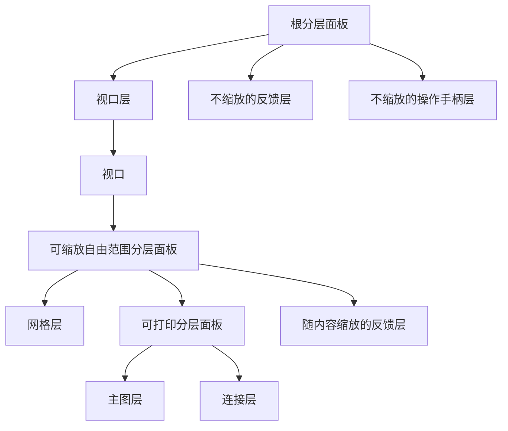
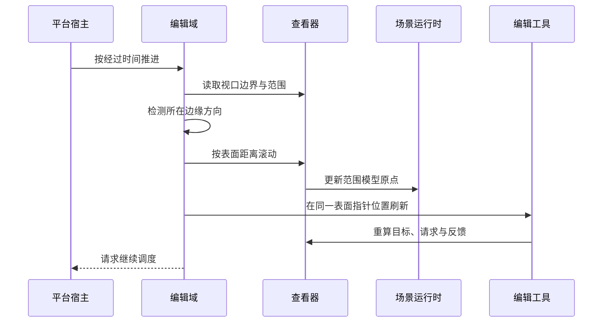

# 6. 图层与视口：构建可滚动、可缩放画布

> **本章解决的问题**：应用如何组织内容层、连接层和反馈层，并让大画布在滚动与
> 缩放后仍保持正确的绘制、命中和交互。

对普通应用，优先使用 `ScrollPaneFigure` 和 Builder 的组合入口；只有实现专用容器
或编辑框架时，才需要直接协调 `RangeModel`、自由范围和多层反馈。

## 6.1 图层是有语义的透明图形对象

**图层**（Layer）是用于组织一组图形及其叠放关系的结构图形，通常不绘制自身。
它仍然是 `FigureTree` 中的节点，因此继续服从统一的：

- 拓扑与叠放顺序；
- 坐标变换；
- 绘制与命中测试；
- 校验与重绘区域；
- 生命周期与销毁。

图层的特殊点是它通常不绘制自身，也不作为输入目标：

```rust
fn paint_figure(&self, _gc: &mut NdCanvas) {}

fn hit_participation(&self) -> HitParticipation {
    HitParticipation::DescendantsOnly
}
```

代码锚点：
[`LayerFigure`](../../novadraw/src/container/layer.rs)。

## 6.2 分层面板的两个索引

**分层面板**（LayeredPane）是按语义键管理多个图层的容器。`LayeredPaneState` 维护：

```text
by_key: LayerKey -> FigureId
by_child: FigureId -> LayerKey
```

它不复制子节点顺序。叠放顺序仍由 `FigureTree` 的子节点顺序唯一保存。添加、删除、
移动和更换图层父节点时，必须在同一个 `Runtime` 修改事务中同时维护拓扑和双向索引。

这一设计把两个概念分开：

- `LayerKey`：关系身份，用于查找语义层；
- 子节点顺序：视觉顺序，用于绘制和命中。

## 6.3 普通图层与自由范围图层

普通 `LayerFigure` 使用固定边界和标准子节点裁剪。**自由范围图层**
（`FreeformLayerFigure`）允许子节点超出图层原有边界，并从子节点几何推导内容范围。
它使用：

```rust
ChildClippingStrategy::OverflowVisible
```

自由范围的语义不是无限画布，而是：

```text
继承祖先的有效裁剪区
-> 不与当前图层客户区求交
-> 不追加子节点边界裁剪
-> 仍在最近的视口或普通裁剪祖先处停止
```

这里的“继承”是指图层进入绘制、命中测试或重绘区域投影时，先沿用父链已经形成的
有效裁剪区。`OverflowVisible` 仅跳过当前自由范围图层的两次收紧：它不再把有效裁剪区
与自身客户区求交，也不再追加每个子节点的边界裁剪。因此，子节点可以越过该图层的
固定边界；但它们不能越过已经存在的视口或普通裁剪祖先。换言之，自由范围图层解决的
是“反馈超出图层初始边界被截断”，而不是建立无限画布。

这对临时反馈图形很重要。拖拽轮廓可以超出图层初始边界并扩展滚动范围，但不能越过
最终的视口裁剪。

## 6.4 编辑框架的标准图层拓扑

**图层拓扑**是各语义图层在图形树中的父子结构和前后顺序。`GraphicalViewer` 构造
以下树：



实际构造见
[`create_root_layers`](../../novadraw-editor/src/viewer/mod.rs#L504-L630)。

各层职责：

| 层 | 坐标/缩放 | 用途 |
|---|---|---|
| 主图层 | 随内容滚动和缩放 | 模型节点图形 |
| 连接层 | 随内容滚动和缩放 | 连接图形 |
| 缩放反馈层 | 随内容滚动和缩放，采用自由范围 | 拖拽轮廓、连接预览 |
| 非缩放反馈层 | 逻辑表面域 | 不随内容变换的瞬时反馈 |
| 操作手柄层 | 逻辑表面域 | 固定屏幕尺寸的交互句柄 |

## 6.5 视口的状态

**视口**（Viewport）是只显示大型内容中一部分区域的容器。它只有一个内容节点，并
通过水平和垂直两个**范围模型**（`RangeModel`）保存可见区域原点：

```text
水平方向：最小值 / 最大值 / 可见长度 / 当前值
垂直方向：最小值 / 最大值 / 可见长度 / 当前值
```

其中：

- `value`：可见区域起点；
- `extent`：可见长度；
- `maximum - minimum`：内容范围；
- 当前值会被钳制（clamp）到 `[minimum, maximum - extent]` 合法区间内。

`set_view_location(x, y)` 同时更新两个轴，并在实际变化后：

- 记录 `viewLocation` 属性变化；
- 发出坐标系变化通知；
- 请求重绘视口。

代码锚点：

- [`ViewportHandle::set_view_location`](../../novadraw/src/container/viewport.rs)
- [`normalize_range`](../../novadraw/src/container/range_model.rs)

## 6.6 滚动与缩放的状态真源

**滚动**（scroll）改变视口原点；**缩放**（zoom）改变内容到视口的比例。两者都必须
只有一个状态真源。`RangeModel` 是单轴滚动状态，`ScalablePane` 是统一缩放其子内容
的容器：


不允许编辑工具、编辑策略或应用保存另一份原点或缩放比例。它们必须通过 `Runtime`
当前变换，将表面坐标点转换到模型域或路由域。

窗口尺寸变化只改变逻辑视口与绘制表面，不应隐式执行适应宽度、高度或全部内容。

## 6.7 自由范围与视口范围

**自由范围**（freeform extent）是包围所有子节点可见内容的派生矩形，由子节点
拓扑、几何与边变换计算得到，不是第二份业务边界。

收敛顺序：

```text
子节点几何或布局变化
-> 重新计算自由范围
-> 更新视口范围的最大值和可见长度
-> 把视口位置钳制到合法区间
-> 坐标变换发生变化
-> 产生重绘区域
```

自由范围矩形变化不代表整块区域都需要重绘；图形的新旧视觉区域仍是重绘来源。如果
范围钳制改变视口原点，则视口客户区进入重绘区域。

## 6.8 边缘自动滚动

**边缘自动滚动**（auto-expose）是拖拽接近视口边缘时，自动滚动内容以露出更多区域
的行为。它是活动编辑手势的临时状态，不属于视口业务模型。



核心不变量：

- 边缘阈值使用逻辑表面单位，不随缩放变化；
- 右下角等角区必须允许两个轴同时滚动；
- 单次经过时间有上限，避免平台宿主卡顿后大幅跳跃；
- 一个轴到边界时，另一个可滚动轴仍继续；
- 边缘自动滚动不修改模型、不进入命令历史栈；
- 释放指针前清理临时反馈，只执行一个模型命令。

实际策略见
[`autoexpose.rs`](../../novadraw-editor/src/autoexpose.rs)。

## 6.9 视口变化后的同帧重投影

滚动、缩放、窗口尺寸变化或范围钳制改变坐标变换后，即使指针没有移动，活动手势也
必须在同帧重新计算：

1. 请求位置与位移；
2. 候选目标；
3. 命令预览；
4. 随内容缩放的反馈；
5. 不缩放的操作手柄。

`EditorDomain` 在视口变化后保留同一个逻辑表面指针位置，并刷新活动工具。该行为见
[`EditorDomain::autoexpose_tick`](../../novadraw-editor/src/domain.rs#L328-L352) 和
`refresh_after_viewport_change`。

## 6.10 为什么缩放反馈层必须采用自由范围

若缩放反馈层使用固定边界的普通图层：

1. 拖拽轮廓到原内容范围之外；
2. 反馈图形被所在图层的客户区截断；
3. 视口范围看不到完整临时范围；
4. 边缘自动滚动后轮廓仍然缺失。

使用 `FreeformLayerFigure` 后：

- 反馈图形可扩展临时范围；
- 自身不按固定边界裁剪；
- 最终仍共享视口裁剪；
- 绘制、命中测试和重绘区域使用同一溢出语义。

## 6.11 构建滚动缩放画布

构建期可以让 Builder 一次建立滚动面板的内部结构：

```rust
use novadraw::container::ZoomManager;
use novadraw::prelude::*;

let pane = tree.builder().add_scroll_pane_to(
    root,
    Rectangle::new(80.0, 60.0, 640.0, 460.0),
)?;
let scalable = tree.builder().add_scalable_layered_pane_to(
    pane.viewport().figure_id(),
    Rectangle::new(0.0, 0.0, 1600.0, 1200.0),
)?;

tree.builder().add_child(
    scalable.figure_id(),
    Box::new(RectangleFigure::new(120.0, 90.0, 180.0, 100.0)),
)?;
tree.builder().validate_subtree(pane.pane_id())?;

let zoom = ZoomManager::new(scalable, pane.viewport().clone());
let mut runtime = Runtime::new(tree);
```

运行期通过 Runtime editor 改变状态：

```rust
runtime
    .viewport(pane.viewport().figure_id())?
    .scroll_by(24.0, 16.0)?;
runtime.zoom(&zoom)?.set_zoom_at(1.25, None)?;
```

选择容器时：

- 内容尺寸固定但大于窗口：使用普通 `ScrollPaneFigure`；
- 内容由自由分布的子节点决定：使用 Freeform 内容；
- 内容需要整体缩放：在 Viewport 内放置 Scalable 容器；
- 需要语义图层：在 Scalable 内容中放置 LayeredPane；
- 需要 Editor：优先使用 `GraphicalViewer` 已建立的标准根图层，不要自行复制拓扑。

完整构建示例见
[`apps/scenes/src/scroll_pane.rs`](../../apps/scenes/src/scroll_pane.rs) 和
[`apps/scenes/src/freeform.rs`](../../apps/scenes/src/freeform.rs)。

## 6.12 失败模式

| 错误 | 后果 |
|---|---|
| 图层保存独立叠放顺序 | 视觉顺序与命中顺序分裂 |
| 用 `hit_test=false` 代替 `DescendantsOnly` | 整个图层子树不可命中 |
| 反馈使用固定边界图层 | 边缘拖拽轮廓被裁掉 |
| 应用手写 `(surface/scale)+origin` | 改变尺寸或缩放后反馈漂移 |
| 边缘自动滚动只处理单轴 | 角区拖拽无法沿对角方向推进 |
| 视口变化不刷新活动工具 | 指针不动时请求仍是旧坐标 |
| 指针离开后不停止调度 | 离开窗口后持续滚动 |

## 6.13 验证入口

- [`d2_layer_contract.rs`](../../novadraw/tests/d2_layer_contract.rs)
- [`d2_freeform_contract.rs`](../../novadraw/tests/d2_freeform_contract.rs)
- [`m8_viewport_contract.rs`](../../novadraw/tests/m8_viewport_contract.rs)
- [`g5_connection_creation_contract.rs`](../../novadraw-editor/tests/g5_connection_creation_contract.rs)
- `cargo xtask run verify.scroll-pane`
- `cargo xtask run replay.editor-g5.5`
