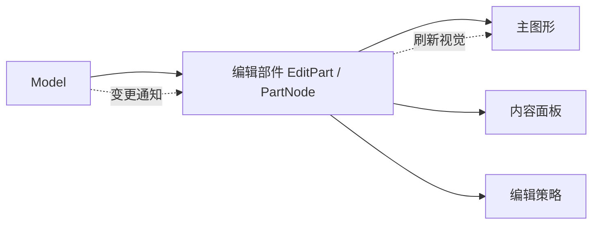
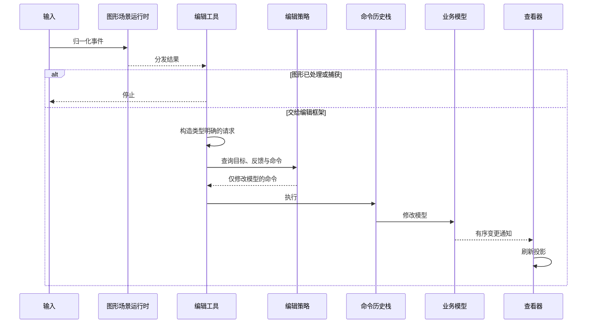

# 8. 编辑框架：从业务模型到可撤销编辑

> **本章解决的问题**：如何把应用自己的模型投影成节点和连接，并把选择、拖拽、
> 创建、删除和连线转换成可撤销的业务命令。

Editor 的核心纪律是：**模型保存业务事实，Figure 只是投影，Command 只改模型，
Viewer 负责刷新。** 一旦让命令和 Figure 同时写同一项事实，撤销、重建和多视图都会
失去一致性。

## 8.1 图形核心与编辑框架的边界

**图形核心**（Core）负责呈现与输入，回答：

- 图形对象如何布局、绘制、命中和接收输入？
- 坐标、重绘区域、视口和连接如何保持一致？

**编辑框架**（Editor）负责把业务模型映射成可交互图形，并把输入转换成可撤销的模型
修改，回答：

- 哪个业务模型对应哪个图形对象？
- 当前选择了什么？
- 一段输入手势表示什么编辑意图？
- 如何生成可撤销的模型修改？

这里的**投影**是指根据业务模型创建或刷新对应的编辑部件与图形对象；模型是事实
来源，投影可以删除并重建。

因此 `novadraw-editor` 是独立的 Rust 包（crate），不把业务模型、选择状态或命令
历史栈写入 `novadraw` Core。

## 8.2 三个身份域

**身份域**是某类 ID 有效且可比较的范围。模型、查看器和场景运行时各自管理不同
身份，不能因为它们指向同一业务对象就混用：


- `ModelId`：应用定义，可持久化；
- `EditPartId`：图形查看器（Viewer）命名空间内的代际运行时身份；
- `FigureId`：场景运行时（Runtime）命名空间内的代际图形身份。

可撤销命令只能保存 `ModelId` 与业务数据，不能保存仍绑定当前运行时的
`EditPartId`、`FigureId`、`ConnectionId` 或 `AnchorId`。撤销后允许重建新的视图身份。

## 8.3 业务模型是持久事实源

**模型适配器**（`ModelAdapter`）是编辑框架读取应用模型结构、连接和有序变更通知的
边界。应用通过它暴露：

```rust
pub trait ModelAdapter {
    type ModelId: Copy + Eq + Hash + Debug + 'static;
    type Event;
    type Error: Error + 'static;

    fn root(&self) -> Self::ModelId;
    fn revision(&self) -> ModelRevision;
    fn children(&self, model: Self::ModelId)
        -> Result<Vec<Self::ModelId>, Self::Error>;
    fn connections(&self)
        -> Result<Vec<ModelConnection<Self::ModelId>>, Self::Error>;
    fn drain_events(&mut self)
        -> Vec<ModelEvent<Self::ModelId, Self::Event>>;
}
```

代码锚点：
[`ModelAdapter`](../../novadraw-editor/src/model/mod.rs)。

模型不知道图形对象或查看器，图形对象也不知道模型。编辑部件和查看器负责投影。

## 8.4 编辑部件是控制器，不是第二份模型

**编辑部件**（EditPart）是连接业务模型与图形对象的控制器：它读取模型并刷新视觉，
但不复制一份可独立修改的业务状态。

`PartNode` 是编辑部件在 `PartTree` 中的运行时记录，保存：

- `model_id`
- 父节点与子节点
- 主图形与内容面板
- 视觉对象列表
- 活动状态

具体 `EditPartBehavior` 负责创建图形、刷新视觉、提供编辑策略和锚点描述符。
**锚点描述符**（Anchor Descriptor）是模型或编辑部件提供的稳定数据，用于在当前
运行时解析出实际锚点；它不会把临时的 `AnchorId` 写入持久模型。



编辑部件拓扑、模型包含关系和图形拓扑可以对应，但不共享身份。

代码锚点：

- [`PartNode`](../../novadraw-editor/src/part/mod.rs)
- [`PartTree`](../../novadraw-editor/src/part/mod.rs)
- [`EditPartBehavior`](../../novadraw-editor/src/part/mod.rs)

## 8.5 连接编辑部件不是包含关系子节点

**连接编辑部件**（ConnectionPart）控制一条模型连接及其连接图形。连接不是单一父级
包含的对象，因此使用独立索引：

```text
连接 -> { 起点 EditPartId, 终点 EditPartId }
出边索引(端点) -> 有序 ConnectionPartId[]
入边索引(端点) -> 有序 ConnectionPartId[]
```

`ConnectionPartId` 是受检的 `EditPartId` 角色包装，不分配第二套键。自环连接同时
出现在同一部件的出边和入边索引中，但仍只有一个连接编辑部件。

连接图形只挂到连接层，不塞入包含关系子节点。

## 8.6 查看器的组合职责

**图形查看器**（`GraphicalViewer`）把一份业务模型投影成编辑部件树和图形树，并
协调交互状态。它拥有一个模型投影及其运行时：

```rust
pub struct GraphicalViewer<A, F> {
    model: A,
    factory: F,
    runtime: Runtime,
    root_layers: RootLayers,
    parts: PartTree<A::ModelId>,
    model_registry: HashMap<A::ModelId, EditPartId>,
    visual_registry: HashMap<FigureId, VisualOwner>,
    selection: SelectionModel<EditPartId>,
    // behavior, policy, connection projections...
}
```

实际定义见
[`GraphicalViewer`](../../novadraw-editor/src/viewer/mod.rs#L646-L667)。

查看器负责：

- 捕获稳定模型快照；
- 创建和退休编辑部件与图形对象；
- 维护模型注册表与视觉对象注册表；
- 维护选择状态与编辑部件焦点；
- 维护根图层拓扑；
- 仲裁图形核心分发与编辑工具输入；
- 投影连接。

## 8.7 投影先计划，再提交

**投影刷新**是把稳定模型快照与当前视图比较，先制定变更计划，再统一同步到编辑部件
树和图形树。`GraphicalViewer::refresh()` 的顺序如下：

```text
取出模型事件
-> 校验版本连续
-> 捕获稳定模型快照
-> 确认读取期间版本未漂移
-> 计算退休、换父节点与创建计划
-> 准备受影响的连接
-> 同步包含关系
-> 同步连接
-> 发布已应用版本
```

重复的 `ModelId`、缺失的连接端点或快照版本漂移会在计划阶段被拒绝。提交期间遇到
无法补偿的扩展失败时，查看器进入故障锁定状态。

代码锚点：
[`GraphicalViewer::refresh`](../../novadraw-editor/src/viewer/mod.rs#L1752-L1791)。

## 8.8 选择状态与视觉对象所有者

**选择状态**（Selection）表示当前被用户选中的编辑部件集合。查看器按顺序保存
`EditPartId`：

- 最后一个元素是主选择项；
- 追加、替换、切换、移除、清空会产生类型明确的变化量；
- 焦点与选择状态相互独立；
- 编辑部件退休时清理失效选择。

**视觉对象所有者**（`VisualOwner`）记录命中的图形属于编辑部件、操作手柄还是临时
反馈：

```text
Part(EditPartId)
Handle(HandleId, owner, role)
Feedback(FeedbackId, optional owner)
```

查看器从命中的图形沿祖先链查找首个已注册所有者，因此一个编辑部件可以控制复合
图形，无需给每个内部图形分别注册控制器。

代码锚点：

- [`SelectionModel`](../../novadraw-editor/src/selection/mod.rs)
- [`VisualOwner`](../../novadraw-editor/src/feedback/mod.rs)
- [`GraphicalViewer::target_at`](../../novadraw-editor/src/viewer/mod.rs#L1127-L1155)

## 8.9 编辑工具、请求、策略与命令

完整编辑链：



### 编辑工具（Tool）

编辑工具是把连续输入解释成一次编辑手势的状态机。它锁定手势来源、操作类型和手势
版本；移动阶段只更新请求与反馈。

### 编辑请求（Request）

编辑请求是平台无关、模型无关、类型明确的编辑意图，本身不修改模型。当前类型包括：

```rust
pub enum EditorRequest {
    ChangeBounds(ChangeBoundsRequest),
    Create(CreateRequest),
    Delete(DeleteRequest),
    CreateConnection(CreateConnectionRequest),
    ReconnectConnection(ReconnectConnectionRequest),
    Bendpoint(BendpointRequest),
}
```

实际定义：
[`EditorRequest`](../../novadraw-editor/src/request/mod.rs#L546-L603)。

### 编辑策略（EditPolicy）

编辑策略解释某类请求对某个编辑部件意味着什么，并按稳定的 `PolicyRole` 安装到
部件。策略可以：

- 判断是否理解请求；
- 决定目标；
- 贡献命令；
- 创建来源反馈或目标反馈；
- 创建仅在本次手势内有效的连接计划。

多个策略贡献的命令按稳定角色顺序组成复合命令（`CompoundCommand`）。

### 可撤销命令（Command）

可撤销命令只修改应用模型。成功执行后才进入历史；执行新命令会清空重做历史。

## 8.10 反馈图形不是模型预写

**反馈图形**（Feedback）是命令提交前用于预览操作结果的临时图形，不是业务模型的
提前写入。

拖拽中：

```text
编辑工具更新请求
-> 编辑策略计算预览
-> 查看器安装临时反馈图形
-> 业务模型保持不变
```

释放指针时：

```text
清除临时反馈
-> 构造最终命令
-> 命令历史栈执行命令
-> 模型发出通知
-> 查看器刷新
```

反馈图形必须在命令执行前清理，避免稳定模型图形与临时图形同时表达结果。

## 8.11 命令历史栈的错误语义

**命令历史栈**（`CommandStack`）负责执行、撤销、重做并记录保存位置。命令的普通
错误必须保证模型与命令都保持调用前状态；无法保证时返回 `state_unknown`，命令
历史栈进入故障锁定状态。

复合命令（`CompoundCommand`）：

- 正序执行；
- 失败时逆序补偿已执行前缀；
- 逆序撤销；
- 补偿失败或代码恐慌导致故障锁定。

实际历史提交逻辑见
[`CommandStack::execute/undo/redo`](../../novadraw-editor/src/command/mod.rs#L398-L574)。

`is_dirty` 比较当前历史身份与保存位置，而不是只判断撤销栈是否为空。

## 8.12 编辑域（EditorDomain）

`EditorDomain` 是一组协同工作的编辑工具和命令历史的组合根，包含：

- 一个 `CommandStack`；
- 选择、移动与调整尺寸工具；
- 连接创建工具；
- 端点重连工具；
- 折点工具；
- 交互版本；
- 指针与边缘自动滚动调度状态。

执行编辑请求时：

```rust
cancel_active_tools();
let command = viewer.command_for_request(request)?;
command_stack.execute(viewer.model_mut(), command)?;
viewer.refresh()?;
```

实际实现见
[`EditorDomain::execute_request`](../../novadraw-editor/src/domain.rs#L193-L209)。

## 8.13 连接编辑

### 创建连接

两阶段手势先锁定起点，移动时更新候选终点和路径反馈，第二次确认后生成唯一模型
命令。

### 重连

固定连接编辑部件与未移动端，只替换起点或终点的模型关系。成功刷新时尽量保留连接
编辑部件和图形身份。

### 折点

请求明确区分创建、移动和删除，并携带路由坐标域中的位置与索引。模型保存折点，
运行时路径是模型投影，不是纯视觉模拟。

### 边缘自动滚动

拖拽到视口内边缘时只改变视口原点，然后用固定的表面指针位置重新运行活动工具。
它不执行模型命令。

## 8.14 实现一个编辑器的顺序

不要从拖拽工具开始。先按以下顺序建立闭环：

1. **定义业务模型身份与修订**
   使用可持久化 `ModelId`，每次已提交变化产生连续 `ModelRevision`。
2. **实现 `ModelAdapter`**
   先支持根、子节点、连接快照和有序事件排空。
3. **实现 `EditPartFactory` 与最小 `EditPartBehavior`**
   只创建静态主图形，证明模型可以确定性投影。
4. **创建 `GraphicalViewer`**
   检查模型注册表、图形注册表、连接层和刷新错误。
5. **加入选择与一个编辑请求**
   从 `ChangeBounds` 或 `Delete` 开始，完成
   `Tool -> Request -> EditPolicy -> Command -> Model -> refresh`。
6. **接入 `EditorDomain` 与 CommandStack**
   验证执行、撤销、重做、取消和保存位置。
7. **最后加入连接、折点和边缘自动滚动**
   这些能力依赖前面的身份、坐标、反馈和命令边界。

最小组合形态：

```rust
use novadraw_editor::{EditorDomain, GraphicalViewer};
use novadraw::Rectangle;

let viewer = GraphicalViewer::new(
    model_adapter,
    edit_part_factory,
    Rectangle::new(0.0, 0.0, width, height),
)?;
let domain = EditorDomain::new();
```

`GraphicalViewer` 拥有 Figure Runtime，平台输入应先交给 Viewer/Core 仲裁，再由
`EditorDomain` 推进活动工具。窗口尺寸、滚动或缩放变化后，需要让活动工具在同一
逻辑表面指针位置重新投影。

产品代码建议把职责分开：

| 模块 | 保存内容 |
|---|---|
| `model` | 可持久化节点、连接和业务属性 |
| `adapter` | 模型快照、修订与事件 |
| `parts` | Figure 创建、视觉刷新和锚点描述 |
| `policies` | 请求解释、反馈与命令生成 |
| `commands` | 只依赖模型 ID 的可撤销修改 |
| `app` | Viewer、EditorDomain、平台宿主和后端组合 |

可运行示例：
[`apps/native/node-editor-demo`](../../apps/native/node-editor-demo)。该示例包含完整能力，
实现自己的应用时应按上面的顺序逐层引入，而不是一次复制全部代码。

## 8.15 失败模式

| 错误 | 后果 |
|---|---|
| 命令保存 `FigureId` | 撤销或重建后引用失效 |
| 图形对象直接修改模型 | 绕过历史和通知 |
| 命令执行后手工修改图形 | 模型与视图出现双写 |
| 连接编辑部件塞入包含关系 | 树关系无法表达双端点 |
| 选择状态写入 `NodeState` | 多个查看器的选择状态互相污染 |
| 反馈图形直接写模型 | 取消时无法恢复，撤销粒度错误 |
| 图形已处理后编辑工具仍执行 | 控件点击同时触发编辑 |
| 刷新时忽略版本缺口 | 丢失事件后仍宣称投影稳定 |

## 8.16 验证入口

- [`g1_model_contract.rs`](../../novadraw-editor/tests/g1_model_contract.rs)
- [`g1_command_stack_contract.rs`](../../novadraw-editor/tests/g1_command_stack_contract.rs)
- [`g2_viewer_projection_contract.rs`](../../novadraw-editor/tests/g2_viewer_projection_contract.rs)
- [`g3_selection_contract.rs`](../../novadraw-editor/tests/g3_selection_contract.rs)
- [`g3_viewer_interaction_contract.rs`](../../novadraw-editor/tests/g3_viewer_interaction_contract.rs)
- [`g4_editing_loop_contract.rs`](../../novadraw-editor/tests/g4_editing_loop_contract.rs)
- [`g5_connection_projection_contract.rs`](../../novadraw-editor/tests/g5_connection_projection_contract.rs)
- [`g5_connection_creation_contract.rs`](../../novadraw-editor/tests/g5_connection_creation_contract.rs)
- `cargo xtask run replay.editor-g3`
- `cargo xtask run replay.editor-g4`
- `cargo xtask run replay.editor-g5.2`
- `cargo xtask run replay.editor-g5.3`
- `cargo xtask run replay.editor-g5.4`
- `cargo xtask run replay.editor-g5.5`
