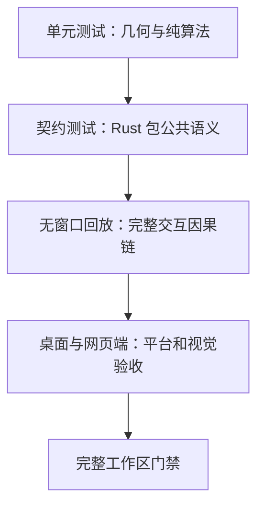

# 9. 扩展、验证与故障排查

> **本章解决的问题**：应用需要自定义能力时从哪里扩展，出现残影、错位、交互中断
> 或无法出帧时如何定位，以及交付前应验证什么。

扩展前先判断问题属于 Figure、布局、连接、编辑行为、平台宿主还是后端。不要为了
一个应用功能打开更低层的写入口。

## 9.1 从不变量设计测试

高价值测试验证跨模块语义，而不是复述某个函数的实现。例如：

```text
移动图形对象
-> 新旧区域都进入重绘范围
-> 连接在同一帧重新路由
-> 命中测试命中新位置
-> 监听器只看到稳定版本
```

这种测试可以同时捕获边界、坐标、更新、路由和通知的语义漂移。

## 9.2 验证层级



### 单元测试

**单元测试**在隔离环境中验证一个数据结构或纯算法。

适合：

- 矩形的并集与交集；
- 矩阵组合与逆变换；
- 路由器纯计算；
- 范围钳制；
- 边缘自动滚动的边缘检测。

### 契约测试

**契约测试**通过公开入口验证多个类型共同承诺的行为，不绑定内部实现步骤。

适合跨类型不变量，如：

- 绘制与命中测试坐标一致；
- 校验先于重绘区域计算；
- 连接批次原子提交；
- 命令历史栈错误与未保存状态语义。

### 无窗口回放（Headless Replay）

无窗口回放在不创建真实窗口的情况下，按真实输入顺序执行完整手势。它适合验证
选择、移动、连接创建、重连、折点和边缘自动滚动。

### 平台验收

**平台验收**在真实桌面或浏览器环境中检查后端、窗口和视觉交互。

覆盖无法仅靠无窗口测试证明的绘制表面、每英寸像素密度（DPI）、WebGPU、窗口尺寸
变化、视觉裁剪与交互手感。

## 9.3 统一验证入口

命令与验证套件（suite）的唯一来源是
[`verification/suites.toml`](../../verification/suites.toml)。

常用入口：

```bash
cargo xtask list
cargo xtask docs
cargo xtask run workspace.quality
cargo xtask check --full
```

不要在书稿中复制会漂移的长命令序列。章节应引用验证套件 ID；新增或改名套件后再
更新本书。

## 9.4 代码、设计、状态三类事实

书稿更新时必须区分：

| 来源 | 回答的问题 |
|---|---|
| `doc/reference/` | Draw2D/GEF 实际如何工作？ |
| `doc/design/`、ADR | Novadraw 应该如何工作？ |
| `doc/parity/` | 哪些语义保留、调整、延后或拒绝？ |
| `doc/roadmap/` | 当前交付到哪里？ |
| Rust 代码 | 现在实现了什么？ |
| 测试、验证套件与证据 | 哪些实现已被证明？ |

“设计存在”不等于“实现完成”，“代码中有类型”也不等于“语义已验证”。

## 9.5 扩展一个图形对象

最小流程：

1. 明确它只需要绘制，还是还需要容器、事件、生命周期、无障碍等能力；
2. 将通用边界、样式和可见性留在 `NodeState`；
3. 在节点本地域实现绘制和精确命中；
4. 如果视觉越界，提供保守视觉边界；
5. 私有内容更新走 `Runtime::figure(id)?.update_component(...)` 的类型化组件更新；
6. 为尺寸变化、裁剪、命中和重绘补契约测试。

不应：

- 保存父节点或 `Runtime` 的长期引用；
- 直接访问 Vello 绘制表面；
- 在绘制中改变布局事实；
- 通过 blanket impl（为一整类类型统一实现 trait）锁死具体类型的定制能力。

## 9.6 扩展一个布局管理器

流程：

```text
声明接受的约束类型
-> 读取不可变布局快照
-> 计算全部候选变更
-> 写入布局输出
-> Runtime 校验子节点归属与几何
-> 原子提交
```

需要回答：

- 约束的具体类型是什么？
- 首选/最小尺寸测量如何处理尺寸提示？
- 是否要求先验证子节点？
- 输出失败时是否完全不修改场景？
- 变更会产生哪些失效项和重绘区域？

## 9.7 扩展一个路由器或锚点

锚点：

- 只读 `SceneQuery`；
- 返回属于明确坐标域的点或端点位置；
- 声明稳定语义键，或使用实例身份；
- 不注册监听器，不缓存所属图形的可变几何。

路由器：

- 纯计算；
- 显式声明约束类型；
- 明确分组范围；
- 输出完整、有限、端点一致的 RouteOutput；
- 由 `Runtime` 准备、校验并提交。

新增策略时先证明单连接计算具有确定性，再证明分组原子性和依赖失效传播。

## 9.8 扩展编辑行为

新增编辑能力应沿现有链路：

```text
类型明确的编辑请求
-> 稳定的策略角色
-> 编辑策略贡献
-> 仅修改模型的命令
-> 模型变更通知
-> 查看器投影
```

编辑工具只保存手势临时状态；反馈只保存临时图形；命令只保存模型身份与自有数据。

需要验证：

- 图形原生控件的输入优先级；
- 手势来源是否锁定；
- 取消、离开或失去焦点时是否清理；
- 释放指针时是否只执行一个命令；
- 撤销/重做后模型与重建视图是否一致。

## 9.9 失败与故障锁定

**故障锁定**（faulted）表示系统遇到无法证明状态一致的错误后，拒绝继续编辑或提交。
错误按可恢复性处理：

| 情况 | 处理 |
|---|---|
| 非有限输入、错误约束、未知 ID | 提交前拒绝，不改变状态 |
| 校验不收敛 | 保留待处理工作，不发布新帧 |
| 路由分组失败 | 整组进入未解析状态，清理旧几何 |
| 后端暂时失败 | 恢复资源增量，下轮全量重绘 |
| 绘制表面暂停 | 不提交，恢复后全量重绘 |
| 扩展代码恐慌或未知状态错误 | 标记为故障锁定，停止继续编辑或提交 |

“捕获代码恐慌”只保证阶段守卫（phase guard）被恢复，不代表任意用户副作用已回滚。

## 9.10 性能优化的边界

可以在不改变语义的前提下替换：

- 失效集合去重；
- 脏区合并；
- 空间索引；
- 变换或投影边界缓存；
- 保留式命令缓存；
- 分块缓存；
- 在冻结快照上并行准备；
- 后端局部呈现。

优化前必须先定义基线与指标，并证明：

- 绘制顺序不变；
- 命中目标不变；
- 重绘区域外像素等价；
- 监听器因果顺序不变；
- 10,000 层边界行为不变。

当前不得从归档恢复迭代渲染主线作为无证据优化。

## 9.11 按症状排查

| 症状 | 首先检查 | 常见根因 |
|---|---|---|
| 图形显示正确但点击偏移 | 坐标域与逆变换 | 平台未换算逻辑单位、应用手写滚动/缩放公式 |
| 移动后留下残影 | 新旧视觉边界与 damage | 绕过 Runtime 修改边界、视觉边界过小 |
| 子节点看得见但点不到 | 客户区与裁剪策略 | 绘制、命中和 damage 使用了不同裁剪 |
| 修改后尺寸没有变化 | 布局约束和 validation | 约束设置到错误父级、未走 scoped editor |
| 拖拽离开图形后中断 | 指针捕获 | 平台适配器重复命中或未传递释放/离开 |
| 滚动后反馈漂移 | 表面坐标重投影 | 工具缓存了内容坐标或缩放比例 |
| 节点移动但连接不更新 | SceneQuery 依赖 | 锚点缓存旧矩形、应用手工维护路径 |
| 撤销后视图与模型不同 | 命令与投影边界 | Command 保存 FigureId 或同时修改模型和 Figure |
| `prepare_submission` 一直无帧 | 帧状态与 surface | 表面暂停、前帧未确认、稳定化失败或无变化 |
| Runtime/Viewer 拒绝继续操作 | faulted 状态 | 扩展 panic、补偿失败或未知状态错误 |

排查顺序应沿因果链进行：

```text
源状态是否已提交
-> 对应派生状态是否失效
-> 稳定化是否完成
-> damage 是否覆盖变化
-> 命令是否录制
-> 后端是否提交并完成确认
```

不要先在渲染主循环添加日志或修改绘制顺序。先用稳定查询、契约测试和无窗口回放定位
哪一个边界首次出现错误。

## 9.12 图形应用交付检查

### 架构

- 应用只通过 `novadraw` facade 使用常规能力；
- 挂载后修改全部经过 Runtime scoped editor；
- 平台适配器不包含布局、命中或业务编辑逻辑；
- 使用 Editor 时，Command 只保存模型身份和自有数据；
- 产品文档格式与业务模型不进入引擎 crate。

### 交互

- 物理坐标只存在于平台边界；
- 按下、拖拽、释放、取消和指针离开都能闭合状态；
- 滚动缩放后命中、反馈和操作手柄仍对齐；
- 图形原生控件处理输入后，Editor 不重复执行。

### 渲染

- 图形移动同时清理旧区域并绘制新区域；
- resize、DPI 变化和零尺寸 surface 有明确处理；
- 每个提交结果都回传 `complete_submission`；
- unsupported、retry、suspended 和 faulted 不被当作同一种失败。

### 验证

- 纯算法有单元测试；
- 关键跨模块行为有契约测试；
- 连续手势有无窗口回放；
- 桌面和 Web 只验证平台差异与最终视觉；
- 提交前运行受影响 suite 和仓库规定的文档/质量门禁。

## 9.13 文档更新检查

当核心代码或规范变化时，按顺序检查：

1. 变更是否修改公理或稳定边界；
2. 当前架构决策记录与专题设计的裁决是什么；
3. 语义对等账本的状态是否变化；
4. 路线图状态是否变化；
5. 代码类型、函数和测试名称是否仍存在；
6. 本书中的图、算法和失败模式是否仍准确；
7. `SUMMARY.md`、`OUTLINE.md` 与章节链接是否完整；
8. `cargo xtask docs` 是否通过。

完整的下一次更新指令见
[`UPDATE_PROMPT.md`](UPDATE_PROMPT.md)。

## 9.14 推荐审计问题

每次架构审查至少问：

1. 新状态的唯一真源在哪里？
2. 它属于源状态、派生状态还是最终显示状态？
3. 哪个场景运行时、查看器或模型拥有它？
4. 修改何时原子提交？
5. 哪些缓存或依赖必须失效？
6. 绘制、命中、事件和重绘区域是否共用变换与裁剪？
7. 失败是否会留下半提交状态？
8. 监听器能否观察到不稳定中间态？
9. 跨场景运行时或查看器的 ID 是否会被拒绝？
10. 自动验证与人工验收分别证明什么？
