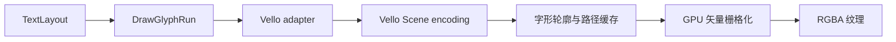
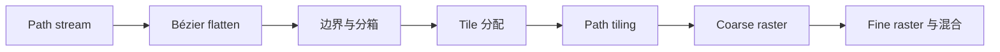

# 附录：Vello 字形绘制机制

本附录面向需要诊断文字显示质量、分析渲染成本或替换字形绘制实现的扩展者。它只讨论
排版完成之后的绘制链路。文本分段、字体回退、双向文本、换行、字距和字形定位已经由
`TextLayoutEngine` 完成，不属于 Vello 后端的职责。

## 输入边界

文字进入渲染后端时已经降低为 `DrawGlyphRun`：

```rust
DrawGlyphRun {
    run: GlyphRun,
    origin: Point,
    paint: GlyphPaint,
}
```

其中 `GlyphRun` 携带：

- 精确的 `FontFaceRef`，由资源 ID、revision 和字体集合索引组成；
- 逻辑字号；
- 可变字体的 normalized coordinates；
- 可选的斜体合成参数；
- 已完成定位的 glyph ID 与逻辑坐标。

命令不再携带原始字符串。Vello 后端既不选择字体，也不重新执行 shaping。这个边界保证
测量、截断、光标几何和最终绘制使用同一份排版事实。



代码锚点：

- [`GlyphRun` 与 `TextLayout`](../../novadraw/src/render/text.rs)
- [`RenderCommandKind::DrawGlyphRun`](../../novadraw/src/render/command.rs)
- [`NdCanvas::draw_text_layout`](../../novadraw/src/render/context.rs)

## 字体资源如何到达后端

字体字节通过 `RenderSubmission.resources` 与绘制命令一起提交。Vello 后端按
`(ResourceId, revision)` 保存字体数据：

1. 收到全量 `Snapshot` 时清空旧缓存并重建；
2. 收到 `Upsert` 时移除同一资源的旧 revision，再保存新字节；
3. 收到 `Remove` 时删除该字体的所有 revision；
4. 重放命令前检查每个 `FontFaceRef` 是否存在；
5. 缺少必需字体时返回 `Retry`，而不是使用其他字体静默替代。

字体集合索引在创建 `FontData` 时继续保留，因此 TTC/OTC 等字体集合中的 glyph ID
仍然绑定到正确 face。字体资源缓存只保存 CPU 字节和身份，不负责决定文字内容或位置。

代码锚点：

- [`VelloRenderer` 字体缓存](../../novadraw-backend-vello/src/lib.rs#L366-L383)
- [`sync_font_face_cache`](../../novadraw-backend-vello/src/lib.rs#L1485-L1515)
- [`ResourceSync`](../../novadraw/src/render/submission.rs)

## 从 GlyphRun 到 Vello Scene

Vello adapter 读取 `DrawGlyphRun` 后执行以下转换：

1. 根据 `FontFaceRef` 取得字体字节和集合索引；
2. 将 Novadraw 的 glyph ID 与坐标映射为 `vello::Glyph`；
3. 将逻辑 origin、字号和当前变换映射到物理像素尺度；
4. 把合成斜体转换为逐 glyph 的 skew transform；
5. 传递可变字体坐标；
6. 根据 `GlyphPaint` 选择填充或描边。

核心调用形态如下：

```rust
scene
    .draw_glyphs(font)
    .brush(color)
    .hint(false)
    .transform(transform)
    .glyph_transform(glyph_transform)
    .font_size(physical_font_size)
    .normalized_coords(coords)
    .draw(style, glyphs);
```

`draw_glyphs` 在这里主要完成场景编码。它记录字体、glyph 序列、变换、样式和资源
patch，并不在调用点立即生成最终像素。这样文字可以保持与其他路径命令相同的顺序、
裁剪、混合和变换语义。

当前实现显式设置 `hint(false)`。普通轮廓字形不会执行小字号网格拟合，也不会把
glyph 的基线位置吸附到整数像素。

代码锚点：
[`append_glyph_run`](../../novadraw-backend-vello/src/lib.rs#L287-L332)。

## 普通字形是矢量路径，不是位图 Atlas

普通 TrueType/OpenType 轮廓字形采用矢量路径流程：

1. Vello 在 resolve 阶段按字体 face 和 glyph ID 查找字形；
2. Skrifa 解析 `glyf`、`CFF` 或 `CFF2` 轮廓；
3. 字号、可变字体坐标和可选 hinting 参数参与轮廓生成；
4. 轮廓转换为 move、line、quadratic Bézier 和 cubic Bézier path；
5. 编码后的字形 path 放入 glyph cache；
6. 每个 glyph 通过独立平移和坐标轴变换插入当前场景。

缓存保存的是可复用的**矢量路径编码**，不是预先栅格化的灰度位图。普通字形因此可以
与其他矢量图形共同接受缩放、旋转、裁剪、填充和描边。

glyph cache 的身份至少区分：

- 字体数据身份与集合索引；
- glyph ID；
- 字号；
- 可变字体坐标；
- synthetic embolden 参数；
- 填充或描边样式；
- hinting 状态。

缓存会记录最近使用阶段，并周期性回收长期未使用条目。字体、字号、variation 或描边
参数变化时，不会错误复用不兼容的路径编码。

## GPU 如何产生像素

字形轮廓并入 Vello 的统一 scene stream 后，与矩形、椭圆和一般路径进入相同的 GPU
矢量渲染管线：



主要阶段是：

1. 扫描 path tag 和 draw tag，解析路径、样式、变换与裁剪关系；
2. 把 Bézier 曲线细分为适合栅格化的线段；
3. 计算路径边界，并把绘制对象分配到相关区域；
4. 为受影响 tile 分配路径段和 backdrop 数据；
5. coarse 阶段生成每个 tile 的绘制命令；
6. fine 阶段计算覆盖率、颜色与混合结果；
7. 写入目标 RGBA 纹理。

Novadraw 当前使用 `AaConfig::Msaa16`。这是统一矢量覆盖抗锯齿路径，不是 LCD
子像素文字栅格化。

Novadraw 在有效 damage 的外层 clip 下重放完整命令流，并让 Vello 把结果渲染到与
surface 同尺寸的临时纹理。随后只把 damage regions 对应的物理像素复制到 retained
texture，最后呈现 retained texture。字形因此遵守与其他图元相同的局部重绘规则。

代码锚点：

- [`VelloRenderer::render_command`](../../novadraw-backend-vello/src/lib.rs#L709-L1092)
- [`VelloRenderer::submit`](../../novadraw-backend-vello/src/lib.rs#L1122-L1309)

## 彩色字形的特殊分支

Vello 在记录 glyph run 时会检查字体是否包含彩色字形能力：

| 字形类型 | 绘制方式 |
|---|---|
| 普通 `glyf`、`CFF`、`CFF2` 轮廓 | 缓存矢量路径，进入统一 GPU 路径管线 |
| COLR/CPAL 彩色字形 | 展开颜色层、轮廓、裁剪和变换后写入场景 |
| 字体内嵌 bitmap strike | 作为图像资源进入 image atlas，再参与场景合成 |

因此，“Vello 不使用 glyph bitmap atlas”只适用于普通轮廓文字。字体本身提供位图字形
时，位图仍需要图像 atlas；彩色矢量字形则可能展开为多层绘制。

## 自研字形绘制的替换边界

自研实现应继续消费现有 `DrawGlyphRun` 与字体资源，不应要求 Core 恢复原始字符串
命令，也不应在 backend 中重新 shaping。

替换范围取决于目标：

| 目标 | 合适边界 |
|---|---|
| 自定义字体轮廓解析，但继续使用 Vello 路径栅格化 | Vello backend 内部的 glyph adapter |
| 自定义 path encoding 或轮廓缓存 | Vello backend 内部的 glyph renderer 模块 |
| SDF/MSDF、位图 atlas 或自定义 coverage | 自定义 GPU glyph pipeline |
| 完全控制文字与其他图元的合成 | 新的完整 `RenderBackend` |

仅把 glyph 转换为 Vello path，最终覆盖率仍由 Vello 计算，不能视为替换了字形栅格器。
若自定义管线直接写 GPU 纹理，还必须同时保持：

- glyph 与其他命令的严格绘制顺序；
- 当前 transform、clip、alpha 和 fill/stroke 语义；
- scale factor 与物理像素尺寸；
- damage region 和 retained texture 的一致性；
- 字体 revision 更新后的缓存失效；
- Native 与 Web 的相同结果边界。

在只有 Vello 一个消费者时，自研实现适合先放在
`novadraw-backend-vello/src/glyph_renderer/`，作为 backend-local 模块。只有当接口稳定、
不依赖 Vello、可以独立测试并存在真实复用需求时，才适合提升为独立 crate。

## 排查顺序

文字显示异常时，应按事实产生顺序定位：

1. `TextLayout` 中的 glyph ID、face、坐标和 metrics 是否正确；
2. `RenderSubmission` 是否包含匹配 revision 的字体资源；
3. adapter 是否正确应用 origin、字号、变换和 scale factor；
4. glyph outline 是否存在，variation 参数是否匹配；
5. fill/stroke、clip 和命令顺序是否正确；
6. 临时纹理中的结果是否正确；
7. damage region 是否完整复制到 retained texture；
8. 最终 surface 呈现是否使用正确尺寸和缩放系数。

这套顺序可以区分“排版错误”“字体资源错误”“字形解析错误”“GPU 栅格错误”和
“局部重绘残影”，避免在最终像素异常时直接修改文本排版。
