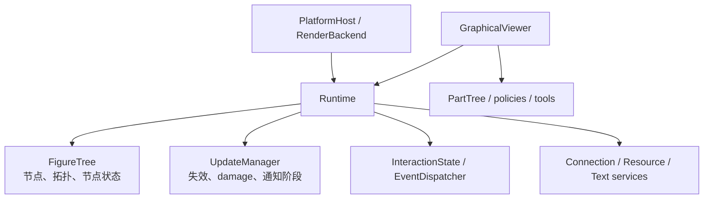

# Runtime 所有权与模块协作边界

类型：`normative-design`

状态：`accepted`

范围：GA-4 Core/Editor 内部依赖与扩展更新入口。

## 1. 所有权图

`Runtime` 是唯一同时拥有这些可变组件的对象。`GraphicalViewer` 拥有一个 Runtime，
但不能取得其内部服务的并列可变引用。Platform adapter 与 RenderBackend 不拥有
FigureTree、UpdateManager 或 Viewer 状态。

## 2. FigureTree 与 UpdateManager

禁止依赖的含义是“禁止所有权和可变服务逃逸”，不是禁止同 crate 内任何函数调用。

允许：

- Runtime 在一个事务内同时短借 `&mut FigureTree` 与 `&mut UpdateManager`；
- FigureTree 的 crate-private 原语接收短生命周期 `&mut UpdateManager`，原子记录
  topology/state 变化产生的 invalidation、damage 和 notification；
- UpdateManager 的 crate-private 算法短借 `&FigureTree` 计算 damage 或 drain work；
- 协调逻辑位于 Runtime，或位于只被 Runtime 调用的 Core 内部函数。

禁止：

- FigureTree 字段持有 UpdateManager、InteractionState、PlatformHost 或 RenderBackend；
- UpdateManager 字段持有 FigureTree、Runtime、Figure 或平台对象；
- Figure、LayoutManager、Anchor、Router 或外部扩展保存上述可变服务引用；
- 从公共 API 同时返回 `&mut FigureTree` 与 `&mut UpdateManager`；
- 用 identity handle 建立第二套 `FigureTree + UpdateManager` 提交入口。

因此 `graph` 与 `runtime::update` 是同一 Core 事务内的协作模块，不是可独立发布的
package。后续按 topology/query、layout/measurement、presentation、
component update、connection service、frame/resource 拆文件时，仍保持 Runtime
单一所有权。

## 3. 扩展组件更新

所有第三方 Figure 私有状态继续使用 `FigureComponentUpdate`。不同调用源只决定
更新何时提交和可选择的目标，不产生新的 mutation 方言。

### 3.1 Figure 回调

`EventContext::update_component_later` 只允许排队更新当前 callback target：

1. callback 移交 owned update；
2. Figure 不再被借用后，Runtime 按 effect FIFO 应用；
3. prepare/commit、revision、invalidation、damage 与 fault 语义复用 FigureEditor；
4. deferred rejection 进入 Runtime deferred mutation errors；
5. callback 不能取得 receipt，也不能更新未被捕获的任意 Figure。

这条路径用于 Figure 的自身输入状态，不替代跨 Figure 命令或模型事务。

### 3.2 Editor 模型刷新

`VisualUpdateContext::update_visual_component` 只接受当前 EditPart 已登记的 visual：

1. Viewer 从 PartNode 的 visual ownership 建立短生命周期 context；
2. behavior 传入 owned typed update；
3. context 先验证 visual ownership，再通过 Runtime FigureEditor 提交；
4. 非本 Part visual 在进入 Runtime 前拒绝；
5. update 错误转换为 `EditPartError`，Viewer 保持既有 refresh fault 边界。

该入口覆盖 primary Figure、content pane 和 `configure_visual` 登记的内部 visual，
不允许 behavior 修改其他 Part 或 feedback layer。

## 4. FigureEditor 边界

`FigureEditor` 保留以下通用职责：

- 通用节点状态与 bounds/style；
- layout constraint、reparent、revalidate 和 repaint；
- `FigureComponentUpdate` 的统一提交。

Label、Image、PointList、TextFlow 等内置专用 mutator 是待迁移的 capability editor，
不应继续扩张 FigureEditor。迁移必须按 API 主题进行，并保留现有 Runtime 原语与验证，
不能用公开 downcast 或任意 mutation closure 代替。

## 5. 失败语义

- target foreign/disposed/faulted：返回或记录 `RuntimeMutationError`；
- deferred component 类型错误、revision 耗尽或 prepare rejection：记录结构化 deferred
  component error，不提交 revision、invalidation 或 damage；
- Event callback 移交 update 后 panic：沿 Runtime fault 边界处理，未开始的 effect
  不承诺执行；
- Editor visual ownership 不匹配：同步返回 `EditPartError`，不调用 update；
- component prepare/commit panic：Runtime/Viewer 进入既有 fault 隔离，不承诺回滚
  扩展内部副作用。

## 6. 验证

GA-4 至少保留两个独立外部消费者：

1. 自定义 Figure + Layout，覆盖 FigureEditor 与 EventContext deferred component update；
2. 自定义 Router + Editor compound visual，覆盖模型 refresh 的 owned visual update。

消费者只能依赖公开 package API，不得使用 `pub(crate)`、测试 helper 或修改 Core 枚举。
