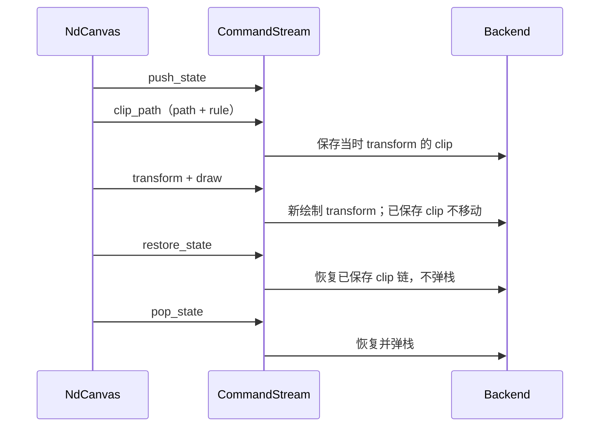

# P2-G01 Graphics 扩展契约

类型：`normative-design`

日期：2026-10-02

规范效力：已接受，依据
[ADR-024](../../adr/adr-024-graphics-paint-stroke-and-clipping.md)。
规范效力不表示 API 已实现；交付状态唯一入口为
[P2 backlog](../../roadmap/p2-delta-backlog.md)。

## 1. 目标与裁决

目标：`GOAL-CAP`、`GOAL-EXT`。承接
[目标一致性调整计划](../../roadmap/goal-alignment-adjustment-plan-2026-09-30.md)。

`api_semantics`：`graphics.context`、`geometry.primitives`、`paint.protocol`、
`builtin.figures`、`connection.figure`、`damage.repaint`、`frame.preparation`、
`render.backend_session`。

以下公共契约已获批准，按功能切片实施：

1. 所有矢量图元共享引擎自有 `Paint` 与 `StrokeStyle` 值；线性渐变也可用于路径、
   形状和 glyph paint，不为每个图元新增独立的渐变命令。
2. 路径裁剪采用可保存、可恢复的交集语义，支持 NonZero/EvenOdd；不复制 SWT
   路径裁剪后无法再次 pushState 的限制。
3. 高级能力按命令内容组合检查，在发布 submission 和 backend 接收时拒绝不支持的
   能力；不能把单个 `Option<RenderCapability>` 当作多能力集合。
4. 拒绝设备像素 XOR；交互反馈使用现有 retained feedback Figure 的添加、移动和
   删除。它替代交互用途，不宣称与 XOR 像素相同。

不增加 package、全局服务、任意 shader/plugin trait 或序列化 ABI。Runtime 继续拥有
提交权威；本项不修改递归 traversal、Figure 树坐标协议或 child clipping strategy。

## 2. 需求与参考证据

Draw2D/GEF 基线：`4463d9d0ce13c19d10fbe769d29f28b7345a8cba`。
只参考 `org.eclipse.draw2d` 与 `org.eclipse.gef`。

| 源码入口 | 可观察契约 | Novadraw 裁决 |
|---|---|---|
| `Graphics.java` 429–444；`SWTGraphics.java` 581–584 | 矩形前景色到背景色的水平/垂直渐变 | 以两站点线性 Paint 组合表达，同时支持任意路径 |
| `SWTGraphics.java` 1178–1199 | 路径与当前矩形 clip 相交，使用当前 fill rule | 保留交集与 fill rule；保留曲线，不按固定容差转整数 Region |
| `SWTGraphics.java` 896–899、976–1002 | 非矩形 clip 后 pushState 抛错；restore 恢复原状态 | 路径 clip 成为普通可重放状态，不继承该宿主限制 |
| `SWTGraphics.java` 1309–1332 | dash 元素须为正，复制输入，记录 offset；null 恢复 solid | owned 受检值；Solid 显式表达；进一步拒绝非有限数 |
| `SWTGraphics.java` 1364–1366 | miter limit 是 stroke 属性 | 与 cap/join/width/dash 共用完整 StrokeStyle |
| `ScaledGraphics.java` 896–938 | dash/offset/miter 直接委托，不能据此推断统一物理像素缩放规则 | 自定义 dash 明确使用 Canvas 逻辑长度，随 affine/DPI 缩放 |
| `MarqueeSelectionTool.java` 的反馈绘制 | 框选反馈调用 XOR | retained 反馈可以显示、移动、取消；无逐像素反色承诺 |
| `GraphicalEditPolicy.java` 的 add/removeFeedback | feedback Figure 经专用 layer 加入/移除 | 复用现有 Editor/Layer 协议，不新建合成子系统 |

以上为语义推导与源码可行性核对；实现和像素证据另见
[验证记录](../../verification/reviews/p2-g01-graphics-evidence.md)。

## 3. 值类型与公开入口

新增类型从 `novadraw::graphics` 导出，Render IR 使用相同定义，不在 crate root
重复平铺。以下为接口契约骨架，具体实现与交付状态见 roadmap：

```rust,ignore
enum Paint {
    Solid(Color),
    LinearGradient(LinearGradient),
}

enum FillRule { NonZero, EvenOdd }
enum DashPattern { Solid, Dash, Dot, Custom(CustomDash) }

// 字段私有；只通过受检构造和只读 accessor 访问。
LinearGradient::try_new(start: Point, end: Point, stops: &[GradientStop])
    -> Result<LinearGradient, GraphicsInputError>;
CustomDash::try_new(lengths: &[f64]) -> Result<CustomDash, GraphicsInputError>;
StrokeStyle::try_new(width: f64, cap: LineCap, join: LineJoin,
                     dash: DashPattern, dash_offset: f64, miter_limit: f64)
    -> Result<StrokeStyle, GraphicsInputError>;
ClipPath::try_new(path: &Path, rule: FillRule) -> Result<ClipPath, GraphicsInputError>;

NdCanvas::set_fill_paint(paint: Paint);
NdCanvas::set_stroke_paint(paint: Paint);
NdCanvas::set_stroke(stroke: StrokeStyle);
NdCanvas::set_fill_rule(rule: FillRule);
NdCanvas::clip_path(clip: &ClipPath);
```

`GradientStop` 的 offset 同样通过构造校验；Color 复用 ADR-020 的不变量。
站点、dash 数组、clip path 均由值拥有，外部后续修改不能影响已录制命令。
重复引用可内部使用不可变共享存储，不引入资源 ID 或 Runtime 注册流程。

现有 Color setter 保留其“设置纯色”的含义，内部替换对应 Paint；`set_line_style`
切换内置 pattern。完整 `set_stroke` 原子替换所有属性；新增单属性 setter 复用同一
校验，失败保持旧值。旧 `line_width` 等入口的非法值处置须在迁移时统一为 Result，
迁移所有 workspace 调用方，不用两套不同校验的入口长期兼容。

显式 recorder 的 `*_with_*` 调用携带完整 paint/stroke 值，不再隐式从当前 state
读取 dash 或 miter。仅设置颜色的 convenience 仍明确命名 `*_with_color`。

## 4. Paint 与渐变

- 本项交付线性渐变，覆盖 Draw2D fillGradient；radial/sweep、纹理画刷不属于当前
  对标需求，不能预先导出没有完整 consumer 的变体。
- 端点使用 Canvas 逻辑坐标；绘制时使用该命令的 transform，与对应几何一起缩放、
  旋转和平移。设置 Paint 时不冻结 transform；不提供隐式 object-bounds 坐标模式。
- 最少两个站点；offset 在 `[0,1]` 且非递减，首尾须为 0、1。重复 offset 保持输入
  顺序形成硬边；不自动排序，不静默补站点。端点相同返回退化错误。
- 超出端点范围采用 Pad；固定在 sRGB 编码通道中按 premultiplied alpha 插值。
  不依赖 Peniko 的默认值，backend 显式指定插值空间与 alpha 模式。
- 全局 alpha 在命令录制时乘入每个站点的 alpha，恰好一次；backend 不再次应用。
  原 Paint 保持不变，push/restore/pop 可恢复原始画刷。
- `fill`、`fill_and_stroke`、形状与路径的 fill/stroke 消费统一 Paint。
  `GlyphPaint` 同步迁移到 Paint/StrokeStyle，使同一个 Canvas paint 不会在文字处
  静默退回纯色；不修改 shaping、字体 fallback 或 layout snapshot。
- 原 current path 的消费规则保持不变；新增 clip 接口使用独立 `ClipPath`，
  不消耗正在构建的 path。

两色水平渐变可由 `(x,y)` 到 `(x+w,y)` 的 Paint 加 `fill_rectangle` 表达，
垂直渐变取 `(x,y+h)`。不为这项 convenience 增加专用 IR opcode。

## 5. Stroke 与包围盒

- width 有限且非负，零宽表示不绘制，不采用 SWT 设备 hairline 语义。
- miter limit 有限且至少为 1，定义为 miter 长度与 stroke 半径的比值；默认复用
  `DEFAULT_STROKE_MITER_LIMIT`。超限采用 bevel，Round/Bevel 不使用 miter 扩张。
- 自定义 dash 非空，元素有限且严格大于零，总周期及奇数数组翻倍后的周期均有限。
  奇数长度数组按重复一次的偶数周期解释，允许负 offset，按周期规范化。
- 正 offset 表示从 pattern 起点向前跳过该长度；如 `[6,2]`、offset 2，
  第一段可见长度为 4。每个独立 subpath 从同一 offset 起算。
- 自定义 dash/offset 是逻辑长度，不再乘 stroke width；内置 Dash/Dot 保留既有
  width 比例，二者均随几何 affine 和 DPI 变换一次。
- Solid 时 offset 不影响像素，但保留配置，切换 pattern 后按新周期解释。
  dash、offset、miter、paint 都完整参与 Canvas 状态栈。
- PointList、Connection 和 decoration 的 visual bounds 使用实际 StrokeStyle。
  miter mutation 必须在 Runtime 同一事务中更新包围盒、freeform extent 与新旧
  damage；不能只改后端尖角而留下默认 miter 的 bounds。
- 自定义 Figure 仍负责声明自己的 paint envelope；提供共享的 stroke outset
  计算入口。自定义 dash 的间隙不扩大 stroke envelope，命中规则延续现有
  Figure 几何契约，本项不自动把 gap 变成可穿透命中区域。

## 6. 路径裁剪状态

`ClipPath` 保存经过有限性与路径结构校验的曲线及 fill rule，未闭合 subpath
按填充规则隐式闭合。空路径是合法空裁剪：之后绘制被抑制，不能当作 no-op。



- 矩形和路径 clip 共享有序交集链；backend 每个 clip 保存调用时的 transform。
- `reset_clip` 清空当前 Canvas clip 链；`set_clip` 保持 reset 后设矩形的既有含义。
  reset 不销毁已保存的状态，restore/pop 可以重放原矩形和路径 clip。
- `clip_depth` 同时统计两种 clip；restore 的公共前缀比较包含几何、rule 和 transform，
  不能只比较 bounds。实现应避免每次 push 都深拷贝路径。
- 路径 clip 只约束 paint；本项不把它注册成 Figure hit-test 或 child clipping
  provider。Figure traversal 继续负责进入、恢复和离开自己的绘制状态。
- backend 的 damage/surface 外层裁剪不属于 Canvas 可 reset 的 clip 链。

## 7. Render IR、能力与失败

保留既有 shape command 分类，统一其中的值：

| 命令族 | 目标 payload |
|---|---|
| FillRect / FillPath / Ellipse fill | 几何 + Paint + FillRule |
| StrokeRect / Line / Polyline / StrokePath / Ellipse stroke | 几何 + Paint + StrokeStyle |
| DrawGlyphRun | 已有 run/origin + 统一 GlyphPaint |
| ClipPath | 受检 ClipPath；transform 从命令流当前状态取得 |
| 既有矩形 Clip、Image、ClearRect | 保留各自语义，ClearRect 不变成渐变绘制 |

Ellipse 等包含 fill/stroke 的命令收集两部分全部能力，不能只检查先遇到的 paint。
新增能力为 PathClips、LinearGradients、CustomStrokes；已有 GlyphRuns 等保持。
非默认 miter、自定义 dash 或非零有效 offset 要求 CustomStrokes；普通旧命令仍能
由只支持基线的 backend 消费。

以 `required_capabilities` 集合替代单个 `required_capability`，由 Core 提供统一
`validate_capabilities` 逻辑：

1. Runtime 在分配/发布 frame 和取走 resource delta 前检查整个 stream。
2. 直接接收 submission 的 backend 再检查一次，在资源/session 接受、scene 修改和
   GPU 提交前完成。缺能力返回现有结构化 Unsupported 结果。
3. 一条渐变 glyph stroke 必须同时检查 GlyphRuns、LinearGradients，以及实际需要的
   CustomStrokes；测试逐项消融，不能仅覆盖“全部支持”。

构造或 setter 的非法值返回 `GraphicsInputError`，区分非有限、退化渐变、站点
范围/顺序、非法 dash、周期溢出、miter 范围、非法 path；附带失败字段或元素索引。
失败不得更改 Canvas state、current path、command stream 或 damage。
受检值的 serde（若启用）必须复用校验，不能绕过私有字段。

backend 还需预检新增 payload 在实际 transform/DPI 下的派生数值：
有限 f64 转为 Vello f32 后溢出或渐变端点坍缩不能静默绘制。
为 `RenderOutcome` 增加结构化 `InvalidGraphicsInput`，携带 command index
和原因；该跨 crate 公共错误边界已获批准。此错误不得接受 session/frame、
取走资源或破坏上一张 retained surface；修正输入后可重试。
不把资源缺失、临时 surface 丢失和非法 Graphics 输入混成同一个错误。

## 8. Vello 可行性与实施触点

本仓库锁文件为 Vello **0.10.0**、Peniko **0.6.1**、Kurbo **0.13.1**。
本地独立 Vello checkout 的 API 与锁定版本不同，实施依据必须是锁定依赖。

- Vello 0.10 `Scene::push_clip_layer` 接受 fill style，支持 NonZero/EvenOdd；
  旧 checkout 固定 NonZero 的实现不能作为当前能力限制。
- `Scene::fill/stroke` 接受 Brush 与 transform；Peniko 提供 linear gradient、
  interpolation color space 和 alpha space 的显式配置。
- Kurbo Stroke 承载 dash、offset、miter；Vello 负责消费，不将这些类型暴露给 Core。
- glyph gradient 的 paint 坐标必须与 run origin、surface scale 做像素验证，
  不能只因 glyph builder 有 brush 参数就声称正确。

在先定义上述契约后，定向核对当前代码得到以下迁移位置：

| 当前入口 | 所需变更 |
|---|---|
| `novadraw/src/render/command.rs` | 重复 stroke 字段合并、受检值、ClipPath、能力集合 |
| `novadraw/src/render/context.rs` | GraphicsState paint/stroke、原子 setter、命令快照 |
| `novadraw/src/graphics.rs` | 专业值类型导出，不扩大 root |
| `novadraw/src/render/traits.rs` | 能力集合检查、明确非法输入结果 |
| `novadraw/src/runtime/runtime/frame_submission.rs` | 多能力预检，延续发布边界 |
| PointList/Connection 样式与受控 editor | 实际 miter envelope 与原子失效 |
| `novadraw-backend-vello/src/lib.rs` | paint/stroke lowering、混合 clip 重放与接收预检 |

## 9. XOR 的处置

保持能力账本中的 `CAP-GRAPHICS-XOR: rejected`。理由不是缺少方法，而是 retained
GPU 场景不提供对目标设备像素进行读改写的 XOR 契约。Difference blend 也不冒充 XOR。

框选/拖拽/吸附反馈通过专用 layer 的普通 Figure 表达；删除反馈后重绘对应新旧 damage。
验收必须覆盖深浅背景、重叠内容、移动、取消，以及移除后底图恢复。
这验证反馈生命周期和可辨识性，不要求重现任意背景上的逐像素反色。
本项不新增通用 blend-mode API；其他合成需求需要单独用例和 delta。

## 10. 分步交付与验收

以下是 P2-G01 内部切片，不另立 M/G 里程碑。suite 的实际命令和证据路径已在
`verification/suites.toml` 登记；验证结果见独立验证记录。

| 顺序 | 交付切片 | 毕业证据 |
|---|---|---|
| 1 | StrokeStyle、custom dash/offset/miter，IR 与 Vello 一起迁移 | 外部 Figure；输入拒绝；状态栈；所有 stroke 图元；实际 miter bounds/damage；像素 |
| 2 | ClipPath、FillRule、混合 clip 重放 | holes、自交、空 clip、曲线、transform 后不漂移、reset/restore/pop；图像/文字在 clip 内 |
| 3 | Paint、linear gradient 与 glyph paint | 多站点、透明插值、硬边、方向、transform/DPI；缺能力和非法输入无发布 |
| 4 | 反馈替代与整体毕业 | 外部消费者组合三项能力；Native/Web 视觉复验；parity 与文档门禁 |

自动契约集中到 `core.p2-g01-graphics`；Native 离屏、surface 和 Web 像素分别使用
`graphics.p2-g01-visual`、`graphics.p2-g01-present`、
`graphics.p2-g01-web-pixels`，避免编译通过替代像素验收。至少覆盖：

- 一条命令多个能力逐项缺失；旧 backend 仍可绘制普通 solid 命令。
- 非法值与派生溢出拒绝，state/path/commands/damage 不变；backend retained 基线
  和资源/session 不被部分提交。
- 不同图元使用相同 stroke 得到相同 dash/offset/miter，odd pattern 与负 offset。
- 外部 Figure 在 clip 内绘制渐变 shape、glyph、image；restore 后兄弟 Figure
  不受其 paint/stroke/clip 污染。
- Native/Web 共用相同场景与断言区域；DPI 1/2、旋转和非均匀缩放，实际像素验证。
  无法运行的平台证据保留未完成，不能用 lowering 测试代替。
- miter 从小变大及变回后不被 bounds 截断、不遗留旧尖角；反馈删除后底图恢复。

性能只记录同负载前后命令数、录制分配、clip 重放量和 backend lowering 成本，
沿用已有 `core.performance` 工作量回归；不恢复 WindowServer/Chrome 端到端性能专项。
站点数、dash 数量、path 长度进入测量输入，避免只用小矩形推断大路径成本。

验证按 crate/定向 suite → 跨 crate quick → 最终交付一次 full 逐级进行。
实施证据与各切片完成状态记录在 roadmap，不从本规范推断验证结果。

## 11. 备选方案与取舍

- **只加 fillGradientRectangle**：改动小，但 Paint 无法用于自定义 path/glyph，
  后续继续扩充命令枚举；不推荐。
- **各 command 追加 dash/miter 字段**：可避免一次迁移，但规则会继续分散，
  显式 recorder 与 stateful Canvas 容易出现属性遗漏；不推荐。
- **开放任意 backend paint trait**：没有第二种语义消费者证明该替换需求，且无法
  确保跨平台可重放；不推荐。
- **共享受检值、按功能切片贯通**：一次承担公共 IR 与错误分支迁移成本，
  获得统一校验、清晰能力声明和外部消费者覆盖；推荐。

已接受的迁移成本包括公开 IR 构造与 `RenderOutcome` 穷尽匹配迁移，以及实际 miter
进入内置 Figure 几何更新路径。

## 12. 关联规范

- [ADR-020：基础值与 Render IR](../../adr/adr-020-engine-value-and-render-contract.md)
- [ADR-021：公开分层](../../adr/adr-021-public-facade-and-feature-boundary.md)
- [ADR-022：第三方类型边界](../../adr/adr-022-third-party-type-and-render-dependency-boundary.md)
- [Reusable Shape/Border](../architecture/reusable-shape-border.md)
- [Connection routing](../architecture/connection-routing.md)
- [图像源区域](image-source-rectangle.md)
- [语义账本](../../parity/draw2d/api-coverage.md)
