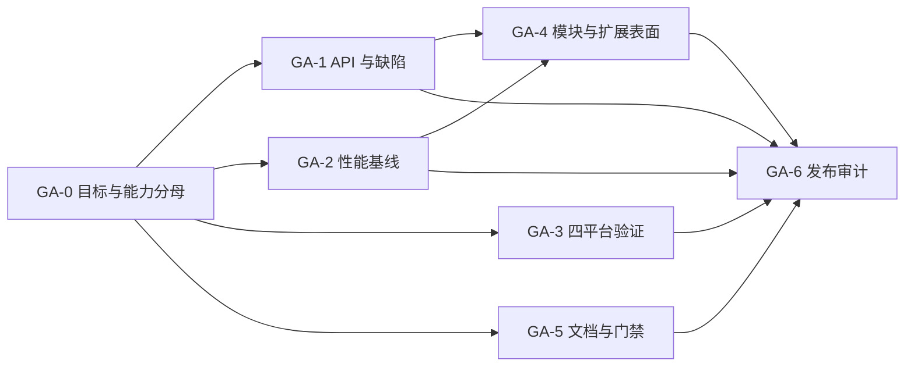

# 项目目标一致性调整计划

类型：`roadmap`

日期：2026-09-30

状态：`in_progress`

依据：[目标、设计与实现一致性审计](../verification/reviews/goal-design-code-audit-2026-09-30.md)。

本计划以“使用 Rust 实现能力对等或超过 Draw2D，尤其性能、可扩展性、跨平台”为目标。
本计划已于 2026-10-01 获准执行。它不修改既有 M1-M10、G0-G5、P2 delta 的历史
完成含义；各 GA 阶段只在对应毕业条件和证据闭合后更新状态。

## 0. 执行状态

| 阶段 | 状态 | 当前证据或阻塞 |
|---|---|---|
| GA-0 目标与能力分母 | `complete` | 长期能力处置、9 个 P2 delta 与平台支持等级已登记 |
| GA-1 API 与确定缺陷 | `complete` | Core/Web/Editor/Layout 修复、root API 与 Graphics 收口；quick gate 通过 |
| GA-2 性能基线 | `in_progress` | CPU/内存、Draw2D 对照与 Native GPU queue 证据完成；待真实 present/input-to-present |
| GA-3 四平台验证 | `in_progress` | release suite 与共享 Winit 适配已收口；macOS/Web 自动前置通过，Windows/Linux 待原生 runner |
| GA-4 模块与扩展表面 | `complete` | 所有权契约、内部职责拆分、外部消费者、投影 suite、性能 A/B 与 quick gate 通过 |
| GA-5 文档与门禁 | `complete` | 文档漂移已修正；类型、链接、命令、索引、facade 与 api_semantics 门禁通过 |
| GA-6 发布审计 | `complete` | 目标矩阵与 full gate 已审计；因 GA-2/GA-3 外部证据缺口，发布结论为 `not_ready` |

## 1. 调整方向

保留六个公开 package、Runtime 单一提交权威、二维坐标协议和可替换策略。
后续投入先闭合目标追踪、API 边界和验证盲点，再补齐能力与性能。

当前的“扩展性 > 稳定性 > 性能”改进为可执行的取舍规则：

- 正确性、失败边界和平台可用性是基础约束；
- 扩展接口必须通过真实外部消费者验证；
- 性能有明确工作负载、预算和回归证据；
- 在满足以上约束的方案中优先选择扩展性更好、状态更少的实现。

这不要求立即改写递归渲染。只有性能测量定位到 traversal，且现有协议回归完整时，
才提出相应性能 delta。

## 2. 目标验收矩阵

| 目标 ID | 可交付结果 | 达标证据 | 不能替代该证据的材料 |
|---|---|---|---|
| GOAL-CAP | Draw2D 能力逐项有等价行为或明确待补项 | 固定源码基线、能力账本、公开入口、正反例、验证 suite | M1-M10 完成、类名存在、测试数量 |
| GOAL-PERF | 指定场景达到交互预算，并能与 Draw2D 比较 | 同环境/同场景对照、p50/p95、内存与工作量、GPU 与呈现证据 | 语言选择、WebGPU、命令录制耗时 |
| GOAL-EXT | 外部实现可扩展 Figure/Layout/Router/文本/host/backend | 独立消费者编译与行为验证，无引擎内部修改 | trait 存在、内置 demo 可用 |
| GOAL-PORT | Web/macOS/Windows/Linux 各有明确支持等级 | 编译、真实运行、输入、DPI、surface、文本、恢复矩阵 | Winit/WGPU 依赖声明、macOS 测试通过 |

能力对等按行为判断；不要求复制 Java 签名、SWT 类型、对象布局或所有 convenience。
用组合替代某项 API 时，必须证明组合能实现同一行为与失败语义。暂缓不等于退出长期分母。

## 3. 实施顺序与毕业条件

下列 GA 编号仅是本计划任务号，不是新的 M/G 里程碑。

### GA-0：固定能力分母与支持等级

依赖：无。负责人角色：维护者与架构负责人。

产物：

1. 在现有 parity 账本内增加能力级稳定标识，方法行保留为证据；
2. 每项记录目标归属、采用/调整/替代/待补、公开入口、suite、差异理由；
3. 为长期剩余项建立正式 P2 delta，不能只留下“有需求再做”；
4. 定义平台状态：未验证、可编译、运行通过、完整支持，逐平台登记；
5. 统一“Core 1.0 完成”指既定切片完成，不能代指全部 Draw2D 能力或四平台达标。

建议近期承接的剩余能力：

| 能力组 | 下一步 | 依赖 |
|---|---|---|
| Graphics | path clip、gradient、custom dash/dash offset、miter 配置；每项贯通 IR 与 backend | GA-1 公共表面 |
| Figure/Connection | 原子 indexed+constraint add；跨 viewport 连接可见性与 clip 扩展 | topology/clip 专题评审 |
| Text/Widget | fragment 样式、inline/block 组合的剩余语义、repeat firing | 文本测量与平台时钟契约 |
| 图自动布局 | 从 Draw2D graph 包建立行为清单，先验证外部布局算法集成 | 独立布局输入/输出模型 |
| 平台/输出 | 原生 AT provider、打印/导出目标的能力矩阵与适配契约 | GA-3 |
| 生命周期 | 评估同 Runtime 保活 unmount/mount 用例 | 独立所有权 ADR |

同域保活的评估不恢复已撤回的自动跨 Runtime 活对象迁移；模型重建仍是当前默认。
XOR、SWT 特有入口等先判断可观察行为与现代替代方案，不直接逐方法搬运。

毕业：每个剩余能力都有去向、依赖、验收方式；明确拒绝的能力不能计入“完整对等”。

### GA-1：收口公开 API 与验证盲点

依赖：GA-0 的边界确认；可与文档整理并行。负责人角色：Core/API 维护者。

产物：

1. 按 ADR-021/023 收窄 crate root；`advanced` 从定义模块导出，避免依赖根层转发；
2. 逐个验证禁止 root 名称，避免多个名称合用一个 `compile_fail`；
3. 保留 root/prelude/领域模块的独立正向编译用例；
4. 对审计报告确认的代码缺陷，按根因建立最小失败路径并修复；
5. 把 `NdCanvas` stateful API 定为规范表面，显式 paint 参数入口明确命名；
6. 迁移 workspace 调用者，一次只处理一个 API 主题。

毕业：

- 禁止的 root 导入各自失败，推荐领域路径各自成功；
- 外部自定义组件 prepare/commit、失败无发布、panic/fault 等既有契约通过；
- 不新增绕过 Runtime 的可变引用，不用 deprecated 双入口长期掩盖迁移。

验证：复用 `core.facade` 和现有组件契约；补充的 API 负向门禁先注册 manifest。
公共跨 crate 改动执行 quick；最终提交前执行一次 full。

### GA-2：建立可比较的性能基线

依赖：GA-0；测量可先于 GA-1 完成。负责人角色：性能与渲染维护者。

产物：

1. 固定场景生成器、输入轨迹、字体、viewport、DPI、可见比例与更新比例；
2. 覆盖宽树与深树、文本、连接/障碍、局部变更、全量变更、滚动缩放和空闲；
3. 记录构建/销毁、validation、routing、recording、lowering、GPU、present、
   input-to-present、内存、命令量、节点访问量；
4. 同场景运行 Draw2D 与 Novadraw，记录 CPU/GPU、OS、target/profile、编译器、
   两端提交、采样次数、预热和原始输出；
5. Native 对照先在相同 OS/硬件完成；Web 单独报告浏览器预算和 Native/Web 差异，
   不把不存在的 Draw2D Web 运行结果作为基线；
6. 将稳定工作量回归纳入常规 gate；墙钟耗时在固定 runner 上观察与比较。

建议的首轮场景规模为 1k/10k Figure、多档可见比例与 1%/100% 变更；
10k 深链主要验证栈与渐进复杂度，不代表典型交互负载。
含文本、路由的场景单独报告，不能用矩形场景推断其性能。

预算提案：选定的常用交互场景以 p95 16.7ms 帧预算为初始目标；首次布局、极端深树、
复杂避障单列预算。该数值是待测量校准的建议，不是本次审计得出的既有性能。

毕业：

- 可复跑同一配置，结果有分布与原始样本；
- 能区分 CPU 录制、GPU 绘制和真实呈现，计数不冒充耗时；
- “超过 Draw2D”限定到经测场景；未测场景明确未知；
- 优化前后做同口径比较，正确性和扩展契约不退化。

### GA-3：补齐四平台交付验证

依赖：GA-0；与 GA-2 并行。负责人角色：平台适配维护者。

产物：

1. 增加 Windows、Linux 的明确构建和真实窗口验收任务；
2. Linux 明确 X11/Wayland 范围；Web 明确浏览器、版本与 WebGPU 环境；
3. 逐平台覆盖 resize/DPI、suspend/resume、surface 重建、pointer capture/leave、
   wheel/zoom、键盘、CJK/组合字符、IME candidate area 和 focus loss；
4. 对平台库内部的特定桌面依赖建立 target 守卫与可移植替代路径；
5. Accessibility 分开记录 Core snapshot、Web DOM、原生 AT provider，
   后两者不能由 Core 测试代替；
6. 把共享宿主实现放回平台 package，examples 只保留场景、验收 UI 与 composition root。

毕业：每个声称支持的平台均能在真实环境运行并保留证据；无法获得的环境继续标记未验证。
优先复用 `web.build`、`platform.p2-e02-text-input` 与对应手工流程；
新的平台 suite ID 必须在执行前注册，不能只修改 `platforms` 标签。

### GA-4：按依赖方向整理内部模块与扩展表面

依赖：GA-1 与 GA-2 基线。负责人角色：Core/Editor 维护者。

实施方式：

1. 先画实际所有权与调用依赖图，区分“允许只读协议依赖”和“禁止持有可变服务”；
2. 确定 FigureTree 与 UpdateManager 协作是否允许同 crate 内依赖：
   保留必要协作或迁移协调器，都必须先修订专题契约，不能仅用改名消除冲突；
3. 按 topology/query、layout/measurement、presentation、component update、
   connection service、frame/resource、viewer projection 拆内部文件；
4. 所有权保持在现有 Runtime/Viewer，避免新建多个共享可变服务；
5. `FigureEditor` 保留通用节点操作与 typed component update，内置私有能力使用专用
   capability editor 或类型化 update；获取阶段验证身份与能力；
6. 增加至少两个独立外部消费者：一个自定义 Figure/布局，一个自定义 Router/文本或
   host/backend 集成，验证扩展不需要修改 Core 分支。

毕业：依赖契约与实现相符；新增第三方能力不扩张核心枚举；基线性能无未解释回退。
按文件职责拆分、按主题提交。保留现有六 package；新增 crate 必须有独立发布、
依赖隔离或真实复用证据。

完成证据：

- 所有权与协作规范：
  [Runtime 所有权与模块协作边界](../design/architecture/runtime-ownership-and-module-boundaries.md)；
- topology/query、layout/measurement、presentation、component update、connection
  service、frame/resource 与 viewer projection 已按职责拆分；
- `ga4.extension-consumers`、`g2.viewer-projection`、`g5.1.connection-projection`、
  `core.performance` 与 `cargo xtask check --quick` 通过；
- GA-4 前后各三轮同锁文件 release A/B，14 个场景工作量一致，p50 最大回退 4.6%；
- 完成记录：
  [GA-4 模块与扩展表面](../verification/reviews/ga4-module-extension-completion-2026-10-01.md)。

### GA-5：文档可执行性与状态同步

依赖：GA-0；可立即开展。负责人角色：文档与验证维护者。

产物：

1. 修复 component-update 的规范/提案归类冲突、Inspector 的 ADR-023 覆盖关系；
2. 清理 parity 的旧 crate 路径、私有方法冒充公开 API、过时 handle mutator；
3. 更新 product-deliverables、roadmap 当前执行方向和 book 失效 CLI；
4. 设计文档只维护规范效力与目标契约；交付状态链接到 roadmap；
5. 历史报告保留历史事实，在入口显示“截至某提交”，不批量改写历史结果；
6. 增强 docs gate：文档类型、索引归类、命令引用、链接和公开符号独立校验；
7. API family 到 delta/suite/证据建立结构化映射；人工评审仍负责行为语义判断。

Book 修订仅展示当前机制与正确使用路径，不把 ADR、审计历史和成书过程加入读者正文。
生成式 deepwiki 应带生成基线与非规范声明，不能反向定义架构。

毕业：新读者沿索引到规范、公开 API、可执行验证不会进入失效路径；
故意加入错误命令/符号/归类时，相关定向检查会失败。

完成证据：

- `cargo xtask docs` 校验 208 份 Markdown 的类型、链接、xtask 引用与设计索引分类；
- 10 个独立 facade compile-fail probe 与 5 个正向 doctest 通过；
- 26 个 contract/application suite 已映射到 parity ledger `api_semantics`；
- `cargo test -p xtask`、`cargo clippy -p xtask -- -D warnings` 与 quick gate 通过；
- 完成记录：
  [GA-5 文档与门禁](../verification/reviews/ga5-documentation-gate-completion-2026-10-01.md)。

### GA-6：按目标矩阵完成一次发布审计

依赖：GA-1—GA-5 的对应切片与 GA-0 剩余能力执行结果。

产物：

- 能力矩阵与未完成项；
- 外部消费者兼容性、API 路径和错误契约；
- 同口径性能对照；
- 四平台支持与运行证据；
- 最终提交上的 suite 结果和剩余限制。

毕业：可以逐项回答“实现了什么、在哪些平台验证、性能是什么、如何扩展、仍缺什么”。
只关闭有证据的能力，不因 full gate 通过自动关闭性能、平台或人工验收项。

完成证据：

- `cargo xtask check --full` 在修复 bin-test 显式输入类型后完整通过；
- GOAL-CAP/PERF/EXT/PORT 已逐项给出证据、限制和后续顺序；
- GA-2 与 GA-3 保持 `in_progress`，总体发布结论为 `not_ready`；
- 完成报告：
  [GA-6 目标矩阵审计](../verification/reviews/ga6-goal-matrix-audit-2026-10-01.md)。

## 4. 执行依赖

## 5. 每个切片的提交契约

每项正式 delta 必须记录：目标 ID、受影响 `api_semantics`、输入/输出、所有权、
失败语义、平台范围、性能影响、suite、证据与剩余限制。

先更新设计或确认既有契约，再实施和验证。修改超过 50 行按主题分步；
内环用 crate/精确验证，批次 quick，最终提交前一次 full。
涉及渲染主循环、生命周期或坐标协议的重大取舍，先提交具体 ADR 供评审。
