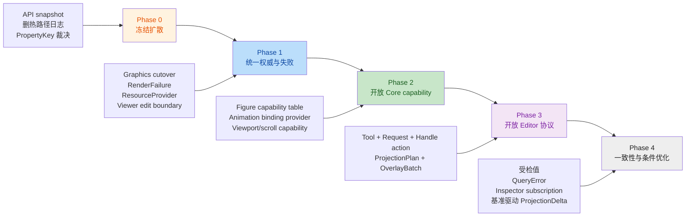

# 临时概念设计与长期演进审计

类型：`verification`

日期：2026-10-08

状态：`findings_open`

## 1. 审计范围与判定标准

本次审计基线为 `29e53ec` 加 2026-10-08 当前工作区，范围覆盖：

- `novadraw` Core；
- `novadraw-editor`；
- `novadraw-inspector`；
- Vello backend 与 Winit/Web platform adapter；
- 公开 API、状态所有权、扩展点、失败模型和热路径。

本报告把以下实现判定为“临时概念设计”：

1. 同一职责存在两个可长期使用的权威入口；
2. 对外宣称可扩展，但新增能力必须修改 Core 基础 trait、私有枚举或中心分派；
3. 类型系统已经能表达的非法状态仍由公开字段、字符串、panic 或静默 clamp 表达；
4. 一个对象通过返回完整可变引用或不断增加 forwarding 方法承接无关职责；
5. 跨多个 owner/registry 的操作依赖手工补偿，无法证明结构发布边界；
6. 当前实现与 accepted ADR / normative design 的长期合同直接冲突。

以下情况不自动视为问题：

- roadmap 已明确记录且具有退出条件的未完成功能；
- 为正确性有意保留、并要求基准后再优化的算法；
- crate 内部的类型擦除、downcast 或具体枚举，只要公共扩展协议仍然开放；
- 测试、示例和诊断代码本身。

## 2. 总体结论

当前 package 分层、Runtime 单一提交权威、代际身份、第三方类型隔离和递归深度合同
不需要推倒重来。主要概念债集中在四条主线上：

1. **旧协议未退出**：`NdCanvas`、旧 Figure paint 和 panic convenience 仍与新 API 并存；
2. **扩展表面闭合**：Figure capability、Animation target、Editor Tool/Request 仍由
   Core 已知类型集合定义；
3. **事务边界不完整**：Viewer 模型写入、Part/Connection projection 和 overlay
   生命周期仍依赖可变逃逸或手工回滚；
4. **失败不可观测**：unknown identity、extension error、锁故障和 GPU failure 仍可能
   被 `None`、`false`、字符串或 panic 折叠。

审计确认 14 项发现：8 项 P0、6 项 P1。另有 2 项属于有意的阶段性实现，不作为缺陷。

### 2.1 整改进展

| 发现 | 状态 | 当前入口 |
|---|---|---|
| TC-02 Figure capability 闭集 | `complete` | ADR-027、P2-F02 与 `figure-capability-model.md` 已实现并通过门禁 |
| TC-04 属性身份和值未类型关联 | `complete` | ADR-028、typed `PropertyKey<V>`、erased journal 与 Behavior key matching 已完成 |
| TC-05 Animation target 闭集 | `complete` | 开放 `PresentationBinding<V>`、外部 Figure consumer 与 Connection route/dash 迁移已完成 |
| TC-13/TC-14 | `complete` | root/prelude 已收窄，分层 rustdoc snapshot 与 hot-path source gate 已进入 quick/full |
| 其余 TC-01、TC-03、TC-06—TC-12 | `not_started` | 按第 5、6 节依赖顺序继续 |

P2-F02 已完成本报告长期演进 Phase 2 的 Core 切片，并同时关闭 TC-02 与 TC-05：
Figure capability discovery/mutation 和 Animation content target 都使用 attach-time
typed descriptor；外部 consumer 不修改 `Figure` trait、`ChannelBinding` 或 renderer。
TC-13/TC-14 随后完成 Phase 0 的 API 防扩散与热路径清理；TC-04 已按 ADR-028
完成 typed property identity。下一原子批次为 TC-12 backend failure contract。

## 3. 发现项

| ID | 优先级 | 临时概念 | 主要证据 | 长期方向 |
|---|---|---|---|---|
| TC-01 | P0 | `Graphics` 与公开 `NdCanvas` 双方言 | `figure/mod.rs:467-486`、`render/context.rs:639-699`、`prelude.rs:13` | Figure 只接收 `PaintContext`；owned 录制只经 `CommandRecorder`；`NdCanvas` 退出 root/prelude 和普通 Figure API |
| TC-02 | P0，已关闭 | `Figure` 是封闭 capability 注册表 | `figure/mod.rs:603-710`、`graph/presentation.rs:461-480`、`container/viewport.rs:668-678` | [ADR-027](../../adr/adr-027-open-figure-capability-registry.md) + [P2-F02](../../roadmap/p2-delta-backlog.md#p2-f02-开放的-figure-capability-registry) |
| TC-03 | P0 | detached 值是未受检公开数据袋 | `figure/rectangle.rs:18-34,80-112`、`figure/border/line_border.rs:17-57`、`style.rs:20-69` | 私有字段、受检领域值和统一 `Result` 构造；admission 只做最后防线 |
| TC-04 | P0，已关闭 | 属性身份和值未类型关联 | [ADR-028](../../adr/adr-028-typed-property-identity.md) + [完成记录](tc04-typed-property-identity-completion-2026-10-08.md) | typed key、erased journal、Behavior/coalescing identity 已实现 |
| TC-05 | P0，已关闭 | Animation 值开放、可见 target 封闭 | `animation/service.rs:30-45,123-166` | typed `PresentationBinding<V>` / provider；领域模块和外部 Figure 自行提供 target |
| TC-06 | P1 | Editor Tool/Request/Handle 是闭集 | `editor/domain.rs:101-116`、`request/mod.rs:546-603`、`feedback/mod.rs:39-52` | object-safe Tool 插槽、typed request envelope、可扩展 handle action |
| TC-07 | P0，中等置信 | Viewer 仍暴露模型可变逃逸 | `viewer/mod.rs:921-930`、`domain.rs:411-450` | `ViewerEditSession` 统一 CommandStack、模型 mutation、通知与 refresh；host 只取得窄 `ViewerDrive` |
| TC-08 | P0 | Editor 结构发布依赖手工补偿 | `viewer/projection.rs:447-475`、`viewer/mod.rs:1681-1749` | `PartProjectionPlan` / `ConnectionProjectionPlan` prepared commit；`OverlayBatch`/lease 管理清理 |
| TC-09 | P1 | 查询用默认值吞掉无效身份 | `layout/mod.rs:102-153`、`graph/layout_measurement.rs:983-1007`、`graph/query.rs:31-36,118-135` | 结构查询统一 `Result<Option<T>, QueryError>`；布局 snapshot 不再返回伪造零值 |
| TC-10 | P1 | fault、幂等和缺失的返回语义碎片化 | `command/mod.rs:576-607`、`animation/service.rs:1344-1367`、`inspector/lib.rs:165-177` | 纯查询无副作用；可能 fault 的探测返回 `Result`；保留错误 source；锁故障显式化 |
| TC-11 | P1 | Core Runtime 承担文件读取 | `runtime/runtime/frame_resource.rs:125-157`、`render/command.rs:760-767` | platform/application provider 读取文件或 URL；Core 只接收 bytes / decoded resource |
| TC-12 | P0 | Render backend 无运行失败通道 | `render/traits.rs:140-159`、`backend-vello/lib.rs:1363-1382` | `submit -> Result<RenderDisposition, RenderFailure>`，区分 retry、surface lost、device lost、fatal |
| TC-13 | P1，已关闭 | root/prelude 仍是专业 API 平铺面 | [TC-13/TC-14 完成记录](tc13-tc14-api-surface-hot-path-completion-2026-10-08.md) | 分层 rustdoc symbol snapshot 已进入 quick/full |
| TC-14 | P1，已关闭 | 渲染与布局热路径仍保留日志 | [TC-13/TC-14 完成记录](tc13-tc14-api-surface-hot-path-completion-2026-10-08.md) | 受保护热路径日志已删除并由 source gate 防回归 |

### 3.1 TC-01：绘制协议仍在迁移态

`PaintContext` 已明确禁止清空命令、修改 damage 和提交帧，但 `Figure::paint` 默认仍回落到
接受 `NdCanvas` 的旧回调。与此同时 `NdCanvas` 仍公开 `clear_commands`、`damage_mut`
和多种 submission 构造函数；TC-13 已将其移出 root/prelude，但旧 Figure 回调尚未退出。

长期模型应只有三层：

```text
Figure / reusable painter
    -> PaintContext
    -> CommandRecorder
    -> Runtime-owned RenderSubmission
```

`NdCanvas` 可以保留为 recorder 内部实现类型，但不应再作为 Figure、应用绘图和帧提交的
共同公共对象。0.1 阶段应直接迁移，不保留长期 deprecated 双入口。

### 3.2 TC-02：Capability 仍由 Core 列举

`Figure` 当前直接知道 event、lifecycle、accessibility、container、layer、freeform、
scale、connection、point-list、text-flow、label 和 clickable。这里同时混入了两类
问题：event/scale/connection 等横切语义由 Core 闭合列举；PointList/TextFlow/Label
等具体类型状态又被伪装成开放 behavior capability。

长期结构已由
[Figure Capability 统一扩展模型](../../design/architecture/figure-capability-model.md)
固定：

```text
Figure
├── mandatory: initial state / prepare / paint / hit
└── capabilities() -> typed capability table
    ├── standard capability vtable
    ├── shared model or behavior borrow
    └── invalidation / mutation descriptor
```

Capability table 在 attach 时冻结身份和借用规则；Runtime facade 按 capability key
取得短借用，不取得 `&mut dyn Figure`。`FigureComponentUpdate` 继续承担第三方私有状态
更新，不与横切 capability 查询合并。Capability 仅在独立消费者需要跨 concrete type
发现多个可替换实现时建立；PointList/TextFlow/Label 等具体 Figure 状态已退出伪
behavior capability。
统一发现语义时成立；具体 Figure、共享数据模型和专用 facade 不进入 registry。

### 3.3 TC-03：值对象与 admission 的职责未统一

Rectangle/Ellipse/RoundedRectangle 暴露 bounds、stroke width 等字段，部分 `with_*`
静默 clamp，Border 构造则使用 assert；`FigureStyle` 允许任意 alpha 和字符串 font，
错误延迟到解析或绘制阶段。树接纳已经统一校验 initial bounds，但不能修复其他字段的
失败语义分裂。

长期规则：

- 几何、opacity、长度、圆角和 stroke 使用受检值类型；
- public field 改为只读 accessor；
- detached 构造负责领域不变量，Builder/Runtime admission 只验证跨对象和 namespace
  不变量；
- 不使用 panic alias 或静默 clamp 隐藏非法输入。

### 3.4 TC-04：属性通知仍是字符串协议

`PropertyChangeEvent` 的 `property: &'static str` 与 `PropertyValue` 没有类型关联，
Animation Trigger 又直接匹配 `"visible"`。这与 Animation 总体设计中“不使用字符串
property path”的约束冲突；但 Behavior 专题当前仍以 name 描述触发器，因此本项也是
一处规范冲突，实施前应先裁决 SSOT。

建议使用：

```text
PropertyKey<V> = namespace + stable identity + value type
TypedPropertyChange<V> -> ErasedPropertyChange for heterogeneous journal
```

coalescing key 使用属性身份，不使用显示名称；Inspector 可以读取稳定名称和结构化值，
但诊断字符串不参与行为匹配。

本项已关闭：`PropertyKey<V>` 与 `TypedPropertyChange<V>` 在 source 边界关联身份和值
类型，`PropertyChangeEvent` 只保存不可公开拼装的 erased key 与诊断值；
Animation Trigger、coalescing 和 shown/hidden 映射只比较 `ErasedPropertyKey`。

### 3.5 TC-05：Animation target 并未开放

`AnimationChannel<V>` 允许外部 `AnimationValue`，但真正进入 presentation snapshot 的
binding 由私有 `ChannelBinding` 枚举固定为 opacity、transform、route、dash 和
temporary visual。外部 channel 只能 detached 存取，无法提供 envelope、damage 和绘制
投影。这与 accepted Animation 合同要求的外部 typed provider 直接冲突。

长期拆分：

1. `AnimationChannel<V>` 只表达 typed value 和 owner 仲裁；
2. `PresentationBinding<V>` 负责读取 committed value、校验 target、采样投影和 envelope；
3. binding prepare 后只保存冻结输入，不保存 Runtime/Figure 可变引用；
4. Connection、Viewport、Widget 分别在自己的模块注册 binding；
5. 外部 Figure consumer 必须在不修改 Core match 的情况下通过 Native/Headless 验证。

上述模型已由 P2-F02 落地：`PresentationBinding<V>` 读取 committed value 并构造
immutable `FigurePresentation`，Runtime 私有层统一处理 owner、damage 与 retire；
Connection route/dash 已删除中心化分支，外部 Figure headless consumer 已通过。

### 3.6 TC-06：Editor 扩展只开放了 Policy 实现

`PolicyRole::Custom` 允许增加槽位，但 `EditorRequest`、`HandleRole` 和私有
`ActiveTool` 仍是闭集。新增 marquee、guide、palette、业务连线工具或自定义 tracker
需要修改 Editor Core，这不符合通用 GEF 风格框架目标。

长期设计不应复制 GEF 的 `Map<Object,Object>`，而应提供：

- object-safe `Tool<A>`，通过窄 `ToolContext` 访问 targeting、feedback 和 command
  提交；
- `RequestKey<T>` / typed request envelope，内置 request 只是标准实现；
- `HandleActionKey<T>`，VisualOwner 保存 opaque action identity；
- EditorDomain 只管理一个 `Box<dyn Tool<A>>` 的 activate/deactivate/cancel 生命周期；
- built-in Selection/Connection/Bendpoint tools 与至少一个外部 Tool consumer 共用协议。

### 3.7 TC-07：Viewer 模型事务边界尚未闭合

删除 `runtime_mut` 是正确收口，但公开 `model_mut` 仍允许调用者绕过 CommandStack、
revision 和 refresh。当前 Domain 自己也通过该入口执行命令，说明缺失的是正式的内部
模型编辑会话，而不是简单改可见性。

长期目标：

- `ViewerEditSession` 持有短生命周期模型写权限，只由 EditorDomain/CommandStack 创建；
- session 完成后统一校验 revision、drain notification 并 refresh；
- 外部模型变化通过显式 `synchronize` / adapter notification 边界进入；
- host 驱动使用 `ViewerDrive`，只暴露 time、input、frame、surface 和必要资源操作；
- 测试故障注入使用 test-only harness，不保留生产 `model_mut`。

### 3.8 TC-08：Editor 结构资源缺少 prepared publication

Overlay 已增加预检查，但 ownership 仍是 `Vec<FigureId>`；Part 和 Connection 创建会
依次发布 Figure、anchor、connection state、PartTree、registry、behavior 和 policy，
失败时再手工逆操作，多处清理错误被丢弃。Viewer fault 可以阻止继续使用，却不能证明
失败前没有半发布结构。

长期引入两个边界：

- `OverlayBatch`：拥有 FeedbackId/FigureId 集合，Drop 只做不可失败的本地撤销；
  显式 commit 后转交 Viewer；
- `PartProjectionPlan` / `ConnectionProjectionPlan`：先准备 Figure subtree、policy、
  anchor 和 registry delta，完整校验后按一个结构提交原语发布。

任意用户 callback 的外部副作用仍不承诺回滚；可回滚的是引擎自身结构和所有权登记。

### 3.9 TC-09：查询默认值伪装成功

`LayoutSnapshot` 对 unknown Figure 返回空 children、零尺寸、无限 maximum 或
`Rectangle::ZERO`。第三方 LayoutManager 若保留 stale/foreign ID，可能生成看似合法的
布局而不是得到 `LayoutError::UnknownFigure`。普通坐标变换的 `Option<Affine2D>` 可继续
表达不可逆或无路径，不应机械改为 Result。

长期规则：

- identity 校验失败返回 `QueryError`；
- `Option` 只表达已验证对象上的合法缺失；
- LayoutSnapshot 的公开查询返回 `Result`，或在 snapshot 构造时冻结只含合法 ID 的
  typed child view，使后续查询不再接受任意 FigureId；
- `false` 仅表达已验证对象上的布尔事实。

### 3.10 TC-10：失败合同跨服务不一致

当前同时存在：

- `can_undo/can_redo(&mut self) -> bool` 执行扩展代码，panic 后改变 fault 状态；
- `AnimationMut::set_mode() -> bool` 把 faulted 与幂等未变化折叠；
- `register_*` 与 `try_register_*` 双入口，前者在 Runtime fault 时 panic；
- Model/EditPart/Policy 错误转为 String，丢失 source 和程序化分类；
- Inspector 锁 poison 返回空事件或静默不清理。

长期统一为：

- 纯查询 `&self` 且无副作用；
- 执行扩展检查的入口命名为 `check_* -> Result<bool, E>`；
- `Ok(false)` 只表示成功且无变化；
- 公共注册只保留 fallible 入口；
- extension error 使用 `Box<dyn Error + Send + Sync>` 或由泛型 facade 保留 source；
- Inspector 提供结构化 fault，并用 subscription token 明确 detach 生命周期。

### 3.11 TC-11：资源便利 API 穿透平台边界

bytes 解码属于 Core 资源合同，但 `ImageData::decode_file` 和
`Runtime::complete_image_file` 直接访问文件系统，并通过 cfg 形成 Native/Web 不同的
Core 表面。

长期流向：

```text
application/platform ResourceProvider
    -> bytes / decoded ImageData
    -> Runtime resource completion
    -> ordered ResourceDelta
```

读取、URL、权限和缓存失败由 provider 保留；解码失败与 Runtime revision/提交失败不再
压缩成同一个 `ImageDecodeError`。

### 3.12 TC-12：Backend operational failure 只能 panic

`RenderBackend::submit` 只能返回 Presented/Skipped/Retry/Unsupported/InvalidInput，
无法表达 device lost、OOM、Vello encoding 或 queue submission failure。Vello 因而在
`render_to_texture` 上 `expect`，宿主无法选择重建 backend、重试或终止 session。

建议把结果拆成：

```text
Result<RenderDisposition, RenderFailure>

RenderDisposition = Presented | Skipped | Retry
RenderFailure      = Unsupported | InvalidInput | SurfaceLost | DeviceLost | OutOfMemory | Fatal
```

Core 只依赖 backend-neutral class 和 recovery contract；backend 自己保留详细 source。
Runtime acknowledgement 必须区分“本帧未呈现但可重试”和“当前 session 已失效”。

### 3.13 TC-13：Facade 没有可执行边界

root/prelude 仍平铺专业 Router、Decoration、RangeModel、RenderBackend 和 `NdCanvas`。
现有 facade probe 验证若干导入能否编译，但没有冻结完整公开符号集合，因此新增 `pub use`
可以无审查扩大稳定面。

长期使用 machine-readable allowlist 或 `cargo public-api` 快照，分别冻结：

- crate root 高频入口；
- prelude 常规 Figure/Runtime 开发入口；
- 领域模块专业扩展入口；
- `advanced` 低层集成入口。

API diff 必须成为 docs/quick gate 的独立报告，0.1 breaking migration 不保留转发壳。

本项已关闭：root/prelude 已收窄，workspace 消费者改用命名模块；
`verification/public-api/novadraw-symbols.txt` 分开冻结 root、prelude、领域模块与
`advanced`，`api.surface` 已进入 quick/full gate。

### 3.14 TC-14：热路径日志仍存在

递归 paint、child paint、布局、逐 RenderCommand lowering 和每帧 submit 仍调用
`debug!` / `debug_render!`。这直接违反仓库热路径禁日志规则；启用 debug 时开销按
Figure/command 数线性增长。

应删除热路径格式化日志。需要采证时使用：

- 累计整数统计；
- 显式离线 command/scene dump；
- feature-gated、非发布默认的 trace sink；
- benchmark 外围采样，不在循环体逐项记录。

本项已关闭：逐节点、逐布局、逐命令和逐帧日志及无用 tracing 依赖已删除；
`quality.hot-path-logging` 对递归 render、layout 和 Vello backend 源码执行静态门禁。

## 4. 不列为缺陷的阶段实现

### 4.1 每批完整 ModelSnapshot

Viewer 当前每个有效 notification batch 捕获完整 containment 和 connection snapshot，
成本为 O(V + E)。这是
`g5-connection-projection.md` 明确接受的正确性优先方案，并规定只有基准证明瓶颈后才
增加 typed change hints。

长期保留完整 snapshot 作为校验/恢复路径。若固定场景的 p95 或节点访问量超预算，再增加
可选 `ProjectionDelta`；增量结果必须能与完整 snapshot 做等价复核。

### 4.2 M01 未完成能力

Presentation hit-test、部分 viewport/lifecycle provider 和 M01-D 平台证据已由 P2-M01
roadmap 明确追踪。它们是未完成能力，不是需要另起炉灶的临时架构。真正的架构阻断是
TC-04/TC-05；两项现已分别由 ADR-028 typed property identity 与 P2-F02
`PresentationBinding<V>` 关闭。

### 4.3 `ScaleModel` 与递归 stack growth

`ScaleModel` 的共享状态、Runtime facade mutation 和 10,000 层递归 stack growth
符合当前 accepted contract。它们不应因使用 `Arc<Mutex<_>>` 或 `stacker` 被机械判为
临时方案。Viewport/ScrollPane 的具体类型识别问题归入 TC-02。

## 5. 长期演进顺序



### Phase 0：冻结扩散

目标：先阻止过渡协议继续产生消费者。

1. 建立 root/prelude/public module API snapshot（已完成）；
2. 禁止新增 `NdCanvas` Figure、panic registration alias 和字符串行为匹配；
3. 删除 render/layout/backend 热路径日志（已完成）；
4. 裁决 `PropertyKey<V>` 与 Behavior 专题文档冲突（已完成，ADR-028）。

毕业条件：新增 API diff 可审查；旧协议消费者数量只减不增。

### Phase 1：统一权威与失败

目标：每项核心职责只有一个提交和失败出口。

1. 完成 Graphics/PaintContext/CommandRecorder 切换；
2. 引入 backend-neutral `RenderFailure`，移除 submit 路径 panic；
3. 移出文件读取，建立 ResourceProvider 边界；
4. 用 `ViewerEditSession` 关闭 `model_mut`，提供窄 `ViewerDrive`；
5. 拆分状态查询、扩展检查和 mutation 的返回语义。

毕业条件：不存在完整可变对象逃逸；失败不会被 `None`、`false` 或 panic alias 隐藏。

### Phase 2：开放 Core capability

目标：新增横切 Figure/Animation 能力无需修改 Core 类型列表。

1. 新建 capability ADR，先固定身份、借用、生命周期和 mutation descriptor；
2. 迁移 Scale、Container/Input/Lifecycle/Accessibility、Connection 和 Clickable；
3. 将 PointList、TextFlow、Label、Viewport、Image 收口为 concrete type/model 与
   typed update，删除伪 behavior trait；
4. 删除横切能力 concrete 分支与基础 trait accessor；类型专用 facade 的受控闭合
   adapter 不在禁令内；
5. 建立 `PresentationBinding<V>`，迁移现有 opacity/transform/route/dash；
6. 用两个外部消费者验证：自定义 Figure capability、自定义 animation target。

毕业条件：消费者只依赖公开 API，不修改 `Figure` trait、`ChannelBinding` 或 Runtime
match 即可增加能力。

### Phase 3：开放 Editor 协议并收口结构事务

目标：Editor 从“内置工具集合”演进为可扩展框架。

1. 引入 object-safe Tool 生命周期与窄 ToolContext；
2. 引入 typed request envelope 和 handle action key；
3. 内置 Selection/Connection/Bendpoint 迁移为普通协议实现；
4. 建立 OverlayBatch、PartProjectionPlan 和 ConnectionProjectionPlan；
5. 用 marquee 或业务专用 Tool 作为外部消费者。

毕业条件：新增 Tool/Request/Handle 不修改 Editor Core 枚举；结构失败无半发布 registry。

### Phase 4：一致性与基准驱动优化

目标：清理剩余值、查询和观察接口，不提前引入无证据复杂度。

1. 迁移受检 Figure/Border/Style 值；
2. 统一 QueryError 与合法缺失；
3. Inspector 使用显式 fault 和 subscription token；
4. 保留完整 ModelSnapshot 基线；
5. 只有性能证据超过预算时增加 ProjectionDelta，并做 full-vs-delta 等价门禁。

毕业条件：公开构造不能产生非法领域状态；增量优化不改变确定性投影结果。

## 6. 建议的原子实施批次

| 顺序 | 批次 | 包含发现 | 风险 |
|---|---|---|---|
| 1 | API 防扩散与热路径清理 | TC-13、TC-14 | 低 |
| 2 | Typed property identity | TC-04 | 中；影响通知和 Animation Behavior |
| 3 | Backend failure contract | TC-12 | 高；跨 Core/backend/host |
| 4 | Graphics 单入口 | TC-01 | 高；外部 Figure 与全部示例迁移 |
| 5 | Viewer 模型与 drive 边界 | TC-07、TC-10 部分 | 高；Editor/host 调用面 |
| 6 | Resource provider 与错误统一 | TC-10、TC-11 | 中 |
| 7 | Figure capability ADR 与迁移 | TC-02 | 高；Core 主要扩展面 |
| 8 | Animation binding provider | TC-05 | 高；依赖 capability 身份 |
| 9 | Editor Tool/Request 协议 | TC-06 | 高；需真实外部 Tool |
| 10 | Editor prepared publication | TC-08 | 高；Part/Connection/overlay 生命周期 |
| 11 | 值与查询一致性 | TC-03、TC-09、TC-10 剩余 | 中 |

每个高风险批次均应先评审独立 ADR 或 normative design，再实施；不得把以上内容合并成
一次全仓重写。

## 7. 验证门禁

建议新增或强化以下证据：

1. public API snapshot：root、prelude、领域模块和 `advanced` 分开比较；
2. compile-fail：`NdCanvas` 不可从普通 Figure/prelude 使用，Viewer 不暴露模型或 Runtime
   完整可变引用；
3. external capability consumer：不修改 Core 即可增加 Figure capability 和 animation
   presentation target；
4. external Editor consumer：不修改 Editor 枚举即可增加 Tool、Request 和 Handle action；
5. fault injection：GPU submit、extension error、poisoned inspector、projection cleanup；
6. structural atomicity：Part/Connection/Overlay 发布失败前后 registry、Runtime 和
   PartTree 快照一致；
7. query negative tests：foreign/stale identity 不得得到零值或正常 false；
8. hot-path source gate：保护目录禁止 tracing/print 宏；
9. performance：完整 snapshot 保留基线，只有测量证明后才启用 delta fast path。

## 8. 审计置信度与限制

两个独立复核均确认 TC-01、TC-02、TC-03、TC-05、TC-06、TC-08 至 TC-14。
TC-04 与 TC-07 各有一位复核者认为当前局部合同可以解释现状；本报告保留它们，是因为：

- TC-04 与 Animation 总体规范明确禁止字符串 property path 的条款冲突；
- TC-07 允许普通调用者绕过 CommandStack，违反 Editor 的模型修改不变量。

本次执行了静态代码/文档交叉检查、`git diff --check` 和
`cargo check -p novadraw --lib`。未运行 GPU、窗口、Web、性能或 full workspace 门禁；
本报告不声称这些运行期能力存在回归。
